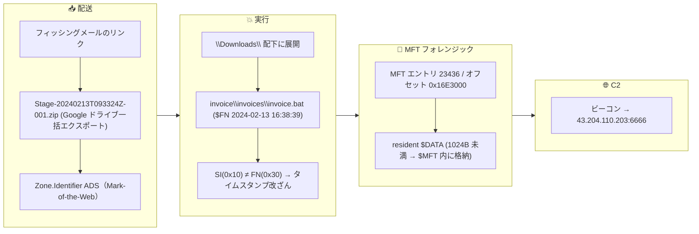
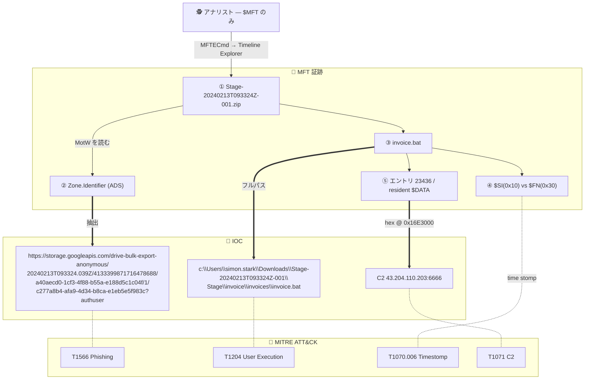

## シナリオ

BFT は HackTheBox の *Sherlock*(防御・DFIR 系)で難易度 **Very Easy**。侵害されたワークステーションの **NTFS `$MFT` だけ**を渡され、この1つの証跡から侵害を再構築する。

> *「Simon Stark は 2 月 13 日に攻撃を受けた。メールで届いたリンクから ZIP ファイルをダウンロードした。SOC アナリストとして、提供された `$MFT` を調査し、ホストがどう侵害されたかを答えよ。」*

| 項目 | 内容 |
|---------------------------|-------|
| プラットフォーム | HackTheBox — Sherlock |
| カテゴリ | DFIR / NTFS ファイルシステム・フォレンジック |
| 難易度 | Very Easy |
| 証跡 | `$MFT` (NTFS Master File Table) |
| 必要スキル | MFT 解析、Zone.Identifier/MotW、NTFS タイムスタンプ、MFT resident ファイル |

## 提供される証跡

ファイルは1つだけ:

- `$MFT` — 被害ホストの NTFS **Master File Table**(本問は約 307 MB、171,927 FILE レコード)。

調査はすべてこの1構造から行う。`$MFT` だけでも侵害がどれだけ保全されているかを学べる問題。

## 使用ツール

- **MFTECmd**(Eric Zimmerman) — `$MFT` を CSV に解析
- **Timeline Explorer**(Eric Zimmerman) — CSV をソート/フィルタ
- **hex エディタ**(HxD, `xxd`, `hexedit`) — MFT resident ファイルの内容を読む
- (任意) **MFT Explorer** — MFT の対話的閲覧

```powershell
# $MFT を CSV タイムラインに解析
MFTECmd.exe -f '.\$MFT' --csv . --csvf mft.csv
# -> FILE records found: 171,927 ; CSV saved to .\mft.csv
```

💡 解説  
`$MFT` は NTFS が持つ「ボリューム上の全ファイルの索引」で、1ファイルにつき約 1 KB のレコードに、名前・親パス・サイズ・複数のタイムスタンプ群が収まっている。*削除済み*ファイルでもレコードが残ることが多い。タイムライン化すれば「MFT しかない」状態が、ディスクに触れた事象のほぼ完全な地図に変わる。

## 前提: 押さえるべき NTFS の概念

| 概念 | 何か | ここでの重要性 |
|---|---|---|
| `$MFT` レコード | 1ファイル = 固定 **1024 バイト** | レコード番号 × 1024 = バイトオフセット |
| `Zone.Identifier` (ADS) | Mark-of-the-Web の代替データストリーム | ダウンロード元の `HostUrl`/`ReferrerUrl` を保持 → IOC |
| `$STANDARD_INFORMATION` (0x10) | エクスプローラ表示のタイムスタンプ | 改ざん(time stomp)が容易 |
| `$FILE_NAME` (0x30) | カーネルが設定するタイムスタンプ | 偽装が難しい → 0x10 と突き合わせる |
| MFT resident ファイル | 約 1024 B 未満のファイルは MFT レコード**内**に格納 | 小さな悪性スクリプトの内容を `$MFT` から直接復元 |

## 調査

### Simon がリンクからダウンロードした ZIP の名前は？

`mft.csv` を Timeline Explorer で開き、2024-02-13 前後のユーザー `Downloads` を見る。ダウンロードされた書庫が目立つ。

**答え:**

```text
Stage-20240213T093324Z-001.zip
```


💡 解説  
報告された日付付近を作成時刻でソートすると、最初のダウンロードが活動の山の先頭に来る。`Stage-...zip`(Google ドライブの一括エクスポート命名パターン)がチェーンの最初のリンクだと分かる。

### ZIP のダウンロード元 Host URL は何か？（Zone.Identifier）

ダウンロードされたファイルは `Zone.Identifier` **代替データストリーム**(Mark-of-the-Web)を持つ。MFTECmd がこれを抽出するので `HostUrl` を読む。

**答え:**

```text
https://storage.googleapis.com/drive-bulk-export-anonymous/20240213T093324.039Z/4133399871716478688/a40aecd0-1cf3-4f88-b55a-e188d5c1c04f/1/c277a8b4-afa9-4d34-b8ca-e1eb5e5f983c?authuser
```


💡 解説  
Mark-of-the-Web はディスク上で最も価値の高い IOC の1つ。Windows はインターネットから落としたファイルに取得元 URL を `Zone.Identifier` ADS で付与する。これは `$MFT` に残り、ペイロードが*どこから*来たか(ここでは Google Cloud Storage の一括エクスポートリンク)を証明する — IOC 横展開やメールゲートウェイ調査の金脈。(MITRE ATT&CK **T1566 — Phishing**、後続 **T1059**)

### コードを実行し C2 に接続した悪性ファイルのフルパスと名前は？

ZIP からユーザー `Downloads` 配下に展開された内容を辿る。1つが、欺瞞的に深くネストした `invoice` パスのバッチスクリプトだ。

**答え:**

```text
c:\Users\simon.stark\Downloads\Stage-20240213T093324Z-001\Stage\invoice\invoices\invoice.bat
```


💡 解説  
二重にネストした `invoice\invoices\` フォルダと、請求書を装った `.bat` は典型的な囮の構造。拡張子＋場所＋タイミング(ZIP 書き込み直後)で実行された stager を特定できる。(MITRE ATT&CK **T1204 — User Execution**)

### そのファイルの `$Created0x30` タイムスタンプ（ディスク上の作成日時）は何か？

`invoice.bat` の **`$FILE_NAME` (0x30)** 作成タイムスタンプ(列 `Created0x30`)を読む。

**答え:**

```text
2024-02-13 16:38:39
```


💡 解説  
NTFS は2組のタイムスタンプを持つ: `$STANDARD_INFORMATION`(0x10、エクスプローラ表示、改ざん容易)と `$FILE_NAME`(0x30、カーネル管理、偽装困難)。0x10 と 0x30 の比較が time stomping 検出の定石で、0x30 の作成時刻こそ*信頼できる*ディスク上の作成時点。

### stager の MFT レコードの hex オフセットは？

各 MFT レコードは **1024 バイト**なので、レコードのバイトオフセット = **エントリ番号 × 1024** を16進数で表したもの。

**答え:**

```text
16E3000
```


💡 解説  
`0x16E3000 = 23,998,464 = 23,436 × 1024` — つまり `invoice.bat` は MFT エントリ **23436**。オフセットが分かれば、CSV では完全に描画されない属性(次問)を見るために、hex エディタで生レコードへ直接ジャンプできる。

### stager の内容から復元する C2 の IP とポートは何か？（MFT resident ファイル）

`invoice.bat` は小さい(約 1024 B 未満)ため **resident**: 外部クラスタではなく自分の MFT レコード内に格納される。hex エディタで `$MFT` のオフセット `0x16E3000` へシークし `$DATA` 属性を読むと、スクリプト本体(と C2 エンドポイント)がそこにある。

**答え:**

```text
43.204.110.203:6666
```


💡 解説  
1024 バイトレコードの空きに収まるサイズのファイルは、NTFS が内容を MFT エントリの `$DATA` 属性に **resident** 格納する。よってディスクにファイル本体が無く、メモリ取得が無くても、小さな悪性スクリプトを `$MFT` から直接復元できる。これだけで C2 `43.204.110.203:6666` が得られる。(MITRE ATT&CK **T1071 — Application Layer Protocol / C2**)

## 攻撃タイムライン

| 時刻 (UTC) | 段階 | 証跡 |
|---|---|---|
| 2024-02-13 | フィッシング | メールのリンク → Google ドライブ一括エクスポート URL から `Stage-20240213T093324Z-001.zip`(Zone.Identifier) |
| 2024-02-13 16:38:39 | ステージング | `...\Downloads\Stage...\Stage\invoice\invoices\` に `invoice.bat` 書き込み($FN 作成 0x30) |
| (実行時) | 実行 | `invoice.bat` を実行(User Execution) |
| (ビーコン) | C2 | .bat の resident `$DATA` から `43.204.110.203:6666` へのビーコンが判明 |



## 証跡 → IOC → ATT&CK 関係図

<!-- DFIR 関係図 (hokkaido 図B 流): 丸数字①〜⑤=各設問の証跡。矢印は 実線=フロー / 太線=IOC抽出(強調) / 点線=ATT&CK対応。値は省略しない。 -->


## 検知と防御（ブルーチーム）

もっと早く捕捉するには:

- **`Downloads`/`Temp` の実行ファイル・スクリプトの Zone.Identifier を狩る** — `HostUrl`(MotW)付きの `.bat`/`.js`/`.hta` は高シグナルのフィッシング痕跡。
- **MFT トリアージで 0x10 と 0x30 を突き合わせ**、time stomping を自動的に検出する。
- **書庫で配送されるスクリプトをブロック/検査**(`.zip` → `.bat`/`.cmd`/`.js`)。MotW を回避するコンテナはメールゲートウェイで除去。
- **生 IP への外向き通信を制限・アラート**(`43.204.110.203:6666` のようなドメイン無し・高ポート)。ワークステーションからの裸 IP ビーコンは異常。
- **`$MFT`(と `$J`/UsnJrnl)をトリアージで採取**(KAPE/Velociraptor)。最小限の証跡でもチェーンを再構築できる。

## まとめ

- **`$MFT` だけ**で、配送 → 実行 → C2 という侵害を再構築できる。
- **Zone.Identifier (Mark-of-the-Web)** はダウンロード元 URL を保全する最上位級の IOC。
- **`$FILE_NAME` (0x30)** タイムスタンプは、改ざんされた `$STANDARD_INFORMATION` (0x10) に対する信頼できる突き合わせ材料。
- MFT レコードは **1024 バイト**(オフセット = エントリ × 1024)で、小さいファイルは `$DATA` に **resident** 格納される — その内容と C2 を MFT から直接復元できる。

## 参考文献

- HackTheBox Sherlock: BFT — <https://app.hackthebox.com/sherlocks>
- MFTECmd / Timeline Explorer (Eric Zimmerman) — <https://ericzimmerman.github.io/>
- Microsoft — NTFS Master File Table (MFT) — <https://learn.microsoft.com/windows/win32/fileio/master-file-table>
- Mark-of-the-Web / Zone.Identifier — <https://learn.microsoft.com/openspecs/windows_protocols/ms-fscc/>
- MITRE ATT&CK: T1566 (Phishing), T1204 (User Execution), T1070.006 (Timestomp), T1071 (C2)
