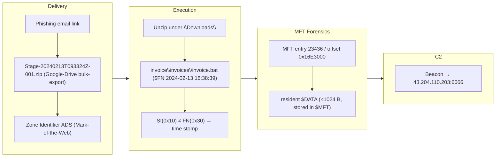
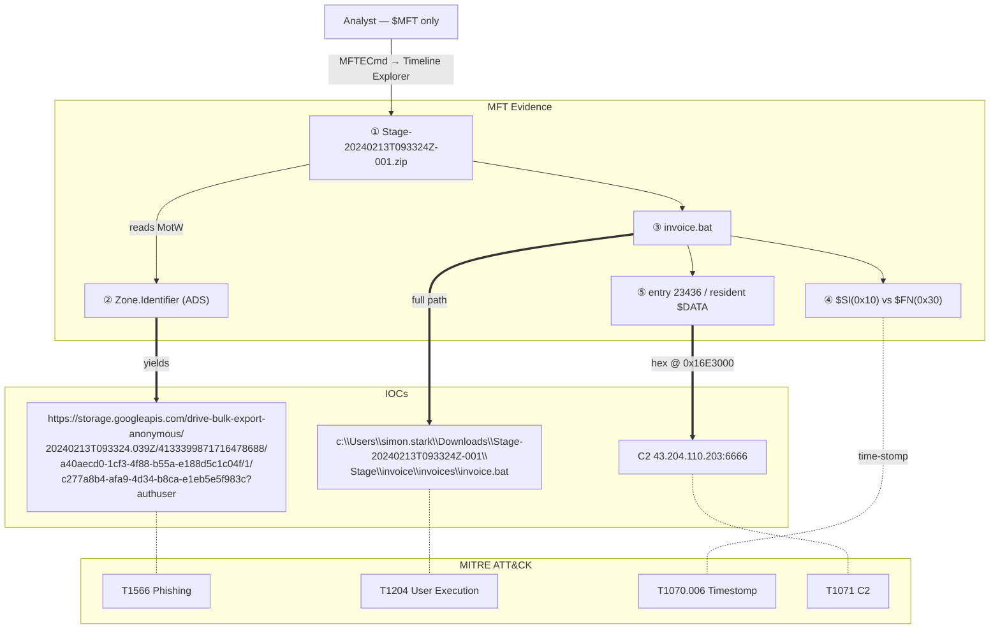

## Scenario

BFT is a **Very Easy** HackTheBox *Sherlock* (defensive / DFIR challenge). You are given **only the NTFS `$MFT`** of a compromised workstation and must reconstruct the intrusion from that single artifact.

> *"Simon Stark was targeted by attackers on February 13. He downloaded a ZIP file from a link received in an email. As the SOC analyst, investigate the provided `$MFT` and answer the questions about how the host was compromised."*

| Field | Value |
|---------------------------|-------|
| Platform | HackTheBox — Sherlock |
| Category | DFIR / NTFS file-system forensics |
| Difficulty | Very Easy |
| Artifact | `$MFT` (NTFS Master File Table) |
| Skills | MFT parsing, Zone.Identifier/MotW, NTFS timestamps, MFT-resident files |

## Artifacts

A single file is provided:

- `$MFT` — the NTFS **Master File Table** of the victim host (here ~307 MB, 171,927 FILE records).

The entire investigation is done from this one structure. The challenge teaches you how much of an intrusion the `$MFT` alone preserves.

## Toolkit

- **MFTECmd** (Eric Zimmerman) — parse `$MFT` → CSV
- **Timeline Explorer** (Eric Zimmerman) — sort/filter the CSV
- A **hex editor** (HxD, `xxd`, `hexedit`) — read MFT-resident file content
- (optional) **MFT Explorer** — interactive MFT browsing

```powershell
# Parse the $MFT into a CSV timeline
MFTECmd.exe -f '.\$MFT' --csv . --csvf mft.csv
# -> FILE records found: 171,927 ; CSV saved to .\mft.csv
```

<svg width="15" height="15" viewBox="0 0 24 24" fill="none" stroke="currentColor" stroke-width="2.2" stroke-linecap="round" stroke-linejoin="round" style="vertical-align:-2px;"><path d="M9 18h6"/><path d="M10 22h4"/><path d="M15.1 14c.2-1 .7-1.7 1.4-2.5A4.6 4.6 0 0 0 18 8 6 6 0 0 0 6 8c0 1 .2 2.2 1.5 3.5.7.8 1.2 1.5 1.4 2.5"/></svg> **Analysis** — The `$MFT` is NTFS's index of every file on the volume — one ~1 KB record per file, holding names, parent paths, sizes, and multiple timestamp sets. Even *deleted* files usually linger as records. Parsing it to a timeline turns "I only have the MFT" into a near-complete map of what touched the disk.

## Background: the NTFS concepts you need

| Concept | What it is | Why it matters here |
|---|---|---|
| `$MFT` record | Fixed **1024-byte** entry per file | record number × 1024 = byte offset |
| `Zone.Identifier` (ADS) | Mark-of-the-Web alternate data stream | stores `HostUrl`/`ReferrerUrl` of downloads → IOC |
| `$STANDARD_INFORMATION` (0x10) | Timestamps shown in Explorer | trivially time-stompable |
| `$FILE_NAME` (0x30) | Timestamps set by the kernel | harder to forge → cross-check vs 0x10 |
| MFT-resident file | File < ~1024 B stored **inside** its MFT record | recover small script/file contents straight from `$MFT` |

## Investigation

<h2 id="q1" style="background:rgba(255,159,67,.16);border-left:5px solid #ff9f43;border-radius:6px;padding:.5rem .85rem;margin:2.5rem 0 1rem;">Q1. What was the name of the ZIP file Simon downloaded from the link?</h2>

Open `mft.csv` in Timeline Explorer and pivot around 2024-02-13 in the user's `Downloads`. The downloaded archive stands out.

<svg width="15" height="15" viewBox="0 0 24 24" fill="none" stroke="currentColor" stroke-width="2.2" stroke-linecap="round" stroke-linejoin="round" style="vertical-align:-2px;"><path d="M21.8 10A10 10 0 1 1 17 3.3"/><path d="m9 11 3 3L22 4"/></svg> **Answer**

```text
Stage-20240213T093324Z-001.zip
```


<svg width="15" height="15" viewBox="0 0 24 24" fill="none" stroke="currentColor" stroke-width="2.2" stroke-linecap="round" stroke-linejoin="round" style="vertical-align:-2px;"><path d="M9 18h6"/><path d="M10 22h4"/><path d="M15.1 14c.2-1 .7-1.7 1.4-2.5A4.6 4.6 0 0 0 18 8 6 6 0 0 0 6 8c0 1 .2 2.2 1.5 3.5.7.8 1.2 1.5 1.4 2.5"/></svg> **Analysis** — A timeline sorted by created time around the reported date puts the initial download right at the top of the activity burst — the `Stage-...zip` name (a Google-Drive bulk-export naming pattern) is the first link in the chain.

<h2 id="q2" style="background:rgba(255,159,67,.16);border-left:5px solid #ff9f43;border-radius:6px;padding:.5rem .85rem;margin:2.5rem 0 1rem;">Q2. What is the full Host URL the ZIP was downloaded from? (Zone.Identifier)</h2>

Downloaded files carry a `Zone.Identifier` **alternate data stream** (Mark-of-the-Web). MFTECmd surfaces it; read its `HostUrl`.

<svg width="15" height="15" viewBox="0 0 24 24" fill="none" stroke="currentColor" stroke-width="2.2" stroke-linecap="round" stroke-linejoin="round" style="vertical-align:-2px;"><path d="M21.8 10A10 10 0 1 1 17 3.3"/><path d="m9 11 3 3L22 4"/></svg> **Answer**

```text
https://storage.googleapis.com/drive-bulk-export-anonymous/20240213T093324.039Z/4133399871716478688/a40aecd0-1cf3-4f88-b55a-e188d5c1c04f/1/c277a8b4-afa9-4d34-b8ca-e1eb5e5f983c?authuser
```


<svg width="15" height="15" viewBox="0 0 24 24" fill="none" stroke="currentColor" stroke-width="2.2" stroke-linecap="round" stroke-linejoin="round" style="vertical-align:-2px;"><path d="M9 18h6"/><path d="M10 22h4"/><path d="M15.1 14c.2-1 .7-1.7 1.4-2.5A4.6 4.6 0 0 0 18 8 6 6 0 0 0 6 8c0 1 .2 2.2 1.5 3.5.7.8 1.2 1.5 1.4 2.5"/></svg> **Analysis** — Mark-of-the-Web is one of the highest-value IOCs on disk: Windows tags internet-downloaded files with the origin URL in the `Zone.Identifier` ADS. It survives in the `$MFT` and proves *where* the payload came from (here a Google Cloud Storage bulk-export link) — gold for IOC pivoting and email-gateway hunting. (MITRE ATT&CK **T1566 — Phishing**, **T1059** downstream.)

<h2 id="q3" style="background:rgba(255,159,67,.16);border-left:5px solid #ff9f43;border-radius:6px;padding:.5rem .85rem;margin:2.5rem 0 1rem;">Q3. What is the full path and name of the malicious file that executed code and connected to C2?</h2>

Trace the contents extracted from the ZIP under the user's `Downloads`. One file is a batch script in a deceptively nested `invoice` path.

<svg width="15" height="15" viewBox="0 0 24 24" fill="none" stroke="currentColor" stroke-width="2.2" stroke-linecap="round" stroke-linejoin="round" style="vertical-align:-2px;"><path d="M21.8 10A10 10 0 1 1 17 3.3"/><path d="m9 11 3 3L22 4"/></svg> **Answer**

```text
c:\Users\simon.stark\Downloads\Stage-20240213T093324Z-001\Stage\invoice\invoices\invoice.bat
```


<svg width="15" height="15" viewBox="0 0 24 24" fill="none" stroke="currentColor" stroke-width="2.2" stroke-linecap="round" stroke-linejoin="round" style="vertical-align:-2px;"><path d="M9 18h6"/><path d="M10 22h4"/><path d="M15.1 14c.2-1 .7-1.7 1.4-2.5A4.6 4.6 0 0 0 18 8 6 6 0 0 0 6 8c0 1 .2 2.2 1.5 3.5.7.8 1.2 1.5 1.4 2.5"/></svg> **Analysis** — The doubly-nested `invoice\invoices\` folder and a `.bat` masquerading as an invoice is classic lure structuring. Extension + location + timing (right after the ZIP write) identify the executed stager. (MITRE ATT&CK **T1204 — User Execution**.)

<h2 id="q4" style="background:rgba(255,159,67,.16);border-left:5px solid #ff9f43;border-radius:6px;padding:.5rem .85rem;margin:2.5rem 0 1rem;">Q4. What is the <code>$Created0x30</code> timestamp of that file (when was it created on disk)?</h2>

Read the **`$FILE_NAME` (0x30)** created timestamp for `invoice.bat` (column `Created0x30`).

<svg width="15" height="15" viewBox="0 0 24 24" fill="none" stroke="currentColor" stroke-width="2.2" stroke-linecap="round" stroke-linejoin="round" style="vertical-align:-2px;"><path d="M21.8 10A10 10 0 1 1 17 3.3"/><path d="m9 11 3 3L22 4"/></svg> **Answer**

```text
2024-02-13 16:38:39
```


<svg width="15" height="15" viewBox="0 0 24 24" fill="none" stroke="currentColor" stroke-width="2.2" stroke-linecap="round" stroke-linejoin="round" style="vertical-align:-2px;"><path d="M9 18h6"/><path d="M10 22h4"/><path d="M15.1 14c.2-1 .7-1.7 1.4-2.5A4.6 4.6 0 0 0 18 8 6 6 0 0 0 6 8c0 1 .2 2.2 1.5 3.5.7.8 1.2 1.5 1.4 2.5"/></svg> **Analysis** — NTFS keeps two timestamp sets: `$STANDARD_INFORMATION` (0x10, shown in Explorer, easily stomped) and `$FILE_NAME` (0x30, kernel-maintained, harder to forge). Comparing 0x10 vs 0x30 is the standard time-stomping check; reporting the 0x30 created time gives the *reliable* on-disk creation moment.

<h2 id="q5" style="background:rgba(255,159,67,.16);border-left:5px solid #ff9f43;border-radius:6px;padding:.5rem .85rem;margin:2.5rem 0 1rem;">Q5. What is the hex offset of the stager's MFT record?</h2>

Each MFT record is **1024 bytes**, so a record's byte offset = its **entry number × 1024**, expressed in hex.

<svg width="15" height="15" viewBox="0 0 24 24" fill="none" stroke="currentColor" stroke-width="2.2" stroke-linecap="round" stroke-linejoin="round" style="vertical-align:-2px;"><path d="M21.8 10A10 10 0 1 1 17 3.3"/><path d="m9 11 3 3L22 4"/></svg> **Answer**

```text
16E3000
```


<svg width="15" height="15" viewBox="0 0 24 24" fill="none" stroke="currentColor" stroke-width="2.2" stroke-linecap="round" stroke-linejoin="round" style="vertical-align:-2px;"><path d="M9 18h6"/><path d="M10 22h4"/><path d="M15.1 14c.2-1 .7-1.7 1.4-2.5A4.6 4.6 0 0 0 18 8 6 6 0 0 0 6 8c0 1 .2 2.2 1.5 3.5.7.8 1.2 1.5 1.4 2.5"/></svg> **Analysis** — `0x16E3000 = 23,998,464 = 23,436 × 1024` — i.e. `invoice.bat` is MFT entry **23436**. Knowing the offset lets you jump straight to the raw record in a hex editor to inspect attributes the CSV may not fully render (next question).

<h2 id="q6" style="background:rgba(255,159,67,.16);border-left:5px solid #ff9f43;border-radius:6px;padding:.5rem .85rem;margin:2.5rem 0 1rem;">Q6. What is the C2 IP and port recovered from the stager's content? (MFT-resident file)</h2>

`invoice.bat` is small (< ~1024 B), so its data is **resident**: stored inside its own MFT record rather than in external clusters. Seek to offset `0x16E3000` in `$MFT` with a hex editor and read the `$DATA` attribute — the script body (and its C2 endpoint) is right there.

<svg width="15" height="15" viewBox="0 0 24 24" fill="none" stroke="currentColor" stroke-width="2.2" stroke-linecap="round" stroke-linejoin="round" style="vertical-align:-2px;"><path d="M21.8 10A10 10 0 1 1 17 3.3"/><path d="m9 11 3 3L22 4"/></svg> **Answer**

```text
43.204.110.203:6666
```


<svg width="15" height="15" viewBox="0 0 24 24" fill="none" stroke="currentColor" stroke-width="2.2" stroke-linecap="round" stroke-linejoin="round" style="vertical-align:-2px;"><path d="M9 18h6"/><path d="M10 22h4"/><path d="M15.1 14c.2-1 .7-1.7 1.4-2.5A4.6 4.6 0 0 0 18 8 6 6 0 0 0 6 8c0 1 .2 2.2 1.5 3.5.7.8 1.2 1.5 1.4 2.5"/></svg> **Analysis** — For files smaller than the slack in a 1024-byte record, NTFS stores the content **resident** in the `$DATA` attribute of the MFT entry itself — so even with no file body on disk and no memory capture, you can recover a small malicious script straight from `$MFT`. That hands you the C2 `43.204.110.203:6666` from the artifact alone. (MITRE ATT&CK **T1071 — Application Layer Protocol / C2**.)

## Attack Timeline

| Time (UTC) | Stage | Evidence |
|---|---|---|
| 2024-02-13 | Phishing | Email link → `Stage-20240213T093324Z-001.zip` from a Google-Drive bulk-export URL (Zone.Identifier) |
| 2024-02-13 16:38:39 | Staging | `invoice.bat` written under `...\Downloads\Stage...\Stage\invoice\invoices\` ($FN created 0x30) |
| (on run) | Execution | `invoice.bat` executed (User Execution) |
| (beacon) | C2 | Resident `$DATA` of the .bat reveals beacon to `43.204.110.203:6666` |



## Evidence → IOC → ATT&CK Map

<!-- DFIR 関係図 (hokkaido 図B 流): 丸数字①〜⑤=各設問の証跡。矢印は 実線=フロー / 太線=IOC抽出(強調) / 点線=ATT&CK対応。値は省略しない。 -->


## Detection & Hardening (Blue Team)

What would have caught this earlier:

- **Hunt Zone.Identifier on executables/scripts** in `Downloads`/`Temp` — a `.bat`/`.js`/`.hta` with a `HostUrl` MotW is a high-signal phishing artifact.
- **Cross-check 0x10 vs 0x30 timestamps** in MFT triage to flag time stomping automatically.
- **Block/inspect archive-delivered scripts** (`.zip` → `.bat`/`.cmd`/`.js`); strip MotW-bypassing containers at the mail gateway.
- **Egress-filter and alert on raw IPs** like `43.204.110.203:6666` (no domain, high port) — beaconing to bare IPs is anomalous from a workstation.
- **Collect `$MFT` (and `$J`/UsnJrnl)** in triage — KAPE/velociraptor — so even minimal artifacts reconstruct the chain.

## Key Takeaways

- The **`$MFT` alone** can reconstruct delivery → execution → C2 of an intrusion.
- **Zone.Identifier (Mark-of-the-Web)** preserves the download URL — a top-tier IOC.
- **`$FILE_NAME` (0x30)** timestamps are the trustworthy cross-check against stomped `$STANDARD_INFORMATION` (0x10).
- MFT records are **1024 bytes** (offset = entry × 1024), and small files live **resident** in `$DATA` — recover their content, and their C2, straight from the MFT.

## References

- HackTheBox Sherlock: BFT — <https://app.hackthebox.com/sherlocks>
- MFTECmd / Timeline Explorer (Eric Zimmerman) — <https://ericzimmerman.github.io/>
- Microsoft — NTFS Master File Table (MFT) — <https://learn.microsoft.com/windows/win32/fileio/master-file-table>
- Mark-of-the-Web / Zone.Identifier — <https://learn.microsoft.com/openspecs/windows_protocols/ms-fscc/>
- MITRE ATT&CK: T1566 (Phishing), T1204 (User Execution), T1070.006 (Timestomp), T1071 (C2)
