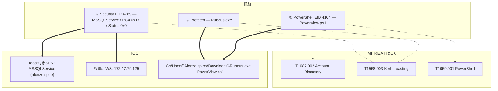

## シナリオ

Campfire-1 は HackTheBox の *Sherlock*(防御・DFIR 系)で難易度 **Easy**。Forela の SOC は **Kerberoasting** 攻撃を疑っている。ドメインコントローラのセキュリティログと、疑わしいワークステーションのトリアージが渡され、攻撃の確認と特定を行う。

> *「SOC マネージャの Alonzo は、攻撃者がネットワークに侵入し Kerberoasting を行ったと考えている。DC のセキュリティログとエンドポイントのトリアージ(PowerShell ログ + Prefetch)が提供される。活動を確認し、標的サービス・攻撃元ワークステーション・使用ツールを特定せよ。」*

| 項目 | 内容 |
|---------------------------|-------|
| プラットフォーム | HackTheBox — Sherlock |
| カテゴリ | DFIR / Active Directory ログ解析 |
| 難易度 | Easy |
| 証跡 | `Security.evtx` (DC) + エンドポイントトリアージ(PowerShell ログ・Prefetch) |
| 必要スキル | Event ID 4769 トリアージ、Kerberoasting 検知、PowerShell ScriptBlock ログ、Prefetch |

## 提供される証跡

- `Security.evtx` — **ドメインコントローラ**のセキュリティイベントログ(Kerberos の `4769` TGS 要求を含む)。
- 攻撃元ワークステーションのエンドポイント**トリアージ**:
  - **PowerShell Operational** ログ(`Microsoft-Windows-PowerShell/Operational`、ScriptBlock イベント `4104`)。
  - **Prefetch**(`C:\Windows\Prefetch\*.pf`) — どの実行ファイルがいつ動いたかの証拠。

本ケースは突き合わせの演習: DC は *何が*(roast されたSPN)と*どこから*(IP)を、エンドポイントは *どうやって*(PowerView + Rubeus)と*いつ*を教える。

## 使用ツール

- **EvtxECmd**(Eric Zimmerman)→ CSV →**Timeline Explorer** で `Security.evtx` と PowerShell ログを閲覧
- **PECmd**(Eric Zimmerman) — Prefetch 解析(最終実行時刻)
- 代替に **Windows イベントビューア**(XPath フィルタ)

```powershell
# Security ログ + PowerShell Operational ログ -> CSV (Timeline Explorer 用)
EvtxECmd.exe -f Security.evtx --csv . --csvf security.csv
# Prefetch -> 最終実行時刻
PECmd.exe -d C:\triage\Prefetch --csv . --csvf prefetch.csv
```

<svg width="15" height="15" viewBox="0 0 24 24" fill="none" stroke="currentColor" stroke-width="2.2" stroke-linecap="round" stroke-linejoin="round" style="vertical-align:-2px;"><path d="M9 18h6"/><path d="M10 22h4"/><path d="M15.1 14c.2-1 .7-1.7 1.4-2.5A4.6 4.6 0 0 0 18 8 6 6 0 0 0 6 8c0 1 .2 2.2 1.5 3.5.7.8 1.2 1.5 1.4 2.5"/></svg> **解説** — Kerberoasting は設計上ちょうど1か所で目立つ: DC は発行する TGS ごとに Event ID **4769**(Kerberos サービスチケット要求)を記録する。まずこれをタイムライン化すれば、正常要求の中から異常な1件を見つけ、エンドポイントへ展開して説明できる。

## 前提: Kerberoasting 検知のシグナル

| シグナル | 何か | ここでの重要性 |
|---|---|---|
| Event ID `4769` | Kerberos サービスチケット(TGS-REP)要求 | roast 1回につき1件 = DC 側の中核シグナル |
| `TicketEncryptionType 0x17` | RC4-HMAC | 攻撃者は AES より遥かに速く割れる RC4 を強制する |
| `ServiceName` が `krbtgt` 以外かつ末尾 `$` でない | **ユーザー**SPN アカウント(コンピュータ/`DC01$` でない) | ユーザーSPN が roastable な標的 |
| `Status 0x0` | 要求成功 | TGS が実際に発行された(割れるハッシュを取得) |
| PowerShell `4104` | ScriptBlock ログ | `PowerView.ps1` の SPN 列挙を捕捉 |
| Prefetch | EXE の最終実行・実行回数 | `Rubeus.exe` の実行を証明・時刻特定 |

## 調査

<h2 id="q1" style="background:rgba(255,159,67,.16);border-left:5px solid #ff9f43;border-radius:6px;padding:.5rem .85rem;margin:2.5rem 0 1rem;">Q1. Analyzing the Domain Controller security logs, what is the UTC date &amp; time the Kerberoasting activity occurred?</h2>

`Security.evtx` を **Event ID 4769** で絞り込み、`TicketEncryptionType = 0x17`(RC4)、`ServiceName` が `krbtgt` 以外かつ末尾 `$` でない、`Status = 0x0` の条件を満たすものだけ残す。一致するイベントは1件:

```json
"EventData": {
  "TargetUserName": "alonzo.spire@FORELA.LOCAL",
  "ServiceName": "MSSQLService",
  "TicketOptions": "0x40800000",
  "TicketEncryptionType": "0x17",
  "IpAddress": "::ffff:172.17.79.129",
  "Status": "0x0"
}
```

<svg width="15" height="15" viewBox="0 0 24 24" fill="none" stroke="currentColor" stroke-width="2.2" stroke-linecap="round" stroke-linejoin="round" style="vertical-align:-2px;"><path d="M21.8 10A10 10 0 1 1 17 3.3"/><path d="m9 11 3 3L22 4"/></svg> **答え**

```text
2024-05-21 03:18:09
```

<svg width="15" height="15" viewBox="0 0 24 24" fill="none" stroke="currentColor" stroke-width="2.2" stroke-linecap="round" stroke-linejoin="round" style="vertical-align:-2px;"><path d="M9 18h6"/><path d="M10 22h4"/><path d="M15.1 14c.2-1 .7-1.7 1.4-2.5A4.6 4.6 0 0 0 18 8 6 6 0 0 0 6 8c0 1 .2 2.2 1.5 3.5.7.8 1.2 1.5 1.4 2.5"/></svg> **解説** — 健全な DC ではほぼ全ての `4769` が AES(`0x12`)でコンピュータアカウント(`…$`)宛て。**ユーザー**SPN 宛ての RC4(`0x17`)・`Status 0x0` 要求が1件あれば、それが Kerberoasting の指紋 — 攻撃者がそのアカウントの割れる TGS ハッシュを取得した証拠。(MITRE ATT&CK **T1558.003 — Kerberoasting**)

<h2 id="q2" style="background:rgba(255,159,67,.16);border-left:5px solid #ff9f43;border-radius:6px;padding:.5rem .85rem;margin:2.5rem 0 1rem;">Q2. What is the Service Name that was targeted?</h2>

一致した `4769` イベントの `ServiceName` を読む。

<svg width="15" height="15" viewBox="0 0 24 24" fill="none" stroke="currentColor" stroke-width="2.2" stroke-linecap="round" stroke-linejoin="round" style="vertical-align:-2px;"><path d="M21.8 10A10 10 0 1 1 17 3.3"/><path d="m9 11 3 3L22 4"/></svg> **答え**

```text
MSSQLService
```


<svg width="15" height="15" viewBox="0 0 24 24" fill="none" stroke="currentColor" stroke-width="2.2" stroke-linecap="round" stroke-linejoin="round" style="vertical-align:-2px;"><path d="M9 18h6"/><path d="M10 22h4"/><path d="M15.1 14c.2-1 .7-1.7 1.4-2.5A4.6 4.6 0 0 0 18 8 6 6 0 0 0 6 8c0 1 .2 2.2 1.5 3.5.7.8 1.2 1.5 1.4 2.5"/></svg> **解説** — SPN はどのサービスアカウントのハッシュが盗まれたかを示す。*ユーザー*アカウントに紐づく SPN(ここでは `MSSQLService`)は roastable で、そのパスワードはオフライン解析に晒される。最優先でリセット・調査すべき対象だ。

<h2 id="q3" style="background:rgba(255,159,67,.16);border-left:5px solid #ff9f43;border-radius:6px;padding:.5rem .85rem;margin:2.5rem 0 1rem;">Q3. What is the IP address of the workstation this activity came from?</h2>

同イベントの `IpAddress` フィールドを読む(IPv6 マップ接頭辞 `::ffff:` を除く)。

<svg width="15" height="15" viewBox="0 0 24 24" fill="none" stroke="currentColor" stroke-width="2.2" stroke-linecap="round" stroke-linejoin="round" style="vertical-align:-2px;"><path d="M21.8 10A10 10 0 1 1 17 3.3"/><path d="m9 11 3 3L22 4"/></svg> **答え**

```text
172.17.79.129
```


<svg width="15" height="15" viewBox="0 0 24 24" fill="none" stroke="currentColor" stroke-width="2.2" stroke-linecap="round" stroke-linejoin="round" style="vertical-align:-2px;"><path d="M9 18h6"/><path d="M10 22h4"/><path d="M15.1 14c.2-1 .7-1.7 1.4-2.5A4.6 4.6 0 0 0 18 8 6 6 0 0 0 6 8c0 1 .2 2.2 1.5 3.5.7.8 1.2 1.5 1.4 2.5"/></svg> **解説** — DC は全チケット要求の発信元 IP を記録する。「roast が起きた」から「172.17.79.129 から来た」へ展開できることで、正しいエンドポイントのトリアージに進み *どうやって* を再構築できる。

<h2 id="q4" style="background:rgba(255,159,67,.16);border-left:5px solid #ff9f43;border-radius:6px;padding:.5rem .85rem;margin:2.5rem 0 1rem;">Q4. What is the name of the file used to enumerate Active Directory and find Kerberoastable accounts?</h2>

ワークステーションの **PowerShell Operational** ログに移り、ScriptBlock イベント(`4104`)を確認する。AD 列挙ツールが際立つ。

<svg width="15" height="15" viewBox="0 0 24 24" fill="none" stroke="currentColor" stroke-width="2.2" stroke-linecap="round" stroke-linejoin="round" style="vertical-align:-2px;"><path d="M21.8 10A10 10 0 1 1 17 3.3"/><path d="m9 11 3 3L22 4"/></svg> **答え**

```text
powerview.ps1
```


<svg width="15" height="15" viewBox="0 0 24 24" fill="none" stroke="currentColor" stroke-width="2.2" stroke-linecap="round" stroke-linejoin="round" style="vertical-align:-2px;"><path d="M9 18h6"/><path d="M10 22h4"/><path d="M15.1 14c.2-1 .7-1.7 1.4-2.5A4.6 4.6 0 0 0 18 8 6 6 0 0 0 6 8c0 1 .2 2.2 1.5 3.5.7.8 1.2 1.5 1.4 2.5"/></svg> **解説** — `PowerView.ps1` は事実上の AD 偵察ツールキット。`Get-DomainUser -SPN` で roastable アカウントを列挙する。ScriptBlock ログ(EID 4104)はスクリプト本体を記録するため、ファイルレス/インメモリ実行でもソースが残る。(MITRE ATT&CK **T1087.002 — Account Discovery: Domain Account**)

<h2 id="q5" style="background:rgba(255,159,67,.16);border-left:5px solid #ff9f43;border-radius:6px;padding:.5rem .85rem;margin:2.5rem 0 1rem;">Q5. When was this script executed? (UTC)</h2>

PowerView の `4104` ScriptBlock イベントのタイムスタンプを読む。

<svg width="15" height="15" viewBox="0 0 24 24" fill="none" stroke="currentColor" stroke-width="2.2" stroke-linecap="round" stroke-linejoin="round" style="vertical-align:-2px;"><path d="M21.8 10A10 10 0 1 1 17 3.3"/><path d="m9 11 3 3L22 4"/></svg> **答え**

```text
2024-05-21 03:16:32
```


<svg width="15" height="15" viewBox="0 0 24 24" fill="none" stroke="currentColor" stroke-width="2.2" stroke-linecap="round" stroke-linejoin="round" style="vertical-align:-2px;"><path d="M9 18h6"/><path d="M10 22h4"/><path d="M15.1 14c.2-1 .7-1.7 1.4-2.5A4.6 4.6 0 0 0 18 8 6 6 0 0 0 6 8c0 1 .2 2.2 1.5 3.5.7.8 1.2 1.5 1.4 2.5"/></svg> **解説** — 順序に注目: 列挙(03:16:32)は roast(03:18:09)の**前**に起きている。この約2分の差が、攻撃者が roastable な SPN を見つけ、そのチケットを要求するまでの、特定しやすいミニタイムラインだ。

<h2 id="q6" style="background:rgba(255,159,67,.16);border-left:5px solid #ff9f43;border-radius:6px;padding:.5rem .85rem;margin:2.5rem 0 1rem;">Q6. What is the full path of the tool used to perform the actual Kerberoasting attack?</h2>

**Prefetch** を PECmd で解析し roasting ツールを探す。prefetch エントリにソースパスが記録される。

<svg width="15" height="15" viewBox="0 0 24 24" fill="none" stroke="currentColor" stroke-width="2.2" stroke-linecap="round" stroke-linejoin="round" style="vertical-align:-2px;"><path d="M21.8 10A10 10 0 1 1 17 3.3"/><path d="m9 11 3 3L22 4"/></svg> **答え**

```text
C:\Users\Alonzo.spire\Downloads\Rubeus.exe
```


<svg width="15" height="15" viewBox="0 0 24 24" fill="none" stroke="currentColor" stroke-width="2.2" stroke-linecap="round" stroke-linejoin="round" style="vertical-align:-2px;"><path d="M9 18h6"/><path d="M10 22h4"/><path d="M15.1 14c.2-1 .7-1.7 1.4-2.5A4.6 4.6 0 0 0 18 8 6 6 0 0 0 6 8c0 1 .2 2.2 1.5 3.5.7.8 1.2 1.5 1.4 2.5"/></svg> **解説** — **Rubeus**(`Rubeus.exe kerberoast`)が実際の TGS 要求とハッシュ抽出を行う。Prefetch はバイナリのパスと実行履歴を記録するため、ツール名の特定と本ホストでの実行証明の両方ができる。`\Downloads\` からの実行自体も弱いシグナルの IOC。(MITRE ATT&CK **T1558.003**)

<h2 id="q7" style="background:rgba(255,159,67,.16);border-left:5px solid #ff9f43;border-radius:6px;padding:.5rem .85rem;margin:2.5rem 0 1rem;">Q7. When was the tool executed to dump credentials? (UTC)</h2>

Prefetch から `RUBEUS.EXE-*.pf` の最終実行時刻を読む。

<svg width="15" height="15" viewBox="0 0 24 24" fill="none" stroke="currentColor" stroke-width="2.2" stroke-linecap="round" stroke-linejoin="round" style="vertical-align:-2px;"><path d="M21.8 10A10 10 0 1 1 17 3.3"/><path d="m9 11 3 3L22 4"/></svg> **答え**

```text
2024-05-21 03:18:08
```


<svg width="15" height="15" viewBox="0 0 24 24" fill="none" stroke="currentColor" stroke-width="2.2" stroke-linecap="round" stroke-linejoin="round" style="vertical-align:-2px;"><path d="M9 18h6"/><path d="M10 22h4"/><path d="M15.1 14c.2-1 .7-1.7 1.4-2.5A4.6 4.6 0 0 0 18 8 6 6 0 0 0 6 8c0 1 .2 2.2 1.5 3.5.7.8 1.2 1.5 1.4 2.5"/></svg> **解説** — Prefetch の実行時刻(03:18:08)は DC の `4769`(03:18:09)の**1秒前**にある — エンドポイントと DC が秒単位で相互に裏付け、Rubeus → TGS 要求という因果連鎖を確定させる。

## 攻撃タイムライン

| 時刻 (UTC) | 段階 | 証跡 |
|---|---|---|
| 2024-05-21 03:16:32 | 探索(Discovery) | `PowerView.ps1` が AD / roastable SPN を列挙 — PowerShell **EID 4104** |
| 2024-05-21 03:18:08 | 実行 | `C:\Users\Alonzo.spire\Downloads\Rubeus.exe` を実行 — **Prefetch** 最終実行 |
| 2024-05-21 03:18:09 | 資格情報アクセス | DC が `MSSQLService` の TGS を発行、RC4 `0x17`、発信元 `172.17.79.129` — **EID 4769** |



## 検知と防御（ブルーチーム）

もっと早く捕捉するには:

- **Event ID 4769 で `TicketEncryptionType 0x17`(RC4)** かつ非マシン SPN にアラート — 極めて高シグナルな Kerberoasting 検知。
- **Kerberos の RC4 を無効化**し、サービスアカウントを **AES 専用**に。roast されても遥かに固いハッシュ(または失敗)になる。
- サービスアカウントに **gMSA / 長いランダムパスワード**を使う。gMSA は実質的に解析不能。
- **PowerShell ScriptBlock ログ(EID 4104)**とモジュールログを有効化し、PowerView/SPN 列挙を捕捉。
- **プロセス実行 / Prefetch を監視**し、`Rubeus`・`Mimikatz`・`\Downloads\` からの実行を検出。
- **ハニーポット SPN アカウント**を配置 — それへの `4769` は確実なアラート。

## まとめ

- DC 上の Kerberoasting 指紋は **EID 4769 + RC4(0x17) + ユーザーSPN(`…$` でない) + Status 0x0**。
- DC ログを**エンドポイントの PowerShell(4104)** と **Prefetch** と突き合わせると、攻撃元ワークステーション・偵察ツール(PowerView)・roasting ツール(Rubeus)を秒単位で特定できる。
- 防御側は RC4 廃止・gMSA 利用・PowerShell/プロセス実行のログ化で勝てる。

## 参考文献

- HackTheBox Sherlock: Campfire-1 — <https://app.hackthebox.com/sherlocks>
- Microsoft — 4769(S, F): A Kerberos service ticket was requested — <https://learn.microsoft.com/windows/security/threat-protection/auditing/event-4769>
- Eric Zimmerman's Tools (EvtxECmd / PECmd / Timeline Explorer) — <https://ericzimmerman.github.io/>
- Rubeus — <https://github.com/GhostPack/Rubeus> ; PowerView — <https://github.com/PowerShellMafia/PowerSploit>
- MITRE ATT&CK: T1558.003 (Kerberoasting), T1087.002 (Account Discovery), T1059.001 (PowerShell)
