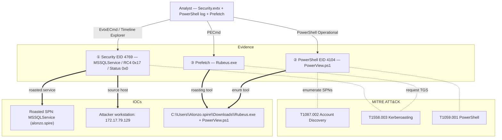

## Scenario

Campfire-1 is an **Easy** HackTheBox *Sherlock* (defensive / DFIR challenge). The Forela SOC suspects a **Kerberoasting** attack. You are given the Domain Controller's security log plus a triage package from the suspected workstation, and must confirm the attack and attribute it.

> *"Alonzo, the SOC manager, has reason to believe that an attacker has gained access to the network and performed a Kerberoasting attack. You are provided with the Domain Controller security logs and a triage of the endpoint (PowerShell logs + Prefetch). Confirm the activity, identify the targeted service, the attacker workstation, and the tools used."*

| Field | Value |
|---------------------------|-------|
| Platform | HackTheBox — Sherlock |
| Category | DFIR / Active Directory log analysis |
| Difficulty | Easy |
| Artifacts | `Security.evtx` (DC) + endpoint triage (PowerShell logs, Prefetch) |
| Skills | Event ID 4769 triage, Kerberoasting detection, PowerShell ScriptBlock logs, Prefetch |

## Artifacts

- `Security.evtx` — the **Domain Controller** security event log (holds the Kerberos `4769` TGS requests).
- Endpoint **triage** of the attacker workstation:
  - **PowerShell Operational** log (`Microsoft-Windows-PowerShell/Operational`, ScriptBlock events `4104`).
  - **Prefetch** (`C:\Windows\Prefetch\*.pf`) — proof of which executables ran and when.

The whole case is a correlation exercise: the DC tells you *what* (a roasted SPN) and *from where* (an IP); the endpoint tells you *how* (PowerView + Rubeus) and *when*.

## Toolkit

- **EvtxECmd** (Eric Zimmerman) → CSV → **Timeline Explorer** for `Security.evtx` and the PowerShell log
- **PECmd** (Eric Zimmerman) — parse Prefetch (last-run timestamps)
- **Windows Event Viewer** (native) as a fallback with XPath filters

```powershell
# Security log + PowerShell Operational log -> CSV for Timeline Explorer
EvtxECmd.exe -f Security.evtx --csv . --csvf security.csv
# Prefetch -> last run times
PECmd.exe -d C:\triage\Prefetch --csv . --csvf prefetch.csv
```

<svg width="15" height="15" viewBox="0 0 24 24" fill="none" stroke="currentColor" stroke-width="2.2" stroke-linecap="round" stroke-linejoin="round" style="vertical-align:-2px;"><path d="M9 18h6"/><path d="M10 22h4"/><path d="M15.1 14c.2-1 .7-1.7 1.4-2.5A4.6 4.6 0 0 0 18 8 6 6 0 0 0 6 8c0 1 .2 2.2 1.5 3.5.7.8 1.2 1.5 1.4 2.5"/></svg> **Analysis** — Kerberoasting is noisy in exactly one place by design: the Domain Controller logs an Event ID **4769** (Kerberos service-ticket request) for every TGS issued. Pulling that log to a timeline first lets you spot the single anomalous request among the normal ones, then pivot to the endpoint to explain it.

## Background: Kerberoasting detection signals

| Signal | What it is | Why it matters here |
|---|---|---|
| Event ID `4769` | Kerberos service ticket (TGS-REP) requested | one per roast — the core DC-side signal |
| `TicketEncryptionType 0x17` | RC4-HMAC | attackers force RC4 because it cracks far faster than AES |
| `ServiceName` ≠ `krbtgt` and not ending in `$` | a **user** SPN account (not a computer/`DC01$`) | user-SPN accounts are the roastable targets |
| `Status 0x0` | request succeeded | the TGS was actually issued (crackable hash obtained) |
| PowerShell `4104` | ScriptBlock logging | catches `PowerView.ps1` enumerating SPNs |
| Prefetch | last-run + run count of EXEs | proves/times `Rubeus.exe` execution |

## Investigation

<h2 id="q1" style="background:rgba(255,159,67,.16);border-left:5px solid #ff9f43;border-radius:6px;padding:.5rem .85rem;margin:2.5rem 0 1rem;">Q1. Analyzing the Domain Controller security logs, what is the UTC date &amp; time the Kerberoasting activity occurred?</h2>

Filter `Security.evtx` on **Event ID 4769**, then keep only events where `TicketEncryptionType = 0x17` (RC4), `ServiceName` is **not** `krbtgt` and does **not** end in `$`, and `Status = 0x0`. Exactly one event matches:

```json
"EventData": {
  "TargetUserName": "alonzo.spire@FORELA.LOCAL",
  "ServiceName": "MSSQLService",
  "TicketOptions": "0x40800000",
  "TicketEncryptionType": "0x17",
  "IpAddress": "::ffff:172.17.79.129",
  "Status": "0x0"
}
```

<svg width="15" height="15" viewBox="0 0 24 24" fill="none" stroke="currentColor" stroke-width="2.2" stroke-linecap="round" stroke-linejoin="round" style="vertical-align:-2px;"><path d="M21.8 10A10 10 0 1 1 17 3.3"/><path d="m9 11 3 3L22 4"/></svg> **Answer**

```text
2024-05-21 03:18:09
```

<svg width="15" height="15" viewBox="0 0 24 24" fill="none" stroke="currentColor" stroke-width="2.2" stroke-linecap="round" stroke-linejoin="round" style="vertical-align:-2px;"><path d="M9 18h6"/><path d="M10 22h4"/><path d="M15.1 14c.2-1 .7-1.7 1.4-2.5A4.6 4.6 0 0 0 18 8 6 6 0 0 0 6 8c0 1 .2 2.2 1.5 3.5.7.8 1.2 1.5 1.4 2.5"/></svg> **Analysis** — On a healthy DC, almost every `4769` uses AES (`0x12`) and targets computer accounts (`…$`). A single RC4 (`0x17`) request for a **user** SPN with `Status 0x0` is the Kerberoasting fingerprint — the attacker pulled a crackable TGS hash for that account. (MITRE ATT&CK **T1558.003 — Kerberoasting**.)

<h2 id="q2" style="background:rgba(255,159,67,.16);border-left:5px solid #ff9f43;border-radius:6px;padding:.5rem .85rem;margin:2.5rem 0 1rem;">Q2. What is the Service Name that was targeted?</h2>

Read `ServiceName` from the matching `4769` event.

<svg width="15" height="15" viewBox="0 0 24 24" fill="none" stroke="currentColor" stroke-width="2.2" stroke-linecap="round" stroke-linejoin="round" style="vertical-align:-2px;"><path d="M21.8 10A10 10 0 1 1 17 3.3"/><path d="m9 11 3 3L22 4"/></svg> **Answer**

```text
MSSQLService
```


<svg width="15" height="15" viewBox="0 0 24 24" fill="none" stroke="currentColor" stroke-width="2.2" stroke-linecap="round" stroke-linejoin="round" style="vertical-align:-2px;"><path d="M9 18h6"/><path d="M10 22h4"/><path d="M15.1 14c.2-1 .7-1.7 1.4-2.5A4.6 4.6 0 0 0 18 8 6 6 0 0 0 6 8c0 1 .2 2.2 1.5 3.5.7.8 1.2 1.5 1.4 2.5"/></svg> **Analysis** — The SPN identifies which service account's hash was stolen. A service principal tied to a *user* account (here `MSSQLService`) is roastable; its password now faces offline cracking, so it is the account to reset and investigate first.

<h2 id="q3" style="background:rgba(255,159,67,.16);border-left:5px solid #ff9f43;border-radius:6px;padding:.5rem .85rem;margin:2.5rem 0 1rem;">Q3. What is the IP address of the workstation this activity came from?</h2>

Read the `IpAddress` field of the same event (strip the IPv6-mapped prefix `::ffff:`).

<svg width="15" height="15" viewBox="0 0 24 24" fill="none" stroke="currentColor" stroke-width="2.2" stroke-linecap="round" stroke-linejoin="round" style="vertical-align:-2px;"><path d="M21.8 10A10 10 0 1 1 17 3.3"/><path d="m9 11 3 3L22 4"/></svg> **Answer**

```text
172.17.79.129
```


<svg width="15" height="15" viewBox="0 0 24 24" fill="none" stroke="currentColor" stroke-width="2.2" stroke-linecap="round" stroke-linejoin="round" style="vertical-align:-2px;"><path d="M9 18h6"/><path d="M10 22h4"/><path d="M15.1 14c.2-1 .7-1.7 1.4-2.5A4.6 4.6 0 0 0 18 8 6 6 0 0 0 6 8c0 1 .2 2.2 1.5 3.5.7.8 1.2 1.5 1.4 2.5"/></svg> **Analysis** — The DC records the source IP of every ticket request. Pivoting from "a roast happened" to "it came from 172.17.79.129" is what lets you go to the right endpoint's triage and reconstruct the *how*.

<h2 id="q4" style="background:rgba(255,159,67,.16);border-left:5px solid #ff9f43;border-radius:6px;padding:.5rem .85rem;margin:2.5rem 0 1rem;">Q4. What is the name of the file used to enumerate Active Directory and find Kerberoastable accounts?</h2>

Move to the workstation's **PowerShell Operational** log and review ScriptBlock events (`4104`). The AD-enumeration tooling stands out.

<svg width="15" height="15" viewBox="0 0 24 24" fill="none" stroke="currentColor" stroke-width="2.2" stroke-linecap="round" stroke-linejoin="round" style="vertical-align:-2px;"><path d="M21.8 10A10 10 0 1 1 17 3.3"/><path d="m9 11 3 3L22 4"/></svg> **Answer**

```text
powerview.ps1
```


<svg width="15" height="15" viewBox="0 0 24 24" fill="none" stroke="currentColor" stroke-width="2.2" stroke-linecap="round" stroke-linejoin="round" style="vertical-align:-2px;"><path d="M9 18h6"/><path d="M10 22h4"/><path d="M15.1 14c.2-1 .7-1.7 1.4-2.5A4.6 4.6 0 0 0 18 8 6 6 0 0 0 6 8c0 1 .2 2.2 1.5 3.5.7.8 1.2 1.5 1.4 2.5"/></svg> **Analysis** — `PowerView.ps1` is the de-facto AD recon toolkit; `Get-DomainUser -SPN` lists roastable accounts. ScriptBlock logging (EID 4104) records the script body, so even a fileless/in-memory run leaves the source behind. (MITRE ATT&CK **T1087.002 — Account Discovery: Domain Account**.)

<h2 id="q5" style="background:rgba(255,159,67,.16);border-left:5px solid #ff9f43;border-radius:6px;padding:.5rem .85rem;margin:2.5rem 0 1rem;">Q5. When was this script executed? (UTC)</h2>

Read the timestamp of the PowerView `4104` ScriptBlock event.

<svg width="15" height="15" viewBox="0 0 24 24" fill="none" stroke="currentColor" stroke-width="2.2" stroke-linecap="round" stroke-linejoin="round" style="vertical-align:-2px;"><path d="M21.8 10A10 10 0 1 1 17 3.3"/><path d="m9 11 3 3L22 4"/></svg> **Answer**

```text
2024-05-21 03:16:32
```


<svg width="15" height="15" viewBox="0 0 24 24" fill="none" stroke="currentColor" stroke-width="2.2" stroke-linecap="round" stroke-linejoin="round" style="vertical-align:-2px;"><path d="M9 18h6"/><path d="M10 22h4"/><path d="M15.1 14c.2-1 .7-1.7 1.4-2.5A4.6 4.6 0 0 0 18 8 6 6 0 0 0 6 8c0 1 .2 2.2 1.5 3.5.7.8 1.2 1.5 1.4 2.5"/></svg> **Analysis** — Note the order: enumeration (03:16:32) happens **before** the roast (03:18:09). That ~2-minute gap is the attacker finding a roastable SPN, then requesting its ticket — a tidy, attributable mini-timeline.

<h2 id="q6" style="background:rgba(255,159,67,.16);border-left:5px solid #ff9f43;border-radius:6px;padding:.5rem .85rem;margin:2.5rem 0 1rem;">Q6. What is the full path of the tool used to perform the actual Kerberoasting attack?</h2>

Parse the **Prefetch** with PECmd and look for the roasting tool; the prefetch entry records the source path.

<svg width="15" height="15" viewBox="0 0 24 24" fill="none" stroke="currentColor" stroke-width="2.2" stroke-linecap="round" stroke-linejoin="round" style="vertical-align:-2px;"><path d="M21.8 10A10 10 0 1 1 17 3.3"/><path d="m9 11 3 3L22 4"/></svg> **Answer**

```text
C:\Users\Alonzo.spire\Downloads\Rubeus.exe
```


<svg width="15" height="15" viewBox="0 0 24 24" fill="none" stroke="currentColor" stroke-width="2.2" stroke-linecap="round" stroke-linejoin="round" style="vertical-align:-2px;"><path d="M9 18h6"/><path d="M10 22h4"/><path d="M15.1 14c.2-1 .7-1.7 1.4-2.5A4.6 4.6 0 0 0 18 8 6 6 0 0 0 6 8c0 1 .2 2.2 1.5 3.5.7.8 1.2 1.5 1.4 2.5"/></svg> **Analysis** — **Rubeus** (`Rubeus.exe kerberoast`) performs the actual TGS request and hash extraction. Prefetch records the binary's path and run history, so it both names the tool and proves it executed on this host. Running from `\Downloads\` is itself a weak-signal IOC. (MITRE ATT&CK **T1558.003**.)

<h2 id="q7" style="background:rgba(255,159,67,.16);border-left:5px solid #ff9f43;border-radius:6px;padding:.5rem .85rem;margin:2.5rem 0 1rem;">Q7. When was the tool executed to dump credentials? (UTC)</h2>

Read the last-run time of `RUBEUS.EXE-*.pf` from the Prefetch.

<svg width="15" height="15" viewBox="0 0 24 24" fill="none" stroke="currentColor" stroke-width="2.2" stroke-linecap="round" stroke-linejoin="round" style="vertical-align:-2px;"><path d="M21.8 10A10 10 0 1 1 17 3.3"/><path d="m9 11 3 3L22 4"/></svg> **Answer**

```text
2024-05-21 03:18:08
```


<svg width="15" height="15" viewBox="0 0 24 24" fill="none" stroke="currentColor" stroke-width="2.2" stroke-linecap="round" stroke-linejoin="round" style="vertical-align:-2px;"><path d="M9 18h6"/><path d="M10 22h4"/><path d="M15.1 14c.2-1 .7-1.7 1.4-2.5A4.6 4.6 0 0 0 18 8 6 6 0 0 0 6 8c0 1 .2 2.2 1.5 3.5.7.8 1.2 1.5 1.4 2.5"/></svg> **Analysis** — The Prefetch run time (03:18:08) sits **one second before** the DC's `4769` (03:18:09) — endpoint and DC corroborate each other to the second, nailing the causal chain Rubeus → TGS request.

## Attack Timeline

| Time (UTC) | Stage | Evidence |
|---|---|---|
| 2024-05-21 03:16:32 | Discovery | `PowerView.ps1` enumerates AD / roastable SPNs — PowerShell **EID 4104** |
| 2024-05-21 03:18:08 | Execution | `C:\Users\Alonzo.spire\Downloads\Rubeus.exe` runs — **Prefetch** last-run |
| 2024-05-21 03:18:09 | Credential Access | DC issues TGS for `MSSQLService`, RC4 `0x17`, from `172.17.79.129` — **EID 4769** |



## Detection & Hardening (Blue Team)

What would have caught this earlier:

- **Alert on Event ID 4769 with `TicketEncryptionType 0x17` (RC4)** for non-machine SPNs — extremely high-signal Kerberoasting detection.
- **Disable RC4 for Kerberos** and set service accounts to **AES-only**, so a roast yields a far harder hash (or fails).
- **Use gMSA / long random passwords** for service accounts — gMSAs are not practically crackable.
- **Enable PowerShell ScriptBlock logging (EID 4104)** and module logging to catch PowerView/SPN enumeration.
- **Monitor process execution / Prefetch** for `Rubeus`, `Mimikatz`, and execution from `\Downloads\`.
- **Deploy honeypot SPN accounts** — any `4769` against them is a guaranteed alert.

## Key Takeaways

- The Kerberoasting fingerprint on a DC is **EID 4769 + RC4 (0x17) + a user SPN (not `…$`) + Status 0x0**.
- Correlating the DC log with **endpoint PowerShell (4104)** and **Prefetch** attributes the attacker workstation, the recon tool (PowerView), and the roasting tool (Rubeus) — to the second.
- Defenders win by removing RC4, using gMSAs, and logging PowerShell + process execution.

## References

- HackTheBox Sherlock: Campfire-1 — <https://app.hackthebox.com/sherlocks>
- Microsoft — 4769(S, F): A Kerberos service ticket was requested — <https://learn.microsoft.com/windows/security/threat-protection/auditing/event-4769>
- Eric Zimmerman's Tools (EvtxECmd / PECmd / Timeline Explorer) — <https://ericzimmerman.github.io/>
- Rubeus — <https://github.com/GhostPack/Rubeus> ; PowerView — <https://github.com/PowerShellMafia/PowerSploit>
- MITRE ATT&CK: T1558.003 (Kerberoasting), T1087.002 (Account Discovery), T1059.001 (PowerShell)
