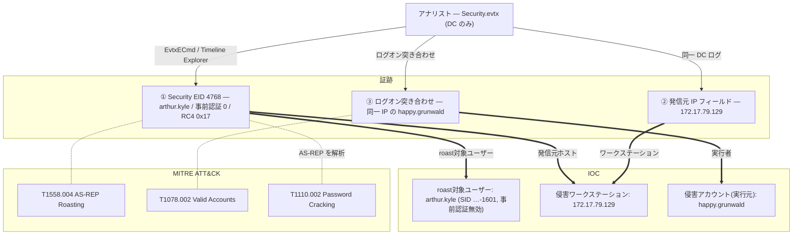

## シナリオ

Campfire-2 は HackTheBox の *Sherlock*(防御・DFIR 系)で難易度 **Easy**。Forela の SOC はドメインに対する **AS-REP Roasting** 攻撃を疑っている。今回渡されるのは**ドメインコントローラのセキュリティログだけ** — 攻撃元ワークステーションのトリアージはない。同じ DC ログだけで、攻撃の確認・roast された標的ユーザーの特定、そして実行に使われた侵害アカウントの特定まで行う。

> *「脅威アクターが Active Directory に対して AS-REP Roasting を行ったと考えている。提供されるのは DC のセキュリティログのみ。いつ攻撃が起きたか、どのアカウントが標的か、どのワークステーションから来たか、そして — ソースホストの証跡なしで — 攻撃者がどのアカウントを使って実行したかを確認せよ。」*

| 項目 | 内容 |
|---------------------------|-------|
| プラットフォーム | HackTheBox — Sherlock |
| カテゴリ | DFIR / Active Directory ログ解析 |
| 難易度 | Easy |
| 証跡 | `Security.evtx`(ドメインコントローラ)のみ |
| 必要スキル | Event ID 4768 トリアージ、AS-REP Roasting 検知、事前認証解析、ログオン突き合わせ |

## 提供される証跡

- `Security.evtx` — **ドメインコントローラ**のセキュリティイベントログで、本ケース唯一の証跡。Kerberos の `4768`(AS-REQ/AS-REP)に加え、攻撃元アカウントを特定するためのログオン(`4624`)・ネットワーク活動を含む。

本ケースは単一ログの突き合わせ演習: `4768` が *何を*(roast されたユーザー)と*どこから*(IP)を、同じ DC 上の周辺ログオンイベントが *誰が*(侵害アカウント)を教える — 攻撃元ワークステーションに一切触れずに。

## 使用ツール

- **EvtxECmd**(Eric Zimmerman)→ CSV →**Timeline Explorer** で `Security.evtx` を閲覧
- 自作の **EVTX ダッシュボード**(私自身の DFIR トリアージ UI) — 4768 の高速フィルタとフィールド確認に使用(以下のスクショ)
- 代替に **Windows イベントビューア**(XPath フィルタ)

```powershell
# Security ログ -> CSV (Timeline Explorer 用)
EvtxECmd.exe -f Security.evtx --csv . --csvf security.csv
```

<svg width="15" height="15" viewBox="0 0 24 24" fill="none" stroke="currentColor" stroke-width="2.2" stroke-linecap="round" stroke-linejoin="round" style="vertical-align:-2px;"><path d="M9 18h6"/><path d="M10 22h4"/><path d="M15.1 14c.2-1 .7-1.7 1.4-2.5A4.6 4.6 0 0 0 18 8 6 6 0 0 0 6 8c0 1 .2 2.2 1.5 3.5.7.8 1.2 1.5 1.4 2.5"/></svg> **解説** — AS-REP Roasting はちょうど1つのイベントに痕跡を残す: DC は標的ユーザーの **TGT 要求**として Event ID **4768** を記録するが、その**事前認証タイプ(Pre-Authentication Type)が 0** — つまりそのアカウントは Kerberos 事前認証を要求しない。この1フィールドこそが、通常のログオンと「roast 可能なアカウントが収穫された」事象を分ける。

## 前提: AS-REP Roasting と Kerberoasting の違い

AS-REP Roasting は **「Kerberos 事前認証を必要としない」**(`UF_DONT_REQUIRE_PREAUTH`)が設定されたアカウントを悪用する。通常 DC は TGT 発行前に暗号化タイムスタンプ(事前認証)を要求するが、事前認証が無効だと*誰でも*そのユーザーの AS-REP を要求でき、その中にユーザーのパスワード鍵で暗号化された素材が含まれる — オフラインで割れる。Kerberoasting と違い**事前の認証が不要**なため、最初の足がかりの手口にもなり得る。

| シグナル | 何か | ここでの重要性 |
|---|---|---|
| Event ID `4768` | Kerberos 認証チケット(TGT / AS-REP)要求 | AS-REP Roasting の DC 側中核シグナル |
| `PreAuthType 0` | Kerberos 事前認証**なし** | 指紋 — roast 可能アカウントが収穫されている |
| `TicketEncryptionType 0x17` | RC4-HMAC | 攻撃者は AES より遥かに速く割れる RC4 を強制する |
| `IpAddress` | AS-REQ の発信元 | 攻撃元ワークステーションを特定 |
| `4624` / ネットワークログオン | そのワークステーションで誰が活動していたか | 実行に使われた侵害アカウントを特定 |

| 手口 | DC イベント | 事前認証 | チケット | 事前の資格情報 |
|---|---|---|---|---|
| **AS-REP Roasting** | `4768`(TGT) | **タイプ 0**(無効) | AS-REP | **不要** |
| Kerberoasting | `4769`(TGS) | 該当なし | TGS-REP | 必要(任意のドメインユーザー) |

## 調査

<h2 id="q1" style="background:rgba(255,159,67,.16);border-left:5px solid #ff9f43;border-radius:6px;padding:.5rem .85rem;margin:2.5rem 0 1rem;">Q1. When did the AS-REP Roasting attack occur, and when did the attacker request the Kerberos ticket for the vulnerable user? (UTC)</h2>

`Security.evtx` を **Event ID 4768** で絞り込み、**事前認証タイプ = 0** かつ **チケット暗号化タイプ = 0x17**(RC4)の要求だけ残す。一致するユーザーアカウントはちょうど1つ — それが roast。その `4768` のタイムスタンプが、攻撃者が脆弱なユーザーの AS-REP を要求した瞬間そのものだ。

<svg width="15" height="15" viewBox="0 0 24 24" fill="none" stroke="currentColor" stroke-width="2.2" stroke-linecap="round" stroke-linejoin="round" style="vertical-align:-2px;"><path d="M21.8 10A10 10 0 1 1 17 3.3"/><path d="m9 11 3 3L22 4"/></svg> **答え**

```text
2024-05-29 06:36:40
```


<svg width="15" height="15" viewBox="0 0 24 24" fill="none" stroke="currentColor" stroke-width="2.2" stroke-linecap="round" stroke-linejoin="round" style="vertical-align:-2px;"><path d="M9 18h6"/><path d="M10 22h4"/><path d="M15.1 14c.2-1 .7-1.7 1.4-2.5A4.6 4.6 0 0 0 18 8 6 6 0 0 0 6 8c0 1 .2 2.2 1.5 3.5.7.8 1.2 1.5 1.4 2.5"/></svg> **解説** — AS-REP Roasting では AS-REQ と攻撃そのものが同一行為だ: チケットを要求すること自体が割れるハッシュの収穫になる。だからこの1つの `4768` タイムスタンプが設問の両方に答える。`PreAuthType 0` と RC4(`0x17`)の併存が、これが通常ログオンではなく roast である裏付けになる。(MITRE ATT&CK **T1558.004 — AS-REP Roasting**)

<h2 id="q2" style="background:rgba(255,159,67,.16);border-left:5px solid #ff9f43;border-radius:6px;padding:.5rem .85rem;margin:2.5rem 0 1rem;">Q2. Please confirm the user account that was targeted by the attacker.</h2>

一致した `4768` イベントの `TargetUserName` を読む — 事前認証が無効化され、AS-REP を収穫されたアカウントだ。

<svg width="15" height="15" viewBox="0 0 24 24" fill="none" stroke="currentColor" stroke-width="2.2" stroke-linecap="round" stroke-linejoin="round" style="vertical-align:-2px;"><path d="M21.8 10A10 10 0 1 1 17 3.3"/><path d="m9 11 3 3L22 4"/></svg> **答え**

```text
arthur.kyle
```


<svg width="15" height="15" viewBox="0 0 24 24" fill="none" stroke="currentColor" stroke-width="2.2" stroke-linecap="round" stroke-linejoin="round" style="vertical-align:-2px;"><path d="M9 18h6"/><path d="M10 22h4"/><path d="M15.1 14c.2-1 .7-1.7 1.4-2.5A4.6 4.6 0 0 0 18 8 6 6 0 0 0 6 8c0 1 .2 2.2 1.5 3.5.7.8 1.2 1.5 1.4 2.5"/></svg> **解説** — 標的アカウントは危険な `DONT_REQ_PREAUTH` フラグを持つ者。`arthur.kyle` のパスワードハッシュはオフライン解析に晒されたので、最初にリセット・監査すべき対象 — そしてドメイン全体で他にも事前認証無効のユーザーがいないか探す合図でもある。

<h2 id="q3" style="background:rgba(255,159,67,.16);border-left:5px solid #ff9f43;border-radius:6px;padding:.5rem .85rem;margin:2.5rem 0 1rem;">Q3. What was the SID of the account?</h2>

同じ `4768` イベントの生データから `TargetSid` フィールドを読む。

<svg width="15" height="15" viewBox="0 0 24 24" fill="none" stroke="currentColor" stroke-width="2.2" stroke-linecap="round" stroke-linejoin="round" style="vertical-align:-2px;"><path d="M21.8 10A10 10 0 1 1 17 3.3"/><path d="m9 11 3 3L22 4"/></svg> **答え**

```text
S-1-5-21-3239415629-1862073780-2394361899-1601
```


<svg width="15" height="15" viewBox="0 0 24 24" fill="none" stroke="currentColor" stroke-width="2.2" stroke-linecap="round" stroke-linejoin="round" style="vertical-align:-2px;"><path d="M9 18h6"/><path d="M10 22h4"/><path d="M15.1 14c.2-1 .7-1.7 1.4-2.5A4.6 4.6 0 0 0 18 8 6 6 0 0 0 6 8c0 1 .2 2.2 1.5 3.5.7.8 1.2 1.5 1.4 2.5"/></svg> **解説** — SID はアカウントが後で改名されても principal を一意に特定する。記録しておけば、表示名ではなく SID しか現れない他のログやシステム(サービス/タスクのコンテキストなど)でも、脅威ハンティングチームが確実に横断追跡できる。

<h2 id="q4" style="background:rgba(255,159,67,.16);border-left:5px solid #ff9f43;border-radius:6px;padding:.5rem .85rem;margin:2.5rem 0 1rem;">Q4. List the internal IP address of the compromised asset.</h2>

同じ `4768` イベントの `IpAddress` フィールドを読む(IPv6 マップ接頭辞 `::ffff:` があれば除く)。AS-REP 要求が発信されたワークステーションだ。

<svg width="15" height="15" viewBox="0 0 24 24" fill="none" stroke="currentColor" stroke-width="2.2" stroke-linecap="round" stroke-linejoin="round" style="vertical-align:-2px;"><path d="M21.8 10A10 10 0 1 1 17 3.3"/><path d="m9 11 3 3L22 4"/></svg> **答え**

```text
172.17.79.129
```


<svg width="15" height="15" viewBox="0 0 24 24" fill="none" stroke="currentColor" stroke-width="2.2" stroke-linecap="round" stroke-linejoin="round" style="vertical-align:-2px;"><path d="M9 18h6"/><path d="M10 22h4"/><path d="M15.1 14c.2-1 .7-1.7 1.4-2.5A4.6 4.6 0 0 0 18 8 6 6 0 0 0 6 8c0 1 .2 2.2 1.5 3.5.7.8 1.2 1.5 1.4 2.5"/></svg> **解説** — ソースホストのトリアージが無くても、DC は全チケット要求の発信元 *どこから* を記録している。`172.17.79.129` へ展開できることが、「アカウントが roast された」を「この資産から来た」に変え、隔離・調査すべき具体的なマシンを脅威ハンティングチームに与える。

<h2 id="q5" style="background:rgba(255,159,67,.16);border-left:5px solid #ff9f43;border-radius:6px;padding:.5rem .85rem;margin:2.5rem 0 1rem;">Q5. Using the same DC security logs, which user account was used to perform the AS-REP Roasting attack?</h2>

ここがひねりだ: AS-REP Roasting 自体は*認証不要*なので、`4768` は攻撃者を名指ししない。だが攻撃は `172.17.79.129` 上のログオン済みセッションから実行された。`06:36:40` 前後の**同じ IP からのログオン・Kerberos 活動**へ展開する — そのワークステーションで実際に認証していたアカウントが、攻撃者の使った侵害アカウントだ。

<svg width="15" height="15" viewBox="0 0 24 24" fill="none" stroke="currentColor" stroke-width="2.2" stroke-linecap="round" stroke-linejoin="round" style="vertical-align:-2px;"><path d="M21.8 10A10 10 0 1 1 17 3.3"/><path d="m9 11 3 3L22 4"/></svg> **答え**

```text
happy.grunwald
```


<svg width="15" height="15" viewBox="0 0 24 24" fill="none" stroke="currentColor" stroke-width="2.2" stroke-linecap="round" stroke-linejoin="round" style="vertical-align:-2px;"><path d="M9 18h6"/><path d="M10 22h4"/><path d="M15.1 14c.2-1 .7-1.7 1.4-2.5A4.6 4.6 0 0 0 18 8 6 6 0 0 0 6 8c0 1 .2 2.2 1.5 3.5.7.8 1.2 1.5 1.4 2.5"/></svg> **解説** — これが Campfire-2 の核心の DFIR 教訓だ: roast は認証しないので、*文脈で*帰属させる。匿名に見える `4768` を記録したのと同じ DC ログが、まさに同一 IP から `happy.grunwald` がログオンし操作していたことも記録している — だからソースホストの証跡ゼロでも、roast を起動した侵害アカウントは `happy.grunwald` だ。(MITRE ATT&CK **T1078.002 — Valid Accounts: Domain Accounts**)

## 攻撃タイムライン

| 時刻 (UTC) | 段階 | 証跡 |
|---|---|---|
| 2024-05-29 ~06:36 | 正規アカウント悪用 | `happy.grunwald` が `172.17.79.129` で活動 — DC ログオン/Kerberos イベント |
| 2024-05-29 06:36:40 | 資格情報アクセス | `arthur.kyle` の AS-REP 要求、事前認証 `0` + RC4 `0x17`、発信元 `172.17.79.129` — **EID 4768** |
| (オフライン) | 資格情報アクセス | AS-REP ハッシュをオフライン解析 → `arthur.kyle` のパスワード |



## 検知と防御(ブルーチーム)

これを早期に捕まえるには:

- **Event ID 4768 で事前認証タイプ 0** のユーザーアカウント要求にアラート — 事前認証はほぼ無効にすべきでないため、そうした TGT 要求は AS-REP Roasting の高シグナル。
- ドメイン全体で **`DONT_REQ_PREAUTH` を監査・除去**(`Get-ADUser -Filter {DoesNotRequirePreAuth -eq $true}`) — 正当な理由はほぼない。
- **Kerberos の RC4 を無効化**し AES を強制 — 収穫された AS-REP の解析を遥かに困難(または不可能)にする。
- 事前認証を無効のまま*残さざるを得ない*アカウントには**長く強固なパスワード**を強制 — オフライン解析こそ攻撃の本質。
- 本チャレンジのように、エンドポイント証跡が無くても **`4768`/`4624` の発信元 IP を突き合わせ**て roast を侵害アカウントに帰属させる。

## まとめ・学んだこと

- DC 上の AS-REP Roasting の指紋は **EID 4768 + 事前認証タイプ 0 + RC4(0x17)** のユーザーアカウント — `4769` なし・事前認証なし・事前の資格情報なし。
- DC ログ*だけ*でも全体像を復元できる: roast 対象ユーザー(`arthur.kyle`)、その SID、攻撃元ワークステーション(`172.17.79.129`)、そして — ログオンの突き合わせで — 実行した侵害アカウント(`happy.grunwald`)。
- 防御側は事前認証の例外を除去し、RC4 を排し、`PreAuthType 0` にアラートを張ることで勝つ。

## 参考文献

- HackTheBox Sherlock: Campfire-2 — <https://app.hackthebox.com/sherlocks>
- Microsoft — 4768(S, F): A Kerberos authentication ticket (TGT) was requested — <https://learn.microsoft.com/windows/security/threat-protection/auditing/event-4768>
- Eric Zimmerman's Tools (EvtxECmd / Timeline Explorer) — <https://ericzimmerman.github.io/>
- MITRE ATT&CK: T1558.004 (AS-REP Roasting), T1078.002 (Valid Accounts: Domain Accounts), T1110.002 (Password Cracking)
