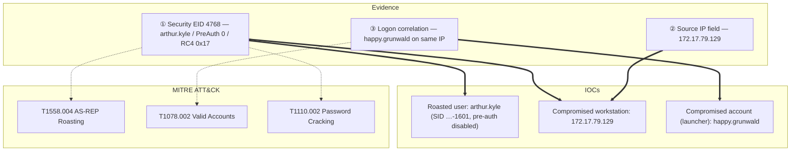

## Scenario

Campfire-2 is an **Easy** HackTheBox *Sherlock* (defensive / DFIR challenge). The Forela SOC suspects an **AS-REP Roasting** attack against the domain. This time you are given **only the Domain Controller security log** — no triage from the source workstation — and must confirm the attack, identify the roasted user, and then attribute the compromised account that performed it using the same DC log.

> *"We believe a threat actor performed an AS-REP Roasting attack against our Active Directory. You are provided with the Domain Controller security logs only. Confirm when the attack happened, which account was targeted, the workstation it came from, and — without any source-host artifacts — which account the attacker used to run the attack."*

| Field | Value |
|---------------------------|-------|
| Platform | HackTheBox — Sherlock |
| Category | DFIR / Active Directory log analysis |
| Difficulty | Easy |
| Artifacts | `Security.evtx` (Domain Controller) only |
| Skills | Event ID 4768 triage, AS-REP Roasting detection, pre-auth analysis, logon correlation |

## Artifacts

- `Security.evtx` — the **Domain Controller** security event log, and the *only* evidence in this case. It holds the Kerberos `4768` AS-REQ/AS-REP records, plus the logon (`4624`) and network activity that let you attribute the source account.

The whole case is a single-log correlation exercise: the `4768` tells you *what* (a roasted user) and *from where* (an IP); the surrounding logon events on that same DC tell you *who* (the compromised account) — all without ever touching the source workstation.

## Toolkit

- **EvtxECmd** (Eric Zimmerman) → CSV → **Timeline Explorer** for `Security.evtx`
- A custom **EVTX dashboard** (my own DFIR triage UI) for fast 4768 filtering and field inspection — shown in the screenshots below
- **Windows Event Viewer** (native) as a fallback with XPath filters

```powershell
# Security log -> CSV for Timeline Explorer
EvtxECmd.exe -f Security.evtx --csv . --csvf security.csv
```

<svg width="15" height="15" viewBox="0 0 24 24" fill="none" stroke="currentColor" stroke-width="2.2" stroke-linecap="round" stroke-linejoin="round" style="vertical-align:-2px;"><path d="M9 18h6"/><path d="M10 22h4"/><path d="M15.1 14c.2-1 .7-1.7 1.4-2.5A4.6 4.6 0 0 0 18 8 6 6 0 0 0 6 8c0 1 .2 2.2 1.5 3.5.7.8 1.2 1.5 1.4 2.5"/></svg> **Analysis** — AS-REP Roasting leaves its mark in exactly one event: the Domain Controller logs an Event ID **4768** (Kerberos TGT requested) for the targeted user — but with **Pre-Authentication Type 0**, meaning the account does not require Kerberos pre-auth. That single field is what separates a normal logon from a roastable account being harvested.

## Background: AS-REP Roasting vs Kerberoasting

AS-REP Roasting abuses accounts that have **"Do not require Kerberos pre-authentication"** set (`UF_DONT_REQUIRE_PREAUTH`). Normally the DC demands an encrypted timestamp (pre-auth) before issuing a TGT; with pre-auth disabled, *anyone* can ask for that user's AS-REP, which contains material encrypted with the user's password key — crackable offline. Unlike Kerberoasting, **no prior authentication is required**, which is why it can be the very first foothold technique.

| Signal | What it is | Why it matters here |
|---|---|---|
| Event ID `4768` | Kerberos authentication ticket (TGT / AS-REP) requested | the core DC-side signal for AS-REP Roasting |
| `PreAuthType 0` | **no** Kerberos pre-authentication | the fingerprint — a roastable account being harvested |
| `TicketEncryptionType 0x17` | RC4-HMAC | attacker forces RC4 because it cracks far faster than AES |
| `IpAddress` | source of the AS-REQ | identifies the attacker workstation |
| `4624` / network logons | who was active on that workstation | attributes the compromised account used to launch the attack |

| Technique | DC event | Pre-auth | Ticket | Needs prior creds? |
|---|---|---|---|---|
| **AS-REP Roasting** | `4768` (TGT) | **type 0** (disabled) | AS-REP | **No** |
| Kerberoasting | `4769` (TGS) | n/a | TGS-REP | Yes (any domain user) |

## Investigation

<h2 id="q1" style="background:rgba(255,159,67,.16);border-left:5px solid #ff9f43;border-radius:6px;padding:.5rem .85rem;margin:2.5rem 0 1rem;">Q1. When did the AS-REP Roasting attack occur, and when did the attacker request the Kerberos ticket for the vulnerable user? (UTC)</h2>

Filter `Security.evtx` on **Event ID 4768**, then keep only the request where **Pre-Authentication Type = 0** and **Ticket Encryption Type = 0x17** (RC4). Exactly one user account matches — the roast. The timestamp of that `4768` *is* the moment the attacker requested the AS-REP for the vulnerable user.

<svg width="15" height="15" viewBox="0 0 24 24" fill="none" stroke="currentColor" stroke-width="2.2" stroke-linecap="round" stroke-linejoin="round" style="vertical-align:-2px;"><path d="M21.8 10A10 10 0 1 1 17 3.3"/><path d="m9 11 3 3L22 4"/></svg> **Answer**

```text
2024-05-29 06:36:40
```


<svg width="15" height="15" viewBox="0 0 24 24" fill="none" stroke="currentColor" stroke-width="2.2" stroke-linecap="round" stroke-linejoin="round" style="vertical-align:-2px;"><path d="M9 18h6"/><path d="M10 22h4"/><path d="M15.1 14c.2-1 .7-1.7 1.4-2.5A4.6 4.6 0 0 0 18 8 6 6 0 0 0 6 8c0 1 .2 2.2 1.5 3.5.7.8 1.2 1.5 1.4 2.5"/></svg> **Analysis** — For AS-REP Roasting, the AS-REQ and the attack are the same act: requesting the ticket *is* harvesting the crackable hash. So this one `4768` timestamp answers both halves of the question. The presence of `PreAuthType 0` with RC4 (`0x17`) confirms it is a roast and not a normal logon. (MITRE ATT&CK **T1558.004 — AS-REP Roasting**.)

<h2 id="q2" style="background:rgba(255,159,67,.16);border-left:5px solid #ff9f43;border-radius:6px;padding:.5rem .85rem;margin:2.5rem 0 1rem;">Q2. Please confirm the user account that was targeted by the attacker.</h2>

Read the `TargetUserName` of that matching `4768` event — the account whose pre-authentication was disabled and whose AS-REP was harvested.

<svg width="15" height="15" viewBox="0 0 24 24" fill="none" stroke="currentColor" stroke-width="2.2" stroke-linecap="round" stroke-linejoin="round" style="vertical-align:-2px;"><path d="M21.8 10A10 10 0 1 1 17 3.3"/><path d="m9 11 3 3L22 4"/></svg> **Answer**

```text
arthur.kyle
```


<svg width="15" height="15" viewBox="0 0 24 24" fill="none" stroke="currentColor" stroke-width="2.2" stroke-linecap="round" stroke-linejoin="round" style="vertical-align:-2px;"><path d="M9 18h6"/><path d="M10 22h4"/><path d="M15.1 14c.2-1 .7-1.7 1.4-2.5A4.6 4.6 0 0 0 18 8 6 6 0 0 0 6 8c0 1 .2 2.2 1.5 3.5.7.8 1.2 1.5 1.4 2.5"/></svg> **Analysis** — The targeted account is the one with the dangerous `DONT_REQ_PREAUTH` flag. `arthur.kyle`'s password hash is now exposed to offline cracking, so it is the first account to reset and audit — and a reminder to hunt the whole domain for any other pre-auth-disabled users.

<h2 id="q3" style="background:rgba(255,159,67,.16);border-left:5px solid #ff9f43;border-radius:6px;padding:.5rem .85rem;margin:2.5rem 0 1rem;">Q3. What was the SID of the account?</h2>

Read the `TargetSid` field from the raw event data of the same `4768` event.

<svg width="15" height="15" viewBox="0 0 24 24" fill="none" stroke="currentColor" stroke-width="2.2" stroke-linecap="round" stroke-linejoin="round" style="vertical-align:-2px;"><path d="M21.8 10A10 10 0 1 1 17 3.3"/><path d="m9 11 3 3L22 4"/></svg> **Answer**

```text
S-1-5-21-3239415629-1862073780-2394361899-1601
```


<svg width="15" height="15" viewBox="0 0 24 24" fill="none" stroke="currentColor" stroke-width="2.2" stroke-linecap="round" stroke-linejoin="round" style="vertical-align:-2px;"><path d="M9 18h6"/><path d="M10 22h4"/><path d="M15.1 14c.2-1 .7-1.7 1.4-2.5A4.6 4.6 0 0 0 18 8 6 6 0 0 0 6 8c0 1 .2 2.2 1.5 3.5.7.8 1.2 1.5 1.4 2.5"/></svg> **Analysis** — The SID uniquely identifies the principal even if the account is later renamed. Recording it lets the threat-hunting team pivot reliably across other logs and systems where only SIDs (not display names) appear — for example service or scheduled-task contexts.

<h2 id="q4" style="background:rgba(255,159,67,.16);border-left:5px solid #ff9f43;border-radius:6px;padding:.5rem .85rem;margin:2.5rem 0 1rem;">Q4. List the internal IP address of the compromised asset.</h2>

Read the `IpAddress` field of the same `4768` event (strip the IPv6-mapped prefix `::ffff:` if present). This is the workstation the AS-REP request originated from.

<svg width="15" height="15" viewBox="0 0 24 24" fill="none" stroke="currentColor" stroke-width="2.2" stroke-linecap="round" stroke-linejoin="round" style="vertical-align:-2px;"><path d="M21.8 10A10 10 0 1 1 17 3.3"/><path d="m9 11 3 3L22 4"/></svg> **Answer**

```text
172.17.79.129
```


<svg width="15" height="15" viewBox="0 0 24 24" fill="none" stroke="currentColor" stroke-width="2.2" stroke-linecap="round" stroke-linejoin="round" style="vertical-align:-2px;"><path d="M9 18h6"/><path d="M10 22h4"/><path d="M15.1 14c.2-1 .7-1.7 1.4-2.5A4.6 4.6 0 0 0 18 8 6 6 0 0 0 6 8c0 1 .2 2.2 1.5 3.5.7.8 1.2 1.5 1.4 2.5"/></svg> **Analysis** — Even though we have no triage from the source host, the DC still records *where* every ticket request came from. Pivoting to `172.17.79.129` is what turns "an account was roasted" into "it came from this asset," giving the threat-hunting team a concrete machine to isolate and investigate.

<h2 id="q5" style="background:rgba(255,159,67,.16);border-left:5px solid #ff9f43;border-radius:6px;padding:.5rem .85rem;margin:2.5rem 0 1rem;">Q5. Using the same DC security logs, which user account was used to perform the AS-REP Roasting attack?</h2>

This is the twist: AS-REP Roasting itself needs *no* authentication, so the `4768` doesn't name the attacker. But the attack ran from a logged-on session on `172.17.79.129`. Pivot to the **logon and Kerberos activity from that same IP** around `06:36:40` — the account actively authenticated on that workstation is the compromised one the attacker used.

<svg width="15" height="15" viewBox="0 0 24 24" fill="none" stroke="currentColor" stroke-width="2.2" stroke-linecap="round" stroke-linejoin="round" style="vertical-align:-2px;"><path d="M21.8 10A10 10 0 1 1 17 3.3"/><path d="m9 11 3 3L22 4"/></svg> **Answer**

```text
happy.grunwald
```


<svg width="15" height="15" viewBox="0 0 24 24" fill="none" stroke="currentColor" stroke-width="2.2" stroke-linecap="round" stroke-linejoin="round" style="vertical-align:-2px;"><path d="M9 18h6"/><path d="M10 22h4"/><path d="M15.1 14c.2-1 .7-1.7 1.4-2.5A4.6 4.6 0 0 0 18 8 6 6 0 0 0 6 8c0 1 .2 2.2 1.5 3.5.7.8 1.2 1.5 1.4 2.5"/></svg> **Analysis** — This is the core DFIR lesson of Campfire-2: a roast doesn't authenticate, so you attribute it *by context*. The same DC log that recorded the anonymous-looking `4768` also recorded `happy.grunwald` logging on and operating from the very same IP — so the compromised account that launched the roast is `happy.grunwald`, even with zero source-host artifacts. (MITRE ATT&CK **T1078.002 — Valid Accounts: Domain Accounts**.)

## Attack Timeline

| Time (UTC) | Stage | Evidence |
|---|---|---|
| 2024-05-29 ~06:36 | Valid Accounts | `happy.grunwald` active on `172.17.79.129` — DC logon/Kerberos events |
| 2024-05-29 06:36:40 | Credential Access | AS-REP requested for `arthur.kyle`, PreAuth `0` + RC4 `0x17`, from `172.17.79.129` — **EID 4768** |
| (offline) | Credential Access | AS-REP hash cracked offline → `arthur.kyle` password |



## Detection & Hardening (Blue Team)

What would have caught this earlier:

- **Alert on Event ID 4768 with `Pre-Authentication Type 0`** for user accounts — pre-auth should almost never be disabled, so any such TGT request is high-signal AS-REP Roasting.
- **Audit and remove `DONT_REQ_PREAUTH`** across the domain (`Get-ADUser -Filter {DoesNotRequirePreAuth -eq $true}`) — there is rarely a legitimate reason for it.
- **Disable RC4 for Kerberos** and enforce AES, so a harvested AS-REP is far harder (or impossible) to crack.
- **Enforce strong, long passwords** on any account that *must* keep pre-auth disabled — offline cracking is the whole point of the attack.
- **Correlate `4768`/`4624` source IPs** to attribute roasts to a compromised account even without endpoint artifacts, exactly as in this challenge.

## Key Takeaways

- The AS-REP Roasting fingerprint on a DC is **EID 4768 + Pre-Auth Type 0 + RC4 (0x17)** for a user account — no `4769`, no pre-auth, no prior creds needed.
- With *only* the DC log you can still recover the full story: the roasted user (`arthur.kyle`), its SID, the source workstation (`172.17.79.129`), and — by correlating logons — the compromised account that launched it (`happy.grunwald`).
- Defenders win by removing pre-auth exceptions, killing RC4, and alerting on `PreAuthType 0`.

## References

- HackTheBox Sherlock: Campfire-2 — <https://app.hackthebox.com/sherlocks>
- Microsoft — 4768(S, F): A Kerberos authentication ticket (TGT) was requested — <https://learn.microsoft.com/windows/security/threat-protection/auditing/event-4768>
- Eric Zimmerman's Tools (EvtxECmd / Timeline Explorer) — <https://ericzimmerman.github.io/>
- MITRE ATT&CK: T1558.004 (AS-REP Roasting), T1078.002 (Valid Accounts: Domain Accounts), T1110.002 (Password Cracking)
