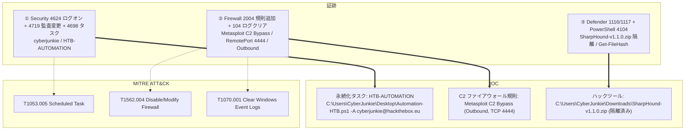

## シナリオ

LogJammer は HackTheBox の *Sherlock*(防御・DFIR 系)で難易度 **Easy**。1台の Windows ワークステーション `DESKTOP-887GK2L` を、**cyberjunkie** というアカウントが使い、足跡を消そうとする前に一連の不審な操作を行った。渡されるのはこのホストからエクスポートされた Windows イベントログで、その全シーケンスを復元する: ユーザーが最初にログオンしたのはいつか、どんなファイアウォール規則を仕込んだか、どの監査ポリシーを改竄したか、作成したスケジュールタスク、アンチウイルスに捕まったハックツール、実行した PowerShell、そして — 最後に — どのログを消したか。

> *「cyberjunkie というユーザーがワークステーション `DESKTOP-887GK2L` 上で複数の悪意ある操作を行った。提供される Windows イベントログから彼の行動を復元せよ: 初回ログオン、ファイアウォールと監査ポリシーの改竄、スケジュールタスク、アンチウイルス検知、PowerShell 実行、そしてログ消去の試み。」*

| 項目 | 内容 |
|---------------------------|-------|
| プラットフォーム | HackTheBox — Sherlock |
| カテゴリ | DFIR / Windows イベントログ解析 |
| 難易度 | Easy |
| 証跡 | `Security.evtx`, `System.evtx`, `Powershell-Operational.evtx`, `Windows Defender-Operational.evtx`, `Windows Firewall-Firewall.evtx` |
| 必要スキル | 複数チャネルの EVTX トリアージ、Event ID マッピング、タイムゾーン正規化、ATT&CK マッピング |

## 提供される証跡

本ケースは*複数チャネル*の演習だ — 答えは設問ごとに別々の Windows イベントログチャネルにあり、肝はどの `.evtx` のどの Event ID がどの操作を記録するかを知ること:

- `Security.evtx` — 対話的ログオン(`4624`)、監査ポリシー変更(`4719`)、スケジュールタスク作成(`4698`)。
- `Windows Firewall-Firewall.evtx`(`Microsoft-Windows-Windows Firewall With Advanced Security/Firewall`) — ファイアウォール規則追加(`2004`)、および**ログクリア**マーカー(`104`)。
- `Windows Defender-Operational.evtx`(`Microsoft-Windows-Windows Defender/Operational`) — マルウェア検知(`1116`)と修復アクション(`1117`)。
- `Powershell-Operational.evtx`(`Microsoft-Windows-PowerShell/Operational`) — ScriptBlock ログ(`4104`)。
- `System.evtx` — ホスト/システムの補助コンテキスト。

アナリストは各チャネルを CSV タイムライン(`.evtx` ごとに1ファイル)へもエクスポートし、並べてソート・フィルタ・検索できるようにしている。

## 使用ツール

- **EvtxECmd**(Eric Zimmerman)→ CSV →**Timeline Explorer** で各 `.evtx` チャネルを閲覧
- 自作の **EVTX ダッシュボード / CSV タイムライン**(私自身の DFIR トリアージ手順) — チャネル横断の高速フィルタとフィールド確認に使用(以下のスクショ)
- 代替に **Windows イベントビューア**(Event ID ごとの XPath フィルタ)
- **CyberChef** の *Translate DateTime Format* でローカル時刻を UTC へ正規化

```powershell
# 各チャネルを CSV へ変換 (Timeline Explorer 用)
EvtxECmd.exe -f "Security.evtx" --csv . --csvf security.csv
EvtxECmd.exe -f "Windows Firewall-Firewall.evtx" --csv . --csvf firewall.csv
EvtxECmd.exe -f "Windows Defender-Operational.evtx" --csv . --csvf defender.csv
EvtxECmd.exe -f "Powershell-Operational.evtx" --csv . --csvf powershell.csv

# あるいは単一 Event ID を EVTX から直接抽出 (Get-WinEvent + XPath)
Get-WinEvent -Path "Security.evtx" -FilterXPath "*[System[EventID=4719]]"
Get-WinEvent -Path "Security.evtx" -FilterXPath "*[System[EventID=4698]]"
```

<svg width="15" height="15" viewBox="0 0 24 24" fill="none" stroke="currentColor" stroke-width="2.2" stroke-linecap="round" stroke-linejoin="round" style="vertical-align:-2px;"><path d="M9 18h6"/><path d="M10 22h4"/><path d="M15.1 14c.2-1 .7-1.7 1.4-2.5A4.6 4.6 0 0 0 18 8 6 6 0 0 0 6 8c0 1 .2 2.2 1.5 3.5.7.8 1.2 1.5 1.4 2.5"/></svg> **解説** — Windows のあらゆる操作は*特定の*チャネルと Event ID に指紋を残すので、このチャレンジ全体はルーティング問題だ: ファイアウォール規則は `Security.evtx` に**ない**し、アンチウイルスのアクションは `System.evtx` に**ない**、PowerShell の中身は ScriptBlock ログが有効なときだけ現れる。もう1つの罠: ホストのタイムラインはローカル時刻(ここでは JST、`+09:00`)だが HTB は **UTC** を求める — 答える前に全タイムスタンプを正規化する(`27/03/2023 23:37:09 JST` → `27/03/2023 14:37:09 UTC`)。

## 前提: この物語を語る Event ID たち

| チャネル | Event ID | 何を記録するか | ここでの重要性 |
|---|---|---|---|
| Security | `4624` | ログオン成功(Type 2 = 対話的) | `cyberjunkie` の初回サインイン |
| Windows Firewall | `2004` | ファイアウォール規則が例外リストに**追加**された | 悪性の `Metasploit C2 Bypass` 規則 |
| Security | `4719` | システム監査ポリシーが**変更**された | 攻撃者が弄ったサブカテゴリ |
| Security | `4698` | **スケジュールタスク**が作成された | 永続化タスク `HTB-AUTOMATION` |
| Defender | `1116` / `1117` | マルウェア**検知** / **アクション実施** | SharpHound を検知 → 隔離 |
| PowerShell | `4104` | ScriptBlock ログ — 実際のコマンド文字列 | ユーザーが実行した `Get-FileHash` |
| Windows Firewall | `104` | イベント**ログがクリア**された | アンチフォレンジック / 足跡消去 |

以下で見るファイアウォール規則の数値とフィールドのクイックリファレンス:

| ファイアウォールのフィールド | 観測値 | 意味 |
|---|---|---|
| Event ID `2004` | 規則追加 | (`2005` = 変更, `2006` = 削除, `2003` = プロファイル無効化) |
| `Direction` | `2` | **Outbound**(`1` = Inbound) |
| `Action` | `3` | Allow if secure / IPsec 認証済みのみ許可(`1` = Allow, `2` = Block) |
| `Protocol` | `6` | TCP |
| `RemotePort` | `4444` | 定番の Metasploit/Meterpreter リスナーポート |

## 調査

<h2 id="q1" style="background:rgba(255,159,67,.16);border-left:5px solid #ff9f43;border-radius:6px;padding:.5rem .85rem;margin:2.5rem 0 1rem;">Q1. When did user cyberjunkie successfully log into his computer? (UTC)</h2>

`Security.evtx` を CSV に変換し、**Event ID 4624**(ログオン成功)で絞り込む。`cyberjunkie` の最初の対話的(Type 2)ログオンが答え — ただしタイムラインは JST(`+09:00`)で記録されているので、生の `2023-03-27 23:37:09.879` を CyberChef の *Translate DateTime Format* で UTC へ正規化する必要がある。

<svg width="15" height="15" viewBox="0 0 24 24" fill="none" stroke="currentColor" stroke-width="2.2" stroke-linecap="round" stroke-linejoin="round" style="vertical-align:-2px;"><path d="M21.8 10A10 10 0 1 1 17 3.3"/><path d="m9 11 3 3L22 4"/></svg> **答え**

```text
27/03/2023 14:37:09
```


<svg width="15" height="15" viewBox="0 0 24 24" fill="none" stroke="currentColor" stroke-width="2.2" stroke-linecap="round" stroke-linejoin="round" style="vertical-align:-2px;"><path d="M9 18h6"/><path d="M10 22h4"/><path d="M15.1 14c.2-1 .7-1.7 1.4-2.5A4.6 4.6 0 0 0 18 8 6 6 0 0 0 6 8c0 1 .2 2.2 1.5 3.5.7.8 1.2 1.5 1.4 2.5"/></svg> **解説** — ログオン Type 2 はキーボードでのローカル対話的サインオンを意味し、これはまさに操作を始める前のワークステーション所有者に期待される挙動だ。DFIR で繰り返し罠になるのがタイムゾーン: ホストは JST で書いたので、9時間引くことが「値は正しいが形式違い」の惜しい外しを、受理される UTC の答えに変える。(MITRE ATT&CK **T1078 — Valid Accounts**)

<h2 id="q2" style="background:rgba(255,159,67,.16);border-left:5px solid #ff9f43;border-radius:6px;padding:.5rem .85rem;margin:2.5rem 0 1rem;">Q2. The user tampered with firewall settings on the system. Analyze the firewall event logs to find out the Name of the firewall rule added?</h2>

チャネルを切り替える: ファイアウォールの変更は `Windows Firewall-Firewall.evtx` にあり、Security には**ない**。これを CSV に変換し、**Event ID 2004**(「規則が Windows ファイアウォール例外リストに追加された」)を探す。名前で目立つ規則が1つある。

<svg width="15" height="15" viewBox="0 0 24 24" fill="none" stroke="currentColor" stroke-width="2.2" stroke-linecap="round" stroke-linejoin="round" style="vertical-align:-2px;"><path d="M21.8 10A10 10 0 1 1 17 3.3"/><path d="m9 11 3 3L22 4"/></svg> **答え**

```text
Metasploit C2 Bypass
```


<svg width="15" height="15" viewBox="0 0 24 24" fill="none" stroke="currentColor" stroke-width="2.2" stroke-linecap="round" stroke-linejoin="round" style="vertical-align:-2px;"><path d="M9 18h6"/><path d="M10 22h4"/><path d="M15.1 14c.2-1 .7-1.7 1.4-2.5A4.6 4.6 0 0 0 18 8 6 6 0 0 0 6 8c0 1 .2 2.2 1.5 3.5.7.8 1.2 1.5 1.4 2.5"/></svg> **解説** — 規則名そのものが IOC だ — 「Metasploit C2 Bypass」と名付ける攻撃者は意図を宣言しているに等しい。補助フィールドで疑いの余地はなくなる: `RemotePort 4444` は Metasploit ハンドラの定番ポート、`Protocol 6` は TCP なので、この規則は C2 トラフィック用の egress(外向き)穴を開けている。追加は `mmc.exe`(Windows ファイアウォール MMC スナップイン)経由。(MITRE ATT&CK **T1562.004 — Impair Defenses: Disable or Modify System Firewall**)

<h2 id="q3" style="background:rgba(255,159,67,.16);border-left:5px solid #ff9f43;border-radius:6px;padding:.5rem .85rem;margin:2.5rem 0 1rem;">Q3. What's the direction of the firewall rule?</h2>

同じ `2004` イベントの `Direction` フィールドを読む。Windows ファイアウォールは方向を数値で符号化する。

<svg width="15" height="15" viewBox="0 0 24 24" fill="none" stroke="currentColor" stroke-width="2.2" stroke-linecap="round" stroke-linejoin="round" style="vertical-align:-2px;"><path d="M21.8 10A10 10 0 1 1 17 3.3"/><path d="m9 11 3 3L22 4"/></svg> **答え**

```text
Outbound
```

<svg width="15" height="15" viewBox="0 0 24 24" fill="none" stroke="currentColor" stroke-width="2.2" stroke-linecap="round" stroke-linejoin="round" style="vertical-align:-2px;"><path d="M9 18h6"/><path d="M10 22h4"/><path d="M15.1 14c.2-1 .7-1.7 1.4-2.5A4.6 4.6 0 0 0 18 8 6 6 0 0 0 6 8c0 1 .2 2.2 1.5 3.5.7.8 1.2 1.5 1.4 2.5"/></svg> **解説** — `Direction: 2` は **Outbound**(`1` なら Inbound)を意味する。これが C2 チャネルの典型的サインだ: インバウンドポートを開けて待つのではなく、インプラントが被害者側から*外へ*攻撃者のリスナーに到達する — これは多くの境界インバウンドフィルタをすり抜ける。`RemotePort 4444` と併せれば、これは Meterpreter にコールホームさせるための egress 規則だ。(MITRE ATT&CK **T1071 — Application Layer Protocol**)

<h2 id="q4" style="background:rgba(255,159,67,.16);border-left:5px solid #ff9f43;border-radius:6px;padding:.5rem .85rem;margin:2.5rem 0 1rem;">Q4. The user changed audit policy of the computer. What's the Subcategory of this changed policy?</h2>

`Security.evtx` に戻る。監査ポリシー変更は **Event ID 4719**。その単一イベントを取り出し、変更されたサブカテゴリを読む(`SubcategoryGuid` `0CCE9227-...` が名前付きサブカテゴリに解決される)。

<svg width="15" height="15" viewBox="0 0 24 24" fill="none" stroke="currentColor" stroke-width="2.2" stroke-linecap="round" stroke-linejoin="round" style="vertical-align:-2px;"><path d="M21.8 10A10 10 0 1 1 17 3.3"/><path d="m9 11 3 3L22 4"/></svg> **答え**

```text
Other Object Access Events
```

<svg width="15" height="15" viewBox="0 0 24 24" fill="none" stroke="currentColor" stroke-width="2.2" stroke-linecap="round" stroke-linejoin="round" style="vertical-align:-2px;"><path d="M9 18h6"/><path d="M10 22h4"/><path d="M15.1 14c.2-1 .7-1.7 1.4-2.5A4.6 4.6 0 0 0 18 8 6 6 0 0 0 6 8c0 1 .2 2.2 1.5 3.5.7.8 1.2 1.5 1.4 2.5"/></svg> **解説** — EID 4719 はそれ自体が高価値アラートだ — システム監査ポリシーを正当に変更するのは稀で、攻撃者が特定のテレメトリを盲目化するために行う典型行為そのもの。ここでは `SubcategoryGuid 0CCE9227-69AE-11D9-BED3-505054503030` が **Other Object Access Events** にマップされる。`S-1-5-18`(SYSTEM)が `DESKTOP-887GK2L$` の文脈で変更したという事実は、この変更が昇格された権限を通ったことを示す。(MITRE ATT&CK **T1562.002 — Impair Defenses: Disable Windows Event Logging**)

<h2 id="q5" style="background:rgba(255,159,67,.16);border-left:5px solid #ff9f43;border-radius:6px;padding:.5rem .85rem;margin:2.5rem 0 1rem;">Q5. The user "cyberjunkie" created a scheduled task. What's the name of this task?</h2>

スケジュールタスクの*作成*は `Security.evtx` に **Event ID 4698** として監査される(タスクスケジューラの Operational ログとは別の ID — 検索に注意)。イベントには `TaskName` から始まる完全なタスク XML が埋め込まれている。

<svg width="15" height="15" viewBox="0 0 24 24" fill="none" stroke="currentColor" stroke-width="2.2" stroke-linecap="round" stroke-linejoin="round" style="vertical-align:-2px;"><path d="M21.8 10A10 10 0 1 1 17 3.3"/><path d="m9 11 3 3L22 4"/></svg> **答え**

```text
HTB-AUTOMATION
```

<svg width="15" height="15" viewBox="0 0 24 24" fill="none" stroke="currentColor" stroke-width="2.2" stroke-linecap="round" stroke-linejoin="round" style="vertical-align:-2px;"><path d="M9 18h6"/><path d="M10 22h4"/><path d="M15.1 14c.2-1 .7-1.7 1.4-2.5A4.6 4.6 0 0 0 18 8 6 6 0 0 0 6 8c0 1 .2 2.2 1.5 3.5.7.8 1.2 1.5 1.4 2.5"/></svg> **解説** — EID 4698 はタスク定義全体を XML として Security ログ内に保持するので宝の山だ: 作成者・トリガー・実行プリンシパル・実行コマンドが、後でタスクを削除しても残る。タスク `\HTB-AUTOMATION` は `DESKTOP-887GK2L\CyberJunkie` が作成し、毎日実行され、`<Actions>` ブロックに従って PowerShell スクリプトを起動する。スケジュールタスクは永続化と実行の古典的メカニズムだ。(MITRE ATT&CK **T1053.005 — Scheduled Task/Job: Scheduled Task**)

<h2 id="q6" style="background:rgba(255,159,67,.16);border-left:5px solid #ff9f43;border-radius:6px;padding:.5rem .85rem;margin:2.5rem 0 1rem;">Q6. What's the full path of the file which was scheduled for the task?</h2>

同じ `4698` イベントが運ぶタスク XML 内の `<Command>` 要素を読む。

<svg width="15" height="15" viewBox="0 0 24 24" fill="none" stroke="currentColor" stroke-width="2.2" stroke-linecap="round" stroke-linejoin="round" style="vertical-align:-2px;"><path d="M21.8 10A10 10 0 1 1 17 3.3"/><path d="m9 11 3 3L22 4"/></svg> **答え**

```text
C:\Users\CyberJunkie\Desktop\Automation-HTB.ps1
```

<svg width="15" height="15" viewBox="0 0 24 24" fill="none" stroke="currentColor" stroke-width="2.2" stroke-linecap="round" stroke-linejoin="round" style="vertical-align:-2px;"><path d="M9 18h6"/><path d="M10 22h4"/><path d="M15.1 14c.2-1 .7-1.7 1.4-2.5A4.6 4.6 0 0 0 18 8 6 6 0 0 0 6 8c0 1 .2 2.2 1.5 3.5.7.8 1.2 1.5 1.4 2.5"/></svg> **解説** — タスクはユーザー自身のデスクトップに置かれた PowerShell スクリプトを実行する — 低コストながら、ユーザー権限でスケジュール実行させるのに効果的なやり方だ。パスは監査されたタスク XML に残るので、防御側は `.ps1` が削除された後でも復元でき、ハント・ハッシュ化すべき具体的ファイルを得られる。(MITRE ATT&CK **T1059.001 — Command and Scripting Interpreter: PowerShell**)

<h2 id="q7" style="background:rgba(255,159,67,.16);border-left:5px solid #ff9f43;border-radius:6px;padding:.5rem .85rem;margin:2.5rem 0 1rem;">Q7. What are the arguments of the command?</h2>

同じタスク XML は `<Command>` と `<Arguments>` 要素を対にしている。直接読む。

<svg width="15" height="15" viewBox="0 0 24 24" fill="none" stroke="currentColor" stroke-width="2.2" stroke-linecap="round" stroke-linejoin="round" style="vertical-align:-2px;"><path d="M21.8 10A10 10 0 1 1 17 3.3"/><path d="m9 11 3 3L22 4"/></svg> **答え**

```text
-A cyberjunkie@hackthebox.eu
```

<svg width="15" height="15" viewBox="0 0 24 24" fill="none" stroke="currentColor" stroke-width="2.2" stroke-linecap="round" stroke-linejoin="round" style="vertical-align:-2px;"><path d="M9 18h6"/><path d="M10 22h4"/><path d="M15.1 14c.2-1 .7-1.7 1.4-2.5A4.6 4.6 0 0 0 18 8 6 6 0 0 0 6 8c0 1 .2 2.2 1.5 3.5.7.8 1.2 1.5 1.4 2.5"/></svg> **解説** — `-A cyberjunkie@hackthebox.eu` という引数はタスク定義に逐語的に記録されるので、*何が*動いたかだけでなく*どうパラメータ化されたか*まで分かる。コマンドラインと引数を完全に取得できることが、無害なスケジュールスクリプトと武器化されたそれをハントで見分ける鍵だ — ここの引数はアクター識別子も兼ねている。(MITRE ATT&CK **T1053.005 — Scheduled Task/Job**)

<h2 id="q8" style="background:rgba(255,159,67,.16);border-left:5px solid #ff9f43;border-radius:6px;padding:.5rem .85rem;margin:2.5rem 0 1rem;">Q8. The antivirus running on the system identified a threat and performed actions on it. Which tool was identified as malware by antivirus?</h2>

`Windows Defender-Operational.evtx` へ移る。**Event ID 1116** は Defender の検知で、`Threat` フィールドにマルウェアのファミリ/ツール名が入る。

<svg width="15" height="15" viewBox="0 0 24 24" fill="none" stroke="currentColor" stroke-width="2.2" stroke-linecap="round" stroke-linejoin="round" style="vertical-align:-2px;"><path d="M21.8 10A10 10 0 1 1 17 3.3"/><path d="m9 11 3 3L22 4"/></svg> **答え**

```text
SharpHound
```

<svg width="15" height="15" viewBox="0 0 24 24" fill="none" stroke="currentColor" stroke-width="2.2" stroke-linecap="round" stroke-linejoin="round" style="vertical-align:-2px;"><path d="M9 18h6"/><path d="M10 22h4"/><path d="M15.1 14c.2-1 .7-1.7 1.4-2.5A4.6 4.6 0 0 0 18 8 6 6 0 0 0 6 8c0 1 .2 2.2 1.5 3.5.7.8 1.2 1.5 1.4 2.5"/></svg> **解説** — Defender は `HackTool:PowerShell/SharpHound.B`(Severity High)を、GitHub のリリースアーカイブから取得したものとして検知した。SharpHound は BloodHound の収集器 — その存在は攻撃者が **Active Directory 偵察**(ユーザー・グループ・セッション・ACL を収集して攻撃経路を可視化)を意図したことを示す。スタンドアロンホストでも、AD 偵察ツールの AV 検知は攻撃者の意図を強く示す指標だ。(MITRE ATT&CK **T1087 — Account Discovery**, **T1482 — Domain Trust Discovery**)

<h2 id="q9" style="background:rgba(255,159,67,.16);border-left:5px solid #ff9f43;border-radius:6px;padding:.5rem .85rem;margin:2.5rem 0 1rem;">Q9. What's the full path of the malware which raised the alert?</h2>

同じ `1116` 検知イベントが脅威のディスク上 `Path` を記録している。

<svg width="15" height="15" viewBox="0 0 24 24" fill="none" stroke="currentColor" stroke-width="2.2" stroke-linecap="round" stroke-linejoin="round" style="vertical-align:-2px;"><path d="M21.8 10A10 10 0 1 1 17 3.3"/><path d="m9 11 3 3L22 4"/></svg> **答え**

```text
C:\Users\CyberJunkie\Downloads\SharpHound-v1.1.0.zip
```

<svg width="15" height="15" viewBox="0 0 24 24" fill="none" stroke="currentColor" stroke-width="2.2" stroke-linecap="round" stroke-linejoin="round" style="vertical-align:-2px;"><path d="M9 18h6"/><path d="M10 22h4"/><path d="M15.1 14c.2-1 .7-1.7 1.4-2.5A4.6 4.6 0 0 0 18 8 6 6 0 0 0 6 8c0 1 .2 2.2 1.5 3.5.7.8 1.2 1.5 1.4 2.5"/></svg> **解説** — Defender はアラートを誘発したコンテナ — Downloads フォルダの `SharpHound-v1.1.0.zip` — を名指しし、詳細はそれが `objects.githubusercontent.com` から直接取得されたことを示す。ダウンロードフォルダという出所と `Source Name: Downloads and attachments` フィールドは、横移動ではなく Web/ダウンロード経由の配送を裏付ける。(MITRE ATT&CK **T1105 — Ingress Tool Transfer**)

<h2 id="q10" style="background:rgba(255,159,67,.16);border-left:5px solid #ff9f43;border-radius:6px;padding:.5rem .85rem;margin:2.5rem 0 1rem;">Q10. What action was taken by the antivirus?</h2>

修復の結末は Defender チャネルの **Event ID 1117**(実施されたアクション)にある。アクション名を読む。

<svg width="15" height="15" viewBox="0 0 24 24" fill="none" stroke="currentColor" stroke-width="2.2" stroke-linecap="round" stroke-linejoin="round" style="vertical-align:-2px;"><path d="M21.8 10A10 10 0 1 1 17 3.3"/><path d="m9 11 3 3L22 4"/></svg> **答え**

```text
quarantine
```

<svg width="15" height="15" viewBox="0 0 24 24" fill="none" stroke="currentColor" stroke-width="2.2" stroke-linecap="round" stroke-linejoin="round" style="vertical-align:-2px;"><path d="M9 18h6"/><path d="M10 22h4"/><path d="M15.1 14c.2-1 .7-1.7 1.4-2.5A4.6 4.6 0 0 0 18 8 6 6 0 0 0 6 8c0 1 .2 2.2 1.5 3.5.7.8 1.2 1.5 1.4 2.5"/></svg> **解説** — Defender は単にログするのではなくアーカイブを隔離したので、SharpHound のペイロードは実行される前に無力化された。防御側にとってこれは朗報イベントだが、それでもハントの引き金にはすべきだ — 隔離されたツールは、その特定のコピーが実行されなかったとしても*意図*(AD 列挙)を物語るからだ。(攻撃者が次に AV を回避するために試みるのが MITRE ATT&CK **T1562.001 — Impair Defenses**)

<h2 id="q11" style="background:rgba(255,159,67,.16);border-left:5px solid #ff9f43;border-radius:6px;padding:.5rem .85rem;margin:2.5rem 0 1rem;">Q11. The user used Powershell to execute commands. What command was executed by the user?</h2>

`Powershell-Operational.evtx` に切り替え、実際のコマンド文字列を記録する **Event ID 4104**(ScriptBlock ログ)で絞り込む。`Automation-HTB.ps1` で検索すると該当ブロックが浮かぶ。

<svg width="15" height="15" viewBox="0 0 24 24" fill="none" stroke="currentColor" stroke-width="2.2" stroke-linecap="round" stroke-linejoin="round" style="vertical-align:-2px;"><path d="M21.8 10A10 10 0 1 1 17 3.3"/><path d="m9 11 3 3L22 4"/></svg> **答え**

```text
Get-FileHash -Algorithm md5 .\Desktop\Automation-HTB.ps1
```


<svg width="15" height="15" viewBox="0 0 24 24" fill="none" stroke="currentColor" stroke-width="2.2" stroke-linecap="round" stroke-linejoin="round" style="vertical-align:-2px;"><path d="M9 18h6"/><path d="M10 22h4"/><path d="M15.1 14c.2-1 .7-1.7 1.4-2.5A4.6 4.6 0 0 0 18 8 6 6 0 0 0 6 8c0 1 .2 2.2 1.5 3.5.7.8 1.2 1.5 1.4 2.5"/></svg> **解説** — ScriptBlock ログ(4104)は最も有用な PowerShell フォレンジック源だ。エンジンが実際に実行した*難読化解除済み*のコマンド文字列を捕らえるからで、これが無いと PowerShell が起動したことしか分からず、何をしたかは見えない。ここでユーザーは自分の `Automation-HTB.ps1`(スケジュールタスクに組み込んだのと同じスクリプト)の MD5 を計算しており — おそらく仕込んだペイロードを検証している。(MITRE ATT&CK **T1059.001 — PowerShell**)

<h2 id="q12" style="background:rgba(255,159,67,.16);border-left:5px solid #ff9f43;border-radius:6px;padding:.5rem .85rem;margin:2.5rem 0 1rem;">Q12. We suspect the user deleted some event logs. Which Event log file was cleared?</h2>

ログのクリアは自身のマーカーを書き込む。`Windows Firewall-Firewall.evtx` で **Event ID 104**(「ログファイルがクリアされた」)を探す — イベントにはどのチャネルが消されたかが記録される。

<svg width="15" height="15" viewBox="0 0 24 24" fill="none" stroke="currentColor" stroke-width="2.2" stroke-linecap="round" stroke-linejoin="round" style="vertical-align:-2px;"><path d="M21.8 10A10 10 0 1 1 17 3.3"/><path d="m9 11 3 3L22 4"/></svg> **答え**

```text
Microsoft-Windows-Windows Firewall With Advanced Security/Firewall 
```


<svg width="15" height="15" viewBox="0 0 24 24" fill="none" stroke="currentColor" stroke-width="2.2" stroke-linecap="round" stroke-linejoin="round" style="vertical-align:-2px;"><path d="M9 18h6"/><path d="M10 22h4"/><path d="M15.1 14c.2-1 .7-1.7 1.4-2.5A4.6 4.6 0 0 0 18 8 6 6 0 0 0 6 8c0 1 .2 2.2 1.5 3.5.7.8 1.2 1.5 1.4 2.5"/></svg> **解説** — EID 104(ログクリア)は攻撃者が逃れられないパラドックスだ: ログをクリアすると、クリアを告げる*新しい*イベントが書かれるので、足跡を消す行為が足跡を残す。とりわけ **Firewall** チャネルを消したのが示唆的だ — それは `Metasploit C2 Bypass` 規則を記録したまさにそのログなので、C2 ファイアウォール変更の証拠を狙って破壊しようとした行為だと分かる。(MITRE ATT&CK **T1070.001 — Indicator Removal: Clear Windows Event Logs**)

## 攻撃タイムライン

| 時刻 (UTC) | 段階 | 証跡 |
|---|---|---|
| 2023-03-27 14:37:09 | 初期アクセス / 正規アカウント | `cyberjunkie` 対話的ログオン — **Security 4624** |
| 2023-03-27 14:42:34 | ツール持ち込み | SharpHound-v1.1.0.zip をダウンロード・検知 — **Defender 1116**、隔離 **1117** |
| 2023-03-27 14:44:43 | 防御の弱体化 | アウトバウンド規則 `Metasploit C2 Bypass`(RemotePort 4444)追加 — **Firewall 2004** |
| 2023-03-27 14:50:03 | 防御の弱体化 | 監査ポリシーのサブカテゴリ「Other Object Access Events」変更 — **Security 4719** |
| 2023-03-27 14:51:21 | 永続化 / 実行 | スケジュールタスク `HTB-AUTOMATION` → `Automation-HTB.ps1 -A cyberjunkie@hackthebox.eu` — **Security 4698** |
| 2023-03-27 (PS) | 実行 | `Get-FileHash -Algorithm md5 .\Desktop\Automation-HTB.ps1` — **PowerShell 4104** |
| 2023-03-27 15:01:56 | 防御回避 | Windows ファイアウォールログをクリア — **Firewall 104** |



## 検知と防御(ブルーチーム)

これを早期に捕まえ、隠蔽を難しくするには:

- **Event ID 2004 のファイアウォール規則追加にアラート**、とりわけ高リスクポート(`4444`、`1337` 等)への**アウトバウンド Allow** 規則や、`mmc.exe`/PowerShell が作成した規則。攻撃フレームワーク名を冠した規則は誰かを呼び出すべきだ。
- **Event ID 4719 の監査ポリシー変更にアラート** — 正当な変更は稀なので、すべてをテレメトリ改竄の可能性として扱い、サブカテゴリが無効化されていないか確認する。
- **Event ID 4698(スケジュールタスク作成)を監視**し、ユーザー書込可能パス(`Desktop`、`Downloads`、`AppData`)のスクリプトを指すタスクを警戒する。
- **PowerShell ScriptBlock(4104)とモジュールログを有効に保ち、トランスクリプションも併用** — PowerShell が*実際に何を*実行したかを確実に復元できる唯一の方法だ。
- **全ログをリアルタイムで SIEM に転送**し、**Event ID 104/1102(ログクリア)** にアラートを張る*と同時に*、ローカルコピーが消されても中身が残るようにする — ローカルのファイアウォールログがクリアされても証拠を失わないように。
- **AV のハックツール検知(Defender 1116/1117)は閉じたチケットではなくハントの引き金として扱う** — 隔離された SharpHound でも AD 偵察の意図は明らかになる。

## まとめ・学んだこと

- LogJammer は**ルーティング演習**だ: 各答えは別々のチャネル/Event ID にある — ファイアウォールは `Windows Firewall-Firewall.evtx`(`2004`/`104`)、AV は `Windows Defender-Operational.evtx`(`1116`/`1117`)、PowerShell の中身は `Powershell-Operational.evtx`(`4104`)、ログオン/監査/タスクは `Security.evtx`(`4624`/`4719`/`4698`)。
- **数値のファイアウォールフィールド**を解読し(`Direction 2` = Outbound、`Action 3` = Allow-if-secure、`Protocol 6` = TCP、`RemotePort 4444`)、答える前に**タイムスタンプを UTC に正規化**する(JST `+09:00`)。
- 攻撃者の**足跡消去は自滅的**だ: ファイアウォールログのクリアが Event ID **104** を発火させ、彼の `Metasploit C2 Bypass` 規則を保持していたまさにそのチャネルを名指ししてしまった。

## 参考文献

- HackTheBox Sherlock: LogJammer — <https://app.hackthebox.com/sherlocks>
- Microsoft — 4624(S): An account was successfully logged on — <https://learn.microsoft.com/windows/security/threat-protection/auditing/event-4624>
- Microsoft — 4719(S): System audit policy was changed — <https://learn.microsoft.com/windows/security/threat-protection/auditing/event-4719>
- Microsoft — 4698(S): A scheduled task was created — <https://learn.microsoft.com/windows/security/threat-protection/auditing/event-4698>
- Microsoft — About PowerShell ScriptBlock logging (4104) — <https://learn.microsoft.com/powershell/module/microsoft.powershell.core/about/about_logging_windows>
- Eric Zimmerman's Tools (EvtxECmd / Timeline Explorer) — <https://ericzimmerman.github.io/>
- MITRE ATT&CK: T1053.005 (Scheduled Task), T1562.004 (Disable/Modify System Firewall), T1070.001 (Clear Windows Event Logs), T1059.001 (PowerShell), T1087 (Account Discovery)
