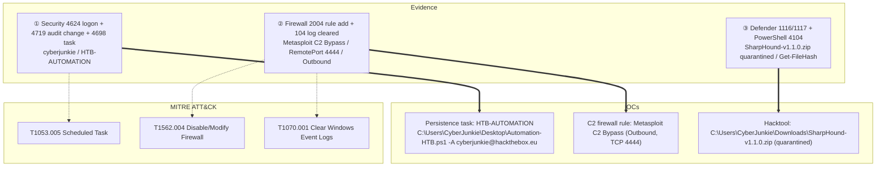

## Scenario

LogJammer is an **Easy** HackTheBox *Sherlock* (defensive / DFIR challenge). A single Windows workstation, `DESKTOP-887GK2L`, was used by an account named **cyberjunkie** who carried out a string of suspicious actions before trying to cover his tracks. You are handed the host's exported Windows event logs and must reconstruct the whole sequence: when the user first logged on, what firewall rule he planted, which audit policy he tampered with, the scheduled task he created, the hacktool antivirus caught, the PowerShell he ran, and — finally — which log he wiped.

> *"A user named cyberjunkie performed several malicious activities on his workstation `DESKTOP-887GK2L`. From the provided Windows event logs, reconstruct his actions: the initial logon, firewall and audit-policy tampering, a scheduled task, an antivirus detection, PowerShell execution, and an attempt to clear the logs."*

| Field | Value |
|---------------------------|-------|
| Platform | HackTheBox — Sherlock |
| Category | DFIR / Windows event-log analysis |
| Difficulty | Easy |
| Artifacts | `Security.evtx`, `System.evtx`, `Powershell-Operational.evtx`, `Windows Defender-Operational.evtx`, `Windows Firewall-Firewall.evtx` |
| Skills | Multi-channel EVTX triage, Event ID mapping, timezone normalisation, ATT&CK mapping |

## Artifacts

This case is a *multi-channel* exercise — every answer lives in a different Windows event-log channel, and the skill is knowing which Event ID in which `.evtx` records each action:

- `Security.evtx` — interactive logon (`4624`), audit-policy change (`4719`), scheduled-task creation (`4698`).
- `Windows Firewall-Firewall.evtx` (`Microsoft-Windows-Windows Firewall With Advanced Security/Firewall`) — firewall rule add (`2004`), and the **log-clear** marker (`104`).
- `Windows Defender-Operational.evtx` (`Microsoft-Windows-Windows Defender/Operational`) — malware detection (`1116`) and remediation action (`1117`).
- `Powershell-Operational.evtx` (`Microsoft-Windows-PowerShell/Operational`) — ScriptBlock logging (`4104`).
- `System.evtx` — supporting host/system context.

The analyst also exported the channels to CSV timelines (one per `.evtx`) so they can be sorted, filtered, and searched side by side.

## Toolkit

- **EvtxECmd** (Eric Zimmerman) → CSV → **Timeline Explorer** for each `.evtx` channel
- A custom **EVTX dashboard / CSV timeline** (my own DFIR triage workflow) for fast cross-channel filtering and field inspection — shown in the screenshots below
- **Windows Event Viewer** (native) as a fallback with XPath filters per Event ID
- **CyberChef** *Translate DateTime Format* to normalise local timestamps to UTC

```powershell
# Convert each channel to CSV for Timeline Explorer
EvtxECmd.exe -f "Security.evtx" --csv . --csvf security.csv
EvtxECmd.exe -f "Windows Firewall-Firewall.evtx" --csv . --csvf firewall.csv
EvtxECmd.exe -f "Windows Defender-Operational.evtx" --csv . --csvf defender.csv
EvtxECmd.exe -f "Powershell-Operational.evtx" --csv . --csvf powershell.csv

# Or pull a single Event ID straight from the EVTX (XPath via Get-WinEvent)
Get-WinEvent -Path "Security.evtx" -FilterXPath "*[System[EventID=4719]]"
Get-WinEvent -Path "Security.evtx" -FilterXPath "*[System[EventID=4698]]"
```

<svg width="15" height="15" viewBox="0 0 24 24" fill="none" stroke="currentColor" stroke-width="2.2" stroke-linecap="round" stroke-linejoin="round" style="vertical-align:-2px;"><path d="M9 18h6"/><path d="M10 22h4"/><path d="M15.1 14c.2-1 .7-1.7 1.4-2.5A4.6 4.6 0 0 0 18 8 6 6 0 0 0 6 8c0 1 .2 2.2 1.5 3.5.7.8 1.2 1.5 1.4 2.5"/></svg> **Analysis** — Every Windows action leaves its fingerprint in a *specific* channel and Event ID, so the whole challenge is a routing problem: a firewall rule is **not** in `Security.evtx`, antivirus actions are **not** in `System.evtx`, and PowerShell content only appears once ScriptBlock logging is on. One trap to watch: the host timeline is in local time (here JST, `+09:00`) but HTB wants **UTC** — normalise every timestamp before answering (`27/03/2023 23:37:09 JST` → `27/03/2023 14:37:09 UTC`).

## Background: the Event IDs that tell this story

| Channel | Event ID | What it records | Why it matters here |
|---|---|---|---|
| Security | `4624` | Successful logon (Type 2 = interactive) | first time `cyberjunkie` signed in |
| Windows Firewall | `2004` | A firewall rule was **added** to the exception list | the malicious `Metasploit C2 Bypass` rule |
| Security | `4719` | System audit policy was **changed** | the subcategory the attacker re-armed/disabled |
| Security | `4698` | A **scheduled task** was created | the `HTB-AUTOMATION` persistence task |
| Defender | `1116` / `1117` | Malware **detected** / **action taken** | SharpHound flagged, then quarantined |
| PowerShell | `4104` | ScriptBlock logging — the actual command text | `Get-FileHash` run by the user |
| Windows Firewall | `104` | The event **log was cleared** | anti-forensics / track covering |

A quick reference for the firewall rule numbers and fields seen below:

| Firewall field | Value seen | Meaning |
|---|---|---|
| Event ID `2004` | rule added | (`2005` = changed, `2006` = deleted, `2003` = profile disabled) |
| `Direction` | `2` | **Outbound** (`1` = Inbound) |
| `Action` | `3` | Allow if secure / IPsec-authenticated (`1` = Allow, `2` = Block) |
| `Protocol` | `6` | TCP |
| `RemotePort` | `4444` | classic Metasploit/Meterpreter listener port |

## Investigation

<h2 id="q1" style="background:rgba(255,159,67,.16);border-left:5px solid #ff9f43;border-radius:6px;padding:.5rem .85rem;margin:2.5rem 0 1rem;">Q1. When did user cyberjunkie successfully log into his computer? (UTC)</h2>

Convert `Security.evtx` to CSV and filter on **Event ID 4624** (successful logon). The first interactive (Type 2) logon for `cyberjunkie` is the answer — but the timeline is recorded in JST (`+09:00`), so the raw `2023-03-27 23:37:09.879` must be normalised to UTC with CyberChef's *Translate DateTime Format*.

<svg width="15" height="15" viewBox="0 0 24 24" fill="none" stroke="currentColor" stroke-width="2.2" stroke-linecap="round" stroke-linejoin="round" style="vertical-align:-2px;"><path d="M21.8 10A10 10 0 1 1 17 3.3"/><path d="m9 11 3 3L22 4"/></svg> **Answer**

```text
27/03/2023 14:37:09
```


<svg width="15" height="15" viewBox="0 0 24 24" fill="none" stroke="currentColor" stroke-width="2.2" stroke-linecap="round" stroke-linejoin="round" style="vertical-align:-2px;"><path d="M9 18h6"/><path d="M10 22h4"/><path d="M15.1 14c.2-1 .7-1.7 1.4-2.5A4.6 4.6 0 0 0 18 8 6 6 0 0 0 6 8c0 1 .2 2.2 1.5 3.5.7.8 1.2 1.5 1.4 2.5"/></svg> **Analysis** — Logon Type 2 means a local interactive sign-on at the keyboard, which is exactly what you expect from the workstation's owner before he starts operating. The recurring DFIR gotcha is timezones: the host wrote JST, so subtracting nine hours is what turns a "right value, wrong format" near-miss into the accepted UTC answer. (MITRE ATT&CK **T1078 — Valid Accounts**.)

<h2 id="q2" style="background:rgba(255,159,67,.16);border-left:5px solid #ff9f43;border-radius:6px;padding:.5rem .85rem;margin:2.5rem 0 1rem;">Q2. The user tampered with firewall settings on the system. Analyze the firewall event logs to find out the Name of the firewall rule added?</h2>

Switch channels: firewall changes are in `Windows Firewall-Firewall.evtx`, **not** in Security. Convert it to CSV and look for **Event ID 2004** ("a rule was added to the Windows Firewall exception list"). One rule stands out by name.

<svg width="15" height="15" viewBox="0 0 24 24" fill="none" stroke="currentColor" stroke-width="2.2" stroke-linecap="round" stroke-linejoin="round" style="vertical-align:-2px;"><path d="M21.8 10A10 10 0 1 1 17 3.3"/><path d="m9 11 3 3L22 4"/></svg> **Answer**

```text
Metasploit C2 Bypass
```


<svg width="15" height="15" viewBox="0 0 24 24" fill="none" stroke="currentColor" stroke-width="2.2" stroke-linecap="round" stroke-linejoin="round" style="vertical-align:-2px;"><path d="M9 18h6"/><path d="M10 22h4"/><path d="M15.1 14c.2-1 .7-1.7 1.4-2.5A4.6 4.6 0 0 0 18 8 6 6 0 0 0 6 8c0 1 .2 2.2 1.5 3.5.7.8 1.2 1.5 1.4 2.5"/></svg> **Analysis** — The rule name itself is the IOC — an attacker who labels a rule "Metasploit C2 Bypass" is announcing intent. The supporting fields make it unambiguous: `RemotePort 4444` is the canonical Metasploit handler port and `Protocol 6` is TCP, so this rule is carving an egress hole for command-and-control traffic. It was added via `mmc.exe` (the Windows Firewall MMC snap-in). (MITRE ATT&CK **T1562.004 — Impair Defenses: Disable or Modify System Firewall**.)

<h2 id="q3" style="background:rgba(255,159,67,.16);border-left:5px solid #ff9f43;border-radius:6px;padding:.5rem .85rem;margin:2.5rem 0 1rem;">Q3. What's the direction of the firewall rule?</h2>

Read the `Direction` field of that same `2004` event. Windows firewall encodes direction numerically.

<svg width="15" height="15" viewBox="0 0 24 24" fill="none" stroke="currentColor" stroke-width="2.2" stroke-linecap="round" stroke-linejoin="round" style="vertical-align:-2px;"><path d="M21.8 10A10 10 0 1 1 17 3.3"/><path d="m9 11 3 3L22 4"/></svg> **Answer**

```text
Outbound
```

<svg width="15" height="15" viewBox="0 0 24 24" fill="none" stroke="currentColor" stroke-width="2.2" stroke-linecap="round" stroke-linejoin="round" style="vertical-align:-2px;"><path d="M9 18h6"/><path d="M10 22h4"/><path d="M15.1 14c.2-1 .7-1.7 1.4-2.5A4.6 4.6 0 0 0 18 8 6 6 0 0 0 6 8c0 1 .2 2.2 1.5 3.5.7.8 1.2 1.5 1.4 2.5"/></svg> **Analysis** — `Direction: 2` decodes to **Outbound** (`1` would be Inbound). That is the tell-tale of a C2 channel: rather than opening an inbound port and waiting, the implant *reaches out* from the victim to the attacker's listener, which sails past most perimeter inbound filtering. Combined with `RemotePort 4444`, this is an egress rule built to let Meterpreter call home. (MITRE ATT&CK **T1071 — Application Layer Protocol**.)

<h2 id="q4" style="background:rgba(255,159,67,.16);border-left:5px solid #ff9f43;border-radius:6px;padding:.5rem .85rem;margin:2.5rem 0 1rem;">Q4. The user changed audit policy of the computer. What's the Subcategory of this changed policy?</h2>

Back to `Security.evtx`. Audit-policy changes are **Event ID 4719**. Pull that single event and read the changed subcategory (the `SubcategoryGuid` `0CCE9227-...` resolves to a named subcategory).

<svg width="15" height="15" viewBox="0 0 24 24" fill="none" stroke="currentColor" stroke-width="2.2" stroke-linecap="round" stroke-linejoin="round" style="vertical-align:-2px;"><path d="M21.8 10A10 10 0 1 1 17 3.3"/><path d="m9 11 3 3L22 4"/></svg> **Answer**

```text
Other Object Access Events
```

<svg width="15" height="15" viewBox="0 0 24 24" fill="none" stroke="currentColor" stroke-width="2.2" stroke-linecap="round" stroke-linejoin="round" style="vertical-align:-2px;"><path d="M9 18h6"/><path d="M10 22h4"/><path d="M15.1 14c.2-1 .7-1.7 1.4-2.5A4.6 4.6 0 0 0 18 8 6 6 0 0 0 6 8c0 1 .2 2.2 1.5 3.5.7.8 1.2 1.5 1.4 2.5"/></svg> **Analysis** — EID 4719 is itself a high-value alert — legitimately changing the system audit policy is rare and is exactly what an attacker does to blind specific telemetry. Here `SubcategoryGuid 0CCE9227-69AE-11D9-BED3-505054503030` maps to **Other Object Access Events**. The fact that it was changed by `S-1-5-18` (SYSTEM) under `DESKTOP-887GK2L$` shows the change went through an elevated context. (MITRE ATT&CK **T1562.002 — Impair Defenses: Disable Windows Event Logging**.)

<h2 id="q5" style="background:rgba(255,159,67,.16);border-left:5px solid #ff9f43;border-radius:6px;padding:.5rem .85rem;margin:2.5rem 0 1rem;">Q5. The user "cyberjunkie" created a scheduled task. What's the name of this task?</h2>

Scheduled-task *creation* is audited in `Security.evtx` as **Event ID 4698** (a different ID from the Task Scheduler operational log — search carefully). The event embeds the full task XML, starting with the `TaskName`.

<svg width="15" height="15" viewBox="0 0 24 24" fill="none" stroke="currentColor" stroke-width="2.2" stroke-linecap="round" stroke-linejoin="round" style="vertical-align:-2px;"><path d="M21.8 10A10 10 0 1 1 17 3.3"/><path d="m9 11 3 3L22 4"/></svg> **Answer**

```text
HTB-AUTOMATION
```

<svg width="15" height="15" viewBox="0 0 24 24" fill="none" stroke="currentColor" stroke-width="2.2" stroke-linecap="round" stroke-linejoin="round" style="vertical-align:-2px;"><path d="M9 18h6"/><path d="M10 22h4"/><path d="M15.1 14c.2-1 .7-1.7 1.4-2.5A4.6 4.6 0 0 0 18 8 6 6 0 0 0 6 8c0 1 .2 2.2 1.5 3.5.7.8 1.2 1.5 1.4 2.5"/></svg> **Analysis** — EID 4698 captures the entire task definition as XML inside the Security log, so it is a goldmine: author, trigger, principal, and the command to run are all preserved even if the task is later deleted. The task `\HTB-AUTOMATION` was created by `DESKTOP-887GK2L\CyberJunkie`, runs daily, and — per its `<Actions>` block — launches a PowerShell script. Scheduled tasks are a classic persistence and execution mechanism. (MITRE ATT&CK **T1053.005 — Scheduled Task/Job: Scheduled Task**.)

<h2 id="q6" style="background:rgba(255,159,67,.16);border-left:5px solid #ff9f43;border-radius:6px;padding:.5rem .85rem;margin:2.5rem 0 1rem;">Q6. What's the full path of the file which was scheduled for the task?</h2>

Read the `<Command>` element inside the task XML carried by the same `4698` event.

<svg width="15" height="15" viewBox="0 0 24 24" fill="none" stroke="currentColor" stroke-width="2.2" stroke-linecap="round" stroke-linejoin="round" style="vertical-align:-2px;"><path d="M21.8 10A10 10 0 1 1 17 3.3"/><path d="m9 11 3 3L22 4"/></svg> **Answer**

```text
C:\Users\CyberJunkie\Desktop\Automation-HTB.ps1
```

<svg width="15" height="15" viewBox="0 0 24 24" fill="none" stroke="currentColor" stroke-width="2.2" stroke-linecap="round" stroke-linejoin="round" style="vertical-align:-2px;"><path d="M9 18h6"/><path d="M10 22h4"/><path d="M15.1 14c.2-1 .7-1.7 1.4-2.5A4.6 4.6 0 0 0 18 8 6 6 0 0 0 6 8c0 1 .2 2.2 1.5 3.5.7.8 1.2 1.5 1.4 2.5"/></svg> **Analysis** — The task runs a PowerShell script staged on the user's own Desktop — a low-effort but effective way to get attacker code executed on a schedule under the user's identity. Because the path lives in the audited task XML, defenders recover it even after the `.ps1` is removed, giving a concrete file to hunt for and hash. (MITRE ATT&CK **T1059.001 — Command and Scripting Interpreter: PowerShell**.)

<h2 id="q7" style="background:rgba(255,159,67,.16);border-left:5px solid #ff9f43;border-radius:6px;padding:.5rem .85rem;margin:2.5rem 0 1rem;">Q7. What are the arguments of the command?</h2>

The same task XML pairs the `<Command>` with an `<Arguments>` element. Read it directly.

<svg width="15" height="15" viewBox="0 0 24 24" fill="none" stroke="currentColor" stroke-width="2.2" stroke-linecap="round" stroke-linejoin="round" style="vertical-align:-2px;"><path d="M21.8 10A10 10 0 1 1 17 3.3"/><path d="m9 11 3 3L22 4"/></svg> **Answer**

```text
-A cyberjunkie@hackthebox.eu
```

<svg width="15" height="15" viewBox="0 0 24 24" fill="none" stroke="currentColor" stroke-width="2.2" stroke-linecap="round" stroke-linejoin="round" style="vertical-align:-2px;"><path d="M9 18h6"/><path d="M10 22h4"/><path d="M15.1 14c.2-1 .7-1.7 1.4-2.5A4.6 4.6 0 0 0 18 8 6 6 0 0 0 6 8c0 1 .2 2.2 1.5 3.5.7.8 1.2 1.5 1.4 2.5"/></svg> **Analysis** — The `-A cyberjunkie@hackthebox.eu` argument is recorded verbatim in the task definition, so we know not just *what* ran but exactly *how* it was parameterised. Capturing full command lines and arguments is what lets a hunt distinguish a benign scheduled script from a weaponised one — the argument here doubles as an actor identifier. (MITRE ATT&CK **T1053.005 — Scheduled Task/Job**.)

<h2 id="q8" style="background:rgba(255,159,67,.16);border-left:5px solid #ff9f43;border-radius:6px;padding:.5rem .85rem;margin:2.5rem 0 1rem;">Q8. The antivirus running on the system identified a threat and performed actions on it. Which tool was identified as malware by antivirus?</h2>

Move to `Windows Defender-Operational.evtx`. **Event ID 1116** is a Defender detection; its `Threat` field names the malware family/tool.

<svg width="15" height="15" viewBox="0 0 24 24" fill="none" stroke="currentColor" stroke-width="2.2" stroke-linecap="round" stroke-linejoin="round" style="vertical-align:-2px;"><path d="M21.8 10A10 10 0 1 1 17 3.3"/><path d="m9 11 3 3L22 4"/></svg> **Answer**

```text
SharpHound
```

<svg width="15" height="15" viewBox="0 0 24 24" fill="none" stroke="currentColor" stroke-width="2.2" stroke-linecap="round" stroke-linejoin="round" style="vertical-align:-2px;"><path d="M9 18h6"/><path d="M10 22h4"/><path d="M15.1 14c.2-1 .7-1.7 1.4-2.5A4.6 4.6 0 0 0 18 8 6 6 0 0 0 6 8c0 1 .2 2.2 1.5 3.5.7.8 1.2 1.5 1.4 2.5"/></svg> **Analysis** — Defender flagged `HackTool:PowerShell/SharpHound.B` (Severity High), pulled from a GitHub release archive. SharpHound is the BloodHound collector — its presence signals the attacker intended **Active Directory reconnaissance** (collecting users, groups, sessions, and ACLs to map attack paths). Even on a standalone host, an AV detection of an AD recon tool is a strong indicator of attacker intent. (MITRE ATT&CK **T1087 — Account Discovery**, **T1482 — Domain Trust Discovery**.)

<h2 id="q9" style="background:rgba(255,159,67,.16);border-left:5px solid #ff9f43;border-radius:6px;padding:.5rem .85rem;margin:2.5rem 0 1rem;">Q9. What's the full path of the malware which raised the alert?</h2>

The same `1116` detection event records the on-disk `Path` of the threat.

<svg width="15" height="15" viewBox="0 0 24 24" fill="none" stroke="currentColor" stroke-width="2.2" stroke-linecap="round" stroke-linejoin="round" style="vertical-align:-2px;"><path d="M21.8 10A10 10 0 1 1 17 3.3"/><path d="m9 11 3 3L22 4"/></svg> **Answer**

```text
C:\Users\CyberJunkie\Downloads\SharpHound-v1.1.0.zip
```

<svg width="15" height="15" viewBox="0 0 24 24" fill="none" stroke="currentColor" stroke-width="2.2" stroke-linecap="round" stroke-linejoin="round" style="vertical-align:-2px;"><path d="M9 18h6"/><path d="M10 22h4"/><path d="M15.1 14c.2-1 .7-1.7 1.4-2.5A4.6 4.6 0 0 0 18 8 6 6 0 0 0 6 8c0 1 .2 2.2 1.5 3.5.7.8 1.2 1.5 1.4 2.5"/></svg> **Analysis** — Defender names the container that triggered the alert — `SharpHound-v1.1.0.zip` in the Downloads folder, with the detail showing it was pulled straight from `objects.githubusercontent.com`. The download-folder origin and the `Source Name: Downloads and attachments` field confirm a web/download delivery rather than lateral spread. (MITRE ATT&CK **T1105 — Ingress Tool Transfer**.)

<h2 id="q10" style="background:rgba(255,159,67,.16);border-left:5px solid #ff9f43;border-radius:6px;padding:.5rem .85rem;margin:2.5rem 0 1rem;">Q10. What action was taken by the antivirus?</h2>

The remediation outcome is in **Event ID 1117** (action taken) on the Defender channel; read the action name.

<svg width="15" height="15" viewBox="0 0 24 24" fill="none" stroke="currentColor" stroke-width="2.2" stroke-linecap="round" stroke-linejoin="round" style="vertical-align:-2px;"><path d="M21.8 10A10 10 0 1 1 17 3.3"/><path d="m9 11 3 3L22 4"/></svg> **Answer**

```text
quarantine
```

<svg width="15" height="15" viewBox="0 0 24 24" fill="none" stroke="currentColor" stroke-width="2.2" stroke-linecap="round" stroke-linejoin="round" style="vertical-align:-2px;"><path d="M9 18h6"/><path d="M10 22h4"/><path d="M15.1 14c.2-1 .7-1.7 1.4-2.5A4.6 4.6 0 0 0 18 8 6 6 0 0 0 6 8c0 1 .2 2.2 1.5 3.5.7.8 1.2 1.5 1.4 2.5"/></svg> **Analysis** — Defender quarantined the archive rather than merely logging it, so the SharpHound payload was neutralised before it could run. For a defender this is the good-news event — but it should still trigger a hunt, because a quarantined tool tells you the *intent* (AD enumeration) even if that particular copy never executed. (MITRE ATT&CK **T1562.001 — Impair Defenses** is what the attacker would attempt next to get past AV.)

<h2 id="q11" style="background:rgba(255,159,67,.16);border-left:5px solid #ff9f43;border-radius:6px;padding:.5rem .85rem;margin:2.5rem 0 1rem;">Q11. The user used Powershell to execute commands. What command was executed by the user?</h2>

Switch to `Powershell-Operational.evtx` and filter on **Event ID 4104** (ScriptBlock logging), which records the actual command text. Searching for `Automation-HTB.ps1` surfaces the relevant block.

<svg width="15" height="15" viewBox="0 0 24 24" fill="none" stroke="currentColor" stroke-width="2.2" stroke-linecap="round" stroke-linejoin="round" style="vertical-align:-2px;"><path d="M21.8 10A10 10 0 1 1 17 3.3"/><path d="m9 11 3 3L22 4"/></svg> **Answer**

```text
Get-FileHash -Algorithm md5 .\Desktop\Automation-HTB.ps1
```


<svg width="15" height="15" viewBox="0 0 24 24" fill="none" stroke="currentColor" stroke-width="2.2" stroke-linecap="round" stroke-linejoin="round" style="vertical-align:-2px;"><path d="M9 18h6"/><path d="M10 22h4"/><path d="M15.1 14c.2-1 .7-1.7 1.4-2.5A4.6 4.6 0 0 0 18 8 6 6 0 0 0 6 8c0 1 .2 2.2 1.5 3.5.7.8 1.2 1.5 1.4 2.5"/></svg> **Analysis** — ScriptBlock logging (4104) is the single most useful PowerShell forensic source because it captures the *de-obfuscated* command text the engine actually ran — without it, you only see that PowerShell launched, not what it did. Here the user computed the MD5 of his own `Automation-HTB.ps1`, the same script wired into the scheduled task — likely verifying the payload he staged. (MITRE ATT&CK **T1059.001 — PowerShell**.)

<h2 id="q12" style="background:rgba(255,159,67,.16);border-left:5px solid #ff9f43;border-radius:6px;padding:.5rem .85rem;margin:2.5rem 0 1rem;">Q12. We suspect the user deleted some event logs. Which Event log file was cleared?</h2>

A cleared log writes its own marker. In `Windows Firewall-Firewall.evtx` look for **Event ID 104** ("the log file was cleared") — the event records which channel was wiped.

<svg width="15" height="15" viewBox="0 0 24 24" fill="none" stroke="currentColor" stroke-width="2.2" stroke-linecap="round" stroke-linejoin="round" style="vertical-align:-2px;"><path d="M21.8 10A10 10 0 1 1 17 3.3"/><path d="m9 11 3 3L22 4"/></svg> **Answer**

```text
Microsoft-Windows-Windows Firewall With Advanced Security/Firewall 
```


<svg width="15" height="15" viewBox="0 0 24 24" fill="none" stroke="currentColor" stroke-width="2.2" stroke-linecap="round" stroke-linejoin="round" style="vertical-align:-2px;"><path d="M9 18h6"/><path d="M10 22h4"/><path d="M15.1 14c.2-1 .7-1.7 1.4-2.5A4.6 4.6 0 0 0 18 8 6 6 0 0 0 6 8c0 1 .2 2.2 1.5 3.5.7.8 1.2 1.5 1.4 2.5"/></svg> **Analysis** — EID 104 (log cleared) is a paradox the attacker can't escape: clearing a log writes a *new* event announcing the clear, so the act of covering tracks leaves a track. Wiping the **Firewall** channel specifically is telling — it is the very log that recorded the `Metasploit C2 Bypass` rule, so this is a targeted attempt to destroy the evidence of the C2 firewall change. (MITRE ATT&CK **T1070.001 — Indicator Removal: Clear Windows Event Logs**.)

## Attack Timeline

| Time (UTC) | Stage | Evidence |
|---|---|---|
| 2023-03-27 14:37:09 | Initial Access / Valid Accounts | `cyberjunkie` interactive logon — **Security 4624** |
| 2023-03-27 14:42:34 | Ingress Tool Transfer | SharpHound-v1.1.0.zip downloaded & flagged — **Defender 1116**, quarantined **1117** |
| 2023-03-27 14:44:43 | Impair Defenses | Outbound firewall rule `Metasploit C2 Bypass` (RemotePort 4444) added — **Firewall 2004** |
| 2023-03-27 14:50:03 | Impair Defenses | Audit policy subcategory "Other Object Access Events" changed — **Security 4719** |
| 2023-03-27 14:51:21 | Persistence / Execution | Scheduled task `HTB-AUTOMATION` → `Automation-HTB.ps1 -A cyberjunkie@hackthebox.eu` — **Security 4698** |
| 2023-03-27 (PS) | Execution | `Get-FileHash -Algorithm md5 .\Desktop\Automation-HTB.ps1` — **PowerShell 4104** |
| 2023-03-27 15:01:56 | Defense Evasion | Windows Firewall log cleared — **Firewall 104** |



## Detection & Hardening (Blue Team)

What would have caught this earlier — and made it harder to hide:

- **Alert on Event ID 2004 firewall rule adds**, especially **outbound Allow** rules to high-risk ports (`4444`, `1337`, etc.) or rules created by `mmc.exe`/PowerShell. A rule named after an attack framework should page someone.
- **Alert on Event ID 4719 audit-policy changes** — legitimate changes are rare; treat any as potential telemetry tampering and verify the subcategory wasn't disabled.
- **Monitor Event ID 4698 (scheduled-task creation)** for tasks pointing at scripts in user-writable paths (`Desktop`, `Downloads`, `AppData`).
- **Keep PowerShell ScriptBlock (4104) and Module logging on, with transcription** — it is the only reliable way to recover *what* PowerShell actually executed.
- **Forward all logs to a SIEM in real time** so that **Event ID 104/1102 (log cleared)** is alerted on *and* the content survives even when the local copy is wiped — a cleared local firewall log shouldn't mean lost evidence.
- **Treat any AV hacktool detection (Defender 1116/1117) as a hunt trigger**, not a closed ticket — a quarantined SharpHound still reveals AD-recon intent.

## Key Takeaways

- LogJammer is a **routing exercise**: each answer lives in a different channel/Event ID — firewall in `Windows Firewall-Firewall.evtx` (`2004`/`104`), AV in `Windows Defender-Operational.evtx` (`1116`/`1117`), PowerShell content in `Powershell-Operational.evtx` (`4104`), logons/audit/tasks in `Security.evtx` (`4624`/`4719`/`4698`).
- Decode the **numeric firewall fields** (`Direction 2` = Outbound, `Action 3` = Allow-if-secure, `Protocol 6` = TCP, `RemotePort 4444`) and **normalise timestamps to UTC** (JST `+09:00`) before answering.
- The attacker's **track-covering is self-defeating**: clearing the firewall log fired Event ID **104**, naming the very channel that held his `Metasploit C2 Bypass` rule.

## References

- HackTheBox Sherlock: LogJammer — <https://app.hackthebox.com/sherlocks>
- Microsoft — 4624(S): An account was successfully logged on — <https://learn.microsoft.com/windows/security/threat-protection/auditing/event-4624>
- Microsoft — 4719(S): System audit policy was changed — <https://learn.microsoft.com/windows/security/threat-protection/auditing/event-4719>
- Microsoft — 4698(S): A scheduled task was created — <https://learn.microsoft.com/windows/security/threat-protection/auditing/event-4698>
- Microsoft — About PowerShell ScriptBlock logging (4104) — <https://learn.microsoft.com/powershell/module/microsoft.powershell.core/about/about_logging_windows>
- Eric Zimmerman's Tools (EvtxECmd / Timeline Explorer) — <https://ericzimmerman.github.io/>
- MITRE ATT&CK: T1053.005 (Scheduled Task), T1562.004 (Disable/Modify System Firewall), T1070.001 (Clear Windows Event Logs), T1059.001 (PowerShell), T1087 (Account Discovery)
