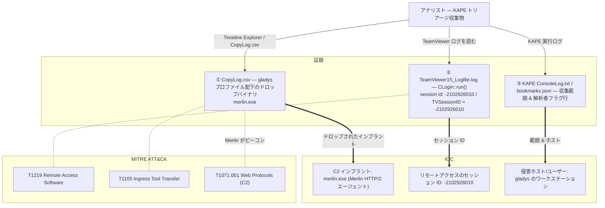

## シナリオ

TickTock は **KAPE トリアージ収集物**を題材にした HackTheBox の *Sherlock*(防御・DFIR 系)。`gladys` のワークステーションがリモート経由で侵害された疑いがある。今回渡されるのは単一の生イベントログではなく、*トリアージ取得の成果物* — KAPE の実行ログと、KAPE がホストから抜き出した対象ファイル群(TeamViewer ログ、ドロップされたバイナリ等)だ。レスポンダーとしてこの収集物を捌く: 攻撃者がアップロードした C2 インプラントを見つけ、初期の足がかりに繋がるリモートアクセスのセッション識別子を復元する。

> *「環境内のあるホストが不審なリモートアクセス活動でフラグされた。そのマシンに KAPE トリアージをかけ、収集物を渡す。攻撃者がこの端末に何のツールをドロップしたかを示し、侵入に使われたリモートセッションを特定せよ。」*

| 項目 | 内容 |
|---------------------------|-------|
| プラットフォーム | HackTheBox — Sherlock |
| カテゴリ | DFIR / トリアージ収集物の解析 |
| 難易度 | Easy |
| 証跡 | KAPE 収集物(`ConsoleLog.txt`, `CopyLog.csv`, `SkipLog.csv`, `bookmarks.json`)＋収集されたホストファイル |
| 必要スキル | KAPE 出力トリアージ、ファイル/パスの掘り起こし、TeamViewer ログ解析、C2 インプラント特定 |

## 提供される証跡

証跡は **KAPE(Kroll Artifact Parser and Extractor)トリアージ収集物** — ソースホストを写し取ったディレクトリツリーと、KAPE 自身の記録ログからなる:

- `ConsoleLog.txt` — KAPE 実行時のコンソール出力: どの target が走り、何件のファイルが一致し、収集中にエラーがあったか。
- `CopyLog.csv` — **KAPE がコピーに成功した全ファイル**のマニフェスト。ソースパス・コピー先・サイズ・タイムスタンプ付き。ホストから実際に抜かれたものの検索可能な索引で、攻撃者がドロップした物も含まれる。
- `SkipLog.csv` — 一致したが**スキップ**されたファイル(ロック中・重複排除・除外)。収集カバレッジの穴を見つけるのに使う。
- `bookmarks.json` — **Timeline Explorer のブックマーク**: 解析者がパース済みタイムラインを見て「重要」とフラグした行。
- 写し取られたホストツリー本体 — 例: `C/Users/gladys/AppData/Local/TeamViewer/Logs/TeamViewer15_Logfile.log` やユーザープロファイル配下の実行ファイル。

本ケースは*収集物トリアージ*の演習だ: KAPE のログが **何がどこから収集されたか**を、収集されたファイル自体(TeamViewer ログ、ドロップされたバイナリ)が **何が起きたか**を教える。

## 使用ツール

- **Timeline Explorer**(Eric Zimmerman)で `CopyLog.csv` / `SkipLog.csv` と `bookmarks.json` の行を開く — パスでソートし `.exe` でフィルタして、ドロップされたバイナリへ一直線。
- `ConsoleLog.txt` とプレーンテキストの **`TeamViewer15_Logfile.log`** 用にテキストエディタ(Mousepad / Notepad++)— TeamViewer のセッション詳細は人間が読めるログに記録される。
- 必要に応じて **PECmd / MFTECmd**(Eric Zimmerman)— ドロップバイナリの実行・作成を収集物内の `$MFT` / Prefetch と突き合わせて裏取りする。

```powershell
# KAPE のコピーマニフェストを Timeline Explorer で開き、ドロップされたバイナリを探す
TimelineExplorer.exe .\CopyLog.csv
# (「SourceFile」/ パス列を ".exe" でフィルタしてアップロードされたツールを浮かび上がらせる)

# TeamViewer のセッションログはプレーンテキスト — セッション行を grep する
Select-String -Path .\TeamViewer15_Logfile.log -Pattern "session id"
```

<svg width="15" height="15" viewBox="0 0 24 24" fill="none" stroke="currentColor" stroke-width="2.2" stroke-linecap="round" stroke-linejoin="round" style="vertical-align:-2px;"><path d="M9 18h6"/><path d="M10 22h4"/><path d="M15.1 14c.2-1 .7-1.7 1.4-2.5A4.6 4.6 0 0 0 18 8 6 6 0 0 0 6 8c0 1 .2 2.2 1.5 3.5.7.8 1.2 1.5 1.4 2.5"/></svg> **解説** — KAPE 収集物は単一ログではなく、*選別された成果物のスナップショット＋取得自体の監査証跡*だ。トリアージは2パス: まず `CopyLog.csv` を読んで何が抜かれたか(つまり攻撃者のファイルがどこに着地したか)を棚卸しし、次に価値の高い収集ファイルを直接開く。`CopyLog.csv` のパス列は実質、侵害されたユーザープロファイルのファイル一覧になっており、ドロップされた C2 エージェントが浮上する場所そのものだ。

## 前提: トリアージ収集物からリモートアクセス・C2 シグナルを読む

本ケースに追うべき Active Directory のイベント ID はない。シグナルは*ファイルパス*と*ベンダーログ*に宿る。2 つの成果物ファミリが全体像を担う。

| シグナル | どこにあるか | ここでの重要性 |
|---|---|---|
| ユーザープロファイル配下の実行ファイル(`AppData`, `Downloads`, `Desktop`) | `CopyLog.csv` のソースパス列 / 写し取ったホストツリー | 攻撃者がアップロードしたバイナリ — C2 インプラント |
| `merlin.exe` / 見慣れない名前のバイナリ | 収集ファイル＋ `$MFT`/Prefetch | **Merlin** はオープンソースの HTTP/2 C2 エージェント |
| `TeamViewer15_Logfile.log` | `C/Users/<user>/AppData/Local/TeamViewer/Logs/` | TeamViewer 自身が記録する着信リモートセッションのログ |
| `CLogin::run(), session id: …` / `TVSessionID = …` | TeamViewer ログ内 | リモートアクセス接続の一意なセッション識別子 |
| `SetThreadDesktop to winlogon successful` / `Authentication was successful` | TeamViewer ログ | 対話的リモートセッションが実際に確立された証 |

侵入を枠付ける MITRE ATT&CK は 2 つ: **T1219 — Remote Access Software**(侵入口としての TeamViewer)と **T1105 — Ingress Tool Transfer**(ホストへの `merlin.exe` アップロード)。

## 調査

<h2 id="q1" style="background:rgba(255,159,67,.16);border-left:5px solid #ff9f43;border-radius:6px;padding:.5rem .85rem;margin:2.5rem 0 1rem;">Q1. What was the name of the executable that was uploaded as a C2 Agent?</h2>

`CopyLog.csv` を Timeline Explorer で開き、ソースパス列を `.exe` でフィルタする。正規の `Program Files` 配下ではなく、`gladys` のプロファイル(Downloads / AppData / Desktop)に書き込まれたファイルに注目する。場違いなツールとして 1 つの実行ファイルが際立つ — オープンソース **Merlin** の HTTP/2 C2 エージェント `merlin.exe` だ。収集物内に存在すること(そして `$MFT`/Prefetch の作成・実行が裏付けること)が、攻撃者がドロップしたインプラントであることを示す。

<svg width="15" height="15" viewBox="0 0 24 24" fill="none" stroke="currentColor" stroke-width="2.2" stroke-linecap="round" stroke-linejoin="round" style="vertical-align:-2px;"><path d="M21.8 10A10 10 0 1 1 17 3.3"/><path d="m9 11 3 3L22 4"/></svg> **答え**

```text
merlin.exe
```

<svg width="15" height="15" viewBox="0 0 24 24" fill="none" stroke="currentColor" stroke-width="2.2" stroke-linecap="round" stroke-linejoin="round" style="vertical-align:-2px;"><path d="M9 18h6"/><path d="M10 22h4"/><path d="M15.1 14c.2-1 .7-1.7 1.4-2.5A4.6 4.6 0 0 0 18 8 6 6 0 0 0 6 8c0 1 .2 2.2 1.5 3.5.7.8 1.2 1.5 1.4 2.5"/></svg> **解説** — **Merlin** は有名なオープンソースのポストエクスプロイト C2 フレームワークで、Windows エージェントは HTTP/2 でビーコンする単一バイナリ `merlin.exe` だ。これがユーザーのホストにあるのは、手動操作(hands-on-keyboard)による侵害の強い指標になる。KAPE トリアージではメモリのライブ取得は不要 — コピーマニフェストとファイルシステムのメタデータだけで、インプラントを名指しし着地点を特定できる。(MITRE ATT&CK **T1105 — Ingress Tool Transfer**、C2 は **T1071.001 — Web Protocols**)

<h2 id="q2" style="background:rgba(255,159,67,.16);border-left:5px solid #ff9f43;border-radius:6px;padding:.5rem .85rem;margin:2.5rem 0 1rem;">Q2. What was the session id for in the initial access?</h2>

ここでの初期侵入は着信リモートアクセスセッションであり、TeamViewer は全接続を `C/Users/gladys/AppData/Local/TeamViewer/Logs/TeamViewer15_Logfile.log` に記録する。このログを開いてセッション行を検索する: `CLogin::run(), session id: -2102926010`(後段で `TVSessionID = -2102926010` として再掲)がそのリモートセッションの一意な識別子で、`SetThreadDesktop to winlogon successful` と認証成功と並んで記録されている — つまり攻撃者が端末で対話的セッションを取った瞬間だ。

<svg width="15" height="15" viewBox="0 0 24 24" fill="none" stroke="currentColor" stroke-width="2.2" stroke-linecap="round" stroke-linejoin="round" style="vertical-align:-2px;"><path d="M21.8 10A10 10 0 1 1 17 3.3"/><path d="m9 11 3 3L22 4"/></svg> **答え**

```text
-2102926010
```


<svg width="15" height="15" viewBox="0 0 24 24" fill="none" stroke="currentColor" stroke-width="2.2" stroke-linecap="round" stroke-linejoin="round" style="vertical-align:-2px;"><path d="M9 18h6"/><path d="M10 22h4"/><path d="M15.1 14c.2-1 .7-1.7 1.4-2.5A4.6 4.6 0 0 0 18 8 6 6 0 0 0 6 8c0 1 .2 2.2 1.5 3.5.7.8 1.2 1.5 1.4 2.5"/></svg> **解説** — TeamViewer は各接続にセッション識別子(ここでは負の 32bit 値 `-2102926010`)を割り当て、ログ全体に通す: 接続確立時の `CLogin::run()` から、`SetThreadDesktop to winlogon successful`(リモート操作者がログオンデスクトップに着地)を経て、後段の `TVSessionID = …` 行まで。この 1 つの ID を取り出せば、レスポンダーは TeamViewer の接続記録(`Connections_incoming.txt`)やホストタイムラインと突き合わせて、攻撃者がいた時間帯を正確に区切れる。これが**初期侵入**ベクター: 正規のリモートアクセスソフトが侵入口に悪用された。(MITRE ATT&CK **T1219 — Remote Access Software**、資格情報の再利用があれば **T1078 — Valid Accounts**)

## 攻撃タイムライン

| 時刻 (UTC) | 段階 | 証跡 |
|---|---|---|
| 2023-05-04 ~11:35:27 | 初期侵入 | `gladys` のホストで着信 TeamViewer セッション `-2102926010` 確立 — `TeamViewer15_Logfile.log`(`CLogin::run()`, `SetThreadDesktop to winlogon successful`) |
| 2023-05-04(セッション中) | ツール持ち込み | `merlin.exe`(Merlin C2 エージェント)をホストにアップロード — KAPE `CopyLog.csv` / ファイルシステムメタデータで浮上 |
| 2023-05-04(ドロップ後) | C2 | Merlin エージェントが HTTP/2 でビーコンし手動操作の制御を確立 |



## 検知と防御(ブルーチーム)

これを早期に捕まえるには:

- **リモートアクセスソフトを制限・監視する。** 許可していない場所では TeamViewer/AnyDesk をブロックし、着信セッションにアラート — `TeamViewer15_Logfile.log` / `Connections_incoming.txt` をパースして想定外の接続 ID・接続元パートナーを検出。
- **アプリケーション許可リスト(WDAC / AppLocker)。** `merlin.exe` のようなユーザープロファイル配下のバイナリは決して実行を許すべきでない。許可リスト化はドロップ後でも C2 エージェントを停止させる。
- **アウトバウンドフィルタリングと HTTP/2 検査。** Merlin は HTTP/2 で攻撃者インフラへビーコンする — プロキシログと TLS/JA3 検査で C2 チャネルが浮上する。
- **`AppData`/`Downloads` 配下の新規実行ファイルに EDR。** ユーザープロファイル内の未署名バイナリの作成＋初回実行は、T1105 に直結する高シグナルのハント。
- **早期に KAPE でトリアージ。** 本ケースは高速 KAPE 収集の価値を示す: `CopyLog.csv` だけで全収集成果物が棚卸しでき、ディスク全体をイメージせずともレスポンダーはインプラントを名指しできる。

## まとめ・学んだこと

- TickTock は**収集物トリアージ**型の Sherlock: KAPE の記録ログ(`CopyLog.csv` / `ConsoleLog.txt` / `bookmarks.json`)を読んで何が抜かれたかを棚卸しし、価値の高い収集ファイルを開く。
- 攻撃者の C2 インプラントは **`merlin.exe`**(オープンソース Merlin の HTTP/2 エージェント)で、コピーマニフェストとファイルシステムメタデータから浮上した。
- 初期侵入は**着信 TeamViewer セッション**で、その識別子 — **`-2102926010`** — は `TeamViewer15_Logfile.log`(`CLogin::run()` / `TVSessionID`)に直接記録されており、侵入の時間帯を区切る起点になる。

## 参考文献

- HackTheBox Sherlock: TickTock — <https://app.hackthebox.com/sherlocks>
- KAPE (Kroll Artifact Parser and Extractor) — <https://www.kroll.com/kape>
- Eric Zimmerman's Tools (Timeline Explorer / PECmd / MFTECmd) — <https://ericzimmerman.github.io/>
- Merlin C2 (Ne0nd0g) — <https://github.com/Ne0nd0g/merlin>
- MITRE ATT&CK: T1219 (Remote Access Software), T1105 (Ingress Tool Transfer), T1071.001 (Web Protocols)
