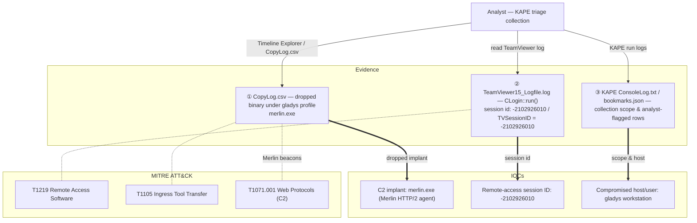

## Scenario

TickTock is a HackTheBox *Sherlock* (defensive / DFIR challenge) built around a **KAPE triage collection**. A workstation belonging to `gladys` is suspected of having been remotely compromised. Instead of a single raw event log, you are handed the *output of a triage acquisition* — the KAPE run logs plus the targeted files KAPE pulled off the host (TeamViewer logs, dropped binaries, etc.). The job is to work that collection like a responder: find the C2 implant the attacker uploaded, and recover the remote-access session identifier that ties back to the initial foothold.

> *"A host in our environment was flagged for suspicious remote-access activity. We ran a KAPE triage on the machine and handed you the collection. Tell us what tooling the attacker dropped on the box and identify the remote session used to get in."*

| Field | Value |
|---------------------------|-------|
| Platform | HackTheBox — Sherlock |
| Category | DFIR / Triage-collection analysis |
| Difficulty | Easy |
| Artifacts | KAPE collection (`ConsoleLog.txt`, `CopyLog.csv`, `SkipLog.csv`, `bookmarks.json`) + collected host files |
| Skills | KAPE output triage, file/path carving, TeamViewer log analysis, C2 implant identification |

## Artifacts

The evidence is a **KAPE (Kroll Artifact Parser and Extractor) triage collection** — a directory tree mirroring the source host plus KAPE's own bookkeeping logs:

- `ConsoleLog.txt` — KAPE's run-time console output: which targets ran, how many files matched, and any errors during collection.
- `CopyLog.csv` — the manifest of **every file KAPE successfully copied**, with source path, destination, size, and timestamps. This is the searchable index of what was actually pulled off the host — including anything the attacker dropped.
- `SkipLog.csv` — files KAPE matched but **skipped** (locked, deduplicated, or excluded), useful for spotting gaps in coverage.
- `bookmarks.json` — **Timeline Explorer bookmarks**: the rows a previous analyst flagged as interesting while reviewing the parsed timeline.
- The mirrored host tree itself — e.g. `C/Users/gladys/AppData/Local/TeamViewer/Logs/TeamViewer15_Logfile.log` and any executables under the user profile.

The whole case is a *collection-triage* exercise: the KAPE logs tell you **what was collected and from where**, and the collected files themselves (the TeamViewer log, the dropped binary) tell you **what happened**.

## Toolkit

- **Timeline Explorer** (Eric Zimmerman) to open `CopyLog.csv` / `SkipLog.csv` and the `bookmarks.json` rows — sort by path, filter on `.exe`, jump straight to the dropped binary.
- A text editor (Mousepad / Notepad++) for `ConsoleLog.txt` and the plain-text **`TeamViewer15_Logfile.log`** — TeamViewer's session details live in the human-readable log.
- **PECmd / MFTECmd** (Eric Zimmerman) as needed to corroborate execution and file creation of the dropped binary against `$MFT` / Prefetch in the collection.

```powershell
# Open the KAPE copy manifest in Timeline Explorer and hunt for the dropped binary
TimelineExplorer.exe .\CopyLog.csv
# (filter the "SourceFile" / path column on ".exe" to surface uploaded tooling)

# TeamViewer's session log is plain text — grep it for the session line
Select-String -Path .\TeamViewer15_Logfile.log -Pattern "session id"
```

<svg width="15" height="15" viewBox="0 0 24 24" fill="none" stroke="currentColor" stroke-width="2.2" stroke-linecap="round" stroke-linejoin="round" style="vertical-align:-2px;"><path d="M9 18h6"/><path d="M10 22h4"/><path d="M15.1 14c.2-1 .7-1.7 1.4-2.5A4.6 4.6 0 0 0 18 8 6 6 0 0 0 6 8c0 1 .2 2.2 1.5 3.5.7.8 1.2 1.5 1.4 2.5"/></svg> **Analysis** — A KAPE collection is not a single log — it is a *snapshot of selected artifacts plus the acquisition's own audit trail*. Triaging it means two passes: first read `CopyLog.csv` to inventory what was pulled (and therefore where the attacker's files landed), then open the high-value collected files directly. The `CopyLog.csv` path column is effectively a file-system listing of the compromised user profile, which is where a dropped C2 agent will surface.

## Background: reading remote-access and C2 signals in a triage collection

This case has no Active Directory event IDs to chase; the signals live in *file paths* and a *vendor log*. Two artifact families carry the whole story.

| Signal | Where it lives | Why it matters here |
|---|---|---|
| Executable under a user profile (`AppData`, `Downloads`, `Desktop`) | `CopyLog.csv` source-path column / mirrored host tree | a binary the attacker uploaded — the C2 implant |
| `merlin.exe` / unusual named binary | collected file + `$MFT`/Prefetch | **Merlin** is an open-source HTTP/2 command-and-control agent |
| `TeamViewer15_Logfile.log` | `C/Users/<user>/AppData/Local/TeamViewer/Logs/` | TeamViewer's own log of incoming remote sessions |
| `CLogin::run(), session id: …` / `TVSessionID = …` | inside the TeamViewer log | the unique session identifier of the remote-access connection |
| `SetThreadDesktop to winlogon successful` / `Authentication was successful` | TeamViewer log | an interactive remote session was actually established |

Two MITRE ATT&CK techniques frame the intrusion: **T1219 — Remote Access Software** (TeamViewer as the entry vector) and **T1105 — Ingress Tool Transfer** (uploading `merlin.exe` onto the host).

## Investigation

<h2 id="q1" style="background:rgba(255,159,67,.16);border-left:5px solid #ff9f43;border-radius:6px;padding:.5rem .85rem;margin:2.5rem 0 1rem;">Q1. What was the name of the executable that was uploaded as a C2 Agent?</h2>

Open `CopyLog.csv` in Timeline Explorer and filter the source-path column on `.exe`, focusing on files written under `gladys`'s profile (Downloads / AppData / Desktop) rather than legitimate `Program Files` binaries. One executable stands out as out-of-place tooling — `merlin.exe`, the open-source **Merlin** HTTP/2 C2 agent. Its presence in the collection (and corroborating creation/execution in `$MFT`/Prefetch) marks the implant the attacker dropped.

<svg width="15" height="15" viewBox="0 0 24 24" fill="none" stroke="currentColor" stroke-width="2.2" stroke-linecap="round" stroke-linejoin="round" style="vertical-align:-2px;"><path d="M21.8 10A10 10 0 1 1 17 3.3"/><path d="m9 11 3 3L22 4"/></svg> **Answer**

```text
merlin.exe
```

<svg width="15" height="15" viewBox="0 0 24 24" fill="none" stroke="currentColor" stroke-width="2.2" stroke-linecap="round" stroke-linejoin="round" style="vertical-align:-2px;"><path d="M9 18h6"/><path d="M10 22h4"/><path d="M15.1 14c.2-1 .7-1.7 1.4-2.5A4.6 4.6 0 0 0 18 8 6 6 0 0 0 6 8c0 1 .2 2.2 1.5 3.5.7.8 1.2 1.5 1.4 2.5"/></svg> **Analysis** — **Merlin** is a well-known open-source post-exploitation C2 framework whose Windows agent is a single `merlin.exe` binary that beacons home over HTTP/2. Finding it on a user's host is a strong indicator of hands-on-keyboard compromise. In a KAPE triage you do not need live memory to spot it — the copy manifest plus file-system metadata are enough to name the implant and pin where it landed. (MITRE ATT&CK **T1105 — Ingress Tool Transfer**, with command-and-control under **T1071.001 — Web Protocols**.)

<h2 id="q2" style="background:rgba(255,159,67,.16);border-left:5px solid #ff9f43;border-radius:6px;padding:.5rem .85rem;margin:2.5rem 0 1rem;">Q2. What was the session id for in the initial access?</h2>

Initial access here was an inbound remote-access session, and TeamViewer records every connection in `C/Users/gladys/AppData/Local/TeamViewer/Logs/TeamViewer15_Logfile.log`. Open that log and search for the session line: the entry `CLogin::run(), session id: -2102926010` (echoed later as `TVSessionID = -2102926010`) is the unique identifier of the remote session, logged alongside `SetThreadDesktop to winlogon successful` and a successful authentication — i.e. the moment the attacker took an interactive session on the box.

<svg width="15" height="15" viewBox="0 0 24 24" fill="none" stroke="currentColor" stroke-width="2.2" stroke-linecap="round" stroke-linejoin="round" style="vertical-align:-2px;"><path d="M21.8 10A10 10 0 1 1 17 3.3"/><path d="m9 11 3 3L22 4"/></svg> **Answer**

```text
-2102926010
```


<svg width="15" height="15" viewBox="0 0 24 24" fill="none" stroke="currentColor" stroke-width="2.2" stroke-linecap="round" stroke-linejoin="round" style="vertical-align:-2px;"><path d="M9 18h6"/><path d="M10 22h4"/><path d="M15.1 14c.2-1 .7-1.7 1.4-2.5A4.6 4.6 0 0 0 18 8 6 6 0 0 0 6 8c0 1 .2 2.2 1.5 3.5.7.8 1.2 1.5 1.4 2.5"/></svg> **Analysis** — TeamViewer assigns each connection a session identifier (here a negative 32-bit value, `-2102926010`) and threads it through the log: from `CLogin::run()` at connection setup, through `SetThreadDesktop to winlogon successful` (the remote operator landing on the logon desktop), to the later `TVSessionID = …` lines. Pulling that single ID lets a responder pivot — correlating it against TeamViewer's connection records (`Connections_incoming.txt`) and the host timeline to bound exactly when the attacker was present. This is the **initial access** vector: legitimate remote-access software abused for entry. (MITRE ATT&CK **T1219 — Remote Access Software**, with **T1078 — Valid Accounts** if credentials were reused.)

## Attack Timeline

| Time (UTC) | Stage | Evidence |
|---|---|---|
| 2023-05-04 ~11:35:27 | Initial Access | Inbound TeamViewer session `-2102926010` established on `gladys`'s host — `TeamViewer15_Logfile.log` (`CLogin::run()`, `SetThreadDesktop to winlogon successful`) |
| 2023-05-04 (session) | Ingress Tool Transfer | `merlin.exe` (Merlin C2 agent) uploaded to the host — surfaced via KAPE `CopyLog.csv` / file-system metadata |
| 2023-05-04 (post-drop) | Command & Control | Merlin agent beacons over HTTP/2 for hands-on-keyboard control |



## Detection & Hardening (Blue Team)

What would have caught this earlier:

- **Restrict and monitor remote-access software.** Block TeamViewer/AnyDesk where it is not sanctioned, and alert on inbound sessions — parse `TeamViewer15_Logfile.log` / `Connections_incoming.txt` for unexpected connection IDs and source partners.
- **Application allow-listing (WDAC / AppLocker).** A user-profile binary like `merlin.exe` should never be allowed to execute; allow-listing stops the C2 agent dead even after it is dropped.
- **Egress filtering and HTTP/2 inspection.** Merlin beacons over HTTP/2 to attacker infrastructure — proxy logging and TLS/JA3 inspection surface the C2 channel.
- **EDR on new executables under `AppData`/`Downloads`.** Creation + first-execution of an unsigned binary in a user profile is a high-signal hunt that maps directly to T1105.
- **Triage with KAPE early.** This case shows the value of a fast KAPE collection: `CopyLog.csv` alone inventories every collected artifact, so a responder can name the implant without imaging the whole disk.

## Key Takeaways

- TickTock is a **triage-collection** Sherlock: read the KAPE bookkeeping (`CopyLog.csv` / `ConsoleLog.txt` / `bookmarks.json`) to inventory what was pulled, then open the high-value collected files.
- The attacker's C2 implant was **`merlin.exe`** (the open-source Merlin HTTP/2 agent), surfaced from the copy manifest and file-system metadata.
- Initial access was an **inbound TeamViewer session**, and its identifier — **`-2102926010`** — is recorded directly in `TeamViewer15_Logfile.log` (`CLogin::run()` / `TVSessionID`), the pivot point for bounding the intrusion.

## References

- HackTheBox Sherlock: TickTock — <https://app.hackthebox.com/sherlocks>
- KAPE (Kroll Artifact Parser and Extractor) — <https://www.kroll.com/kape>
- Eric Zimmerman's Tools (Timeline Explorer / PECmd / MFTECmd) — <https://ericzimmerman.github.io/>
- Merlin C2 (Ne0nd0g) — <https://github.com/Ne0nd0g/merlin>
- MITRE ATT&CK: T1219 (Remote Access Software), T1105 (Ingress Tool Transfer), T1071.001 (Web Protocols)
