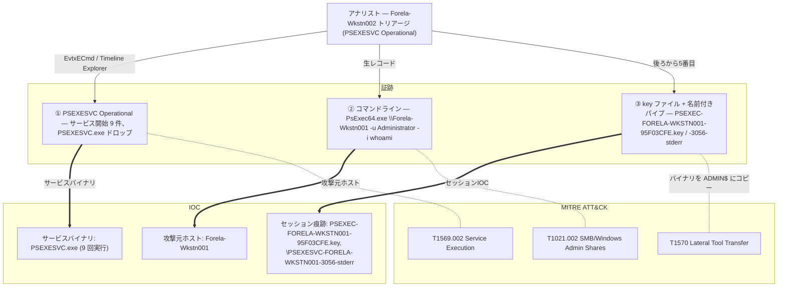

## シナリオ

Tracer は HackTheBox の *Sherlock*(防御・DFIR 系)で難易度 **Easy**。Forela の SOC は攻撃者が **PsExec** で横展開していると考えており、若手アナリストが1台のワークステーション上で PsExec の使用を報告した。渡されるのはそのエンドポイント1台のトリアージのみ。そこから PsExec の活動を再構成する — 何回実行されたか、ドロップされたサービスバイナリは何か、特定の実行が残した痕跡、そして — 最も重要なのは — 攻撃者が**どのホストから**横展開してきたかを突き止める。

> *「脅威アクターが環境内に潜伏し、PsExec で横展開していると考えている。若手 SOC アナリストがあるワークステーションでの PsExec 使用を報告した。PsExec が何回実行されたかを確認し、サービスバイナリとドロップされた痕跡を特定し、攻撃者が pivot してきた攻撃元ホストを判定せよ。」*

| 項目 | 内容 |
|---------------------------|-------|
| プラットフォーム | HackTheBox — Sherlock |
| カテゴリ | DFIR / Windows 横展開 |
| 難易度 | Easy |
| 証跡 | `Forela-Wkstn002` のトリアージ(Windows イベントログ、PsExec Operational ログ含む) |
| 必要スキル | PsExec の内部動作、PSEXESVC サービス追跡、名前付きパイプ解析、コマンドライン解析 |

## 提供される証跡

- **`Forela-Wkstn002` のトリアージ** — 被害ワークステーションから収集された Windows イベントログ(ケースディレクトリにはノートと収集証跡の ZIP が同梱)。決定的なチャネルは **PSEXESVC Operational ログ**で、PsExec のサービス開始・ファイル作成・名前付きパイプのイベントがすべて記録されている。補助的に `System`・`Security`・Sysmon 系の Operational ログがタイムラインを補完する。

本ケースはエンドポイント中心だ: 宛先ホスト(`Forela-Wkstn002.forela.local`)が*受信側*の PsExec サービス活動を記録しており、ある実行で記録された**コマンドライン**がオペレーターの pivot 元ホストを明かす。攻撃者のマシンには一切触れない — その攻撃元ホスト名は、サービスバイナリが残した痕跡からおのずと導かれる。

## 使用ツール

- **EvtxECmd**(Eric Zimmerman)→ CSV →**Timeline Explorer** で PSEXESVC Operational・`System`・`Security` ログを閲覧
- 自作の **EVTX ダッシュボード**(私自身の DFIR トリアージ UI) — キーワード(`psexesvc`)高速フィルタと生レコードのフィールド確認に使用(以下のスクショ)
- 代替に **Windows イベントビューア**(XPath フィルタ)
- `.key` ファイルの作成を Prefetch や MFT と突き合わせるなら **PECmd** / **MFTECmd**(Eric Zimmerman)

```powershell
# 全イベントログを CSV 化(Timeline Explorer 用)
EvtxECmd.exe -d C:\Triage\Forela-Wkstn002\Windows\System32\winevt\Logs --csv . --csvf tracer.csv

# あるいは PSEXESVC Operational チャネルだけを対象に
EvtxECmd.exe -f "PSEXESVC%4Operational.evtx" --csv . --csvf psexesvc.csv
```

<svg width="15" height="15" viewBox="0 0 24 24" fill="none" stroke="currentColor" stroke-width="2.2" stroke-linecap="round" stroke-linejoin="round" style="vertical-align:-2px;"><path d="M9 18h6"/><path d="M10 22h4"/><path d="M15.1 14c.2-1 .7-1.7 1.4-2.5A4.6 4.6 0 0 0 18 8 6 6 0 0 0 6 8c0 1 .2 2.2 1.5 3.5.7.8 1.2 1.5 1.4 2.5"/></svg> **解説** — PsExec は*宛先*ホスト上で派手に痕跡を残す。クライアントが接続すると `PSEXESVC.exe` を `ADMIN$` に書き込み、サービスを登録・開始し、一連の名前付きパイプ(`stdin`/`stdout`/`stderr`)と暗号化チャネル用のホストごとの `.key` ファイルを作成する。これらはそれぞれ独立した時刻付きの痕跡だ — だから「PsExec が何回実行されたか」はサービス開始レコードを数える作業になり、「どこから来たか」はパイプ名・key ファイル・記録されたコマンドラインに刻まれたホスト名が答える。(MITRE ATT&CK **T1021.002 — SMB/Windows Admin Shares**、**T1569.002 — Service Execution**)

## 前提: 宛先ホスト上の PsExec 痕跡

PsExec は SMB 管理共有とサービス制御マネージャ(SCM)を悪用してリモート実行を達成する。*標的*に残る痕跡を知っていることが、単一エンドポイントから本ケースを攻略可能にする。

| シグナル | 何か | ここでの重要性 |
|---|---|---|
| `PSEXESVC.exe` | `ADMIN$` にコピーされるサービスバイナリ(`C:\Windows\PSEXESVC.exe`) | ドロッパーの足跡。PsExec セッションごとに1つ |
| Event ID `7045`(System) | 「サービスがインストールされました」 — サービス名 `PSEXESVC` | PsExec 実行を示す古典的な SCM シグナル |
| PSEXESVC **Operational** ログ | セッションごとのサービス開始 / ファイル作成 / パイプイベント | 実行回数を*数え*、攻撃元ホストを引き出せる |
| `PSEXEC-<HOST>-<id>.key` | 暗号化通信チャネル用のホストごとの key ファイル | 名前のホストトークンが**攻撃元**ワークステーション |
| 名前付きパイプ `\PSEXESVC-<HOST>-<pid>-{stdin,stdout,stderr}` | リモートプロセスの I/O チャネル | ホストトークンが再び発信元ホストを特定 |
| 記録されたコマンドライン | 例: `PsExec64.exe \\Forela-Wkstn001 -u Administrator -i whoami` | 横展開の方向を直接証明 |

Tracer の妙: *宛先*(`Forela-Wkstn002`)が、key ファイル・パイプ名・コマンドラインの中で *攻撃元*(`Forela-Wkstn001`)を名指しするレコードを保持している。

## 調査

<h2 id="q1" style="background:rgba(255,159,67,.16);border-left:5px solid #ff9f43;border-radius:6px;padding:.5rem .85rem;margin:2.5rem 0 1rem;">Q1. The SOC Team suspects that an adversary is lurking in their environment and are using PsExec to move laterally. A junior SOC Analyst specifically reported the usage of PsExec on a WorkStation. How many times was PsExec executed by the attacker on the system?</h2>

トリアージを `psexesvc` キーワードで絞り込み、PSEXESVC Operational ログの中で個別の PsExec **サービス開始**イベントを数える。PsExec セッションごとに新しいサービスインスタンスが立つので、その開始レコードの数が実行回数だ。イベントメッセージ列でハイライトされた `psexesvc` のヒットを数えると、9 回の個別実行になる。

<svg width="15" height="15" viewBox="0 0 24 24" fill="none" stroke="currentColor" stroke-width="2.2" stroke-linecap="round" stroke-linejoin="round" style="vertical-align:-2px;"><path d="M21.8 10A10 10 0 1 1 17 3.3"/><path d="m9 11 3 3L22 4"/></svg> **答え**

```text
9
```


<svg width="15" height="15" viewBox="0 0 24 24" fill="none" stroke="currentColor" stroke-width="2.2" stroke-linecap="round" stroke-linejoin="round" style="vertical-align:-2px;"><path d="M9 18h6"/><path d="M10 22h4"/><path d="M15.1 14c.2-1 .7-1.7 1.4-2.5A4.6 4.6 0 0 0 18 8 6 6 0 0 0 6 8c0 1 .2 2.2 1.5 3.5.7.8 1.2 1.5 1.4 2.5"/></svg> **解説** — 実行回数をきれいに数えるには、PsExec に言及する全行ではなく*サービス開始*を数える。1 回の実行でサービス開始に加え複数のファイル作成・パイプイベントが発生するため、単純な grep は過剰にカウントしてしまう。セッションごとの開始レコードを軸にすることで、真の 9 という値が得られる。(MITRE ATT&CK **T1569.002 — System Services: Service Execution**)

<h2 id="q2" style="background:rgba(255,159,67,.16);border-left:5px solid #ff9f43;border-radius:6px;padding:.5rem .85rem;margin:2.5rem 0 1rem;">Q2. What is the name of the service binary dropped by PsExec tool allowing attacker to execute remote commands?</h2>

PsExec はサービスバイナリを `ADMIN$`(すなわち `C:\Windows\`)にコピーし、SCM がそれを `PSEXESVC` サービスとして開始する。PsExec 横展開インスタンスのトリアージアラートパネルが、ドロップされたバイナリを直接名指ししている。

<svg width="15" height="15" viewBox="0 0 24 24" fill="none" stroke="currentColor" stroke-width="2.2" stroke-linecap="round" stroke-linejoin="round" style="vertical-align:-2px;"><path d="M21.8 10A10 10 0 1 1 17 3.3"/><path d="m9 11 3 3L22 4"/></svg> **答え**

```text
PSEXESVC.exe
```


<svg width="15" height="15" viewBox="0 0 24 24" fill="none" stroke="currentColor" stroke-width="2.2" stroke-linecap="round" stroke-linejoin="round" style="vertical-align:-2px;"><path d="M9 18h6"/><path d="M10 22h4"/><path d="M15.1 14c.2-1 .7-1.7 1.4-2.5A4.6 4.6 0 0 0 18 8 6 6 0 0 0 6 8c0 1 .2 2.2 1.5 3.5.7.8 1.2 1.5 1.4 2.5"/></svg> **解説** — `PSEXESVC.exe` は PsExec のディスク上の指紋だ: クライアントがそれを標的の `ADMIN$` にアップロードし、サービスとして登録し、それが要求されたコマンドを起動するローカルブローカーとして動作する。`C:\Windows\` 内の存在(あるいは `PSEXESVC` サービスを名指しする Event ID 7045)は、リモート実行の高信頼な指標だ。(MITRE ATT&CK **T1570 — Lateral Tool Transfer**)

<h2 id="q3" style="background:rgba(255,159,67,.16);border-left:5px solid #ff9f43;border-radius:6px;padding:.5rem .85rem;margin:2.5rem 0 1rem;">Q3. Now we have confirmed that PsExec ran multiple times, we are particularly interested in the 5th Last instance of the PsExec. What is the timestamp when the PsExec Service binary ran?</h2>

PSEXESVC Operational のサービス開始レコードを時系列に並べ、最新から 5 つ遡る(後ろから 5 番目の実行)。そのインスタンスのサービス開始イベントのタイムスタンプが、`PSEXESVC` バイナリが実行された瞬間だ。

<svg width="15" height="15" viewBox="0 0 24 24" fill="none" stroke="currentColor" stroke-width="2.2" stroke-linecap="round" stroke-linejoin="round" style="vertical-align:-2px;"><path d="M21.8 10A10 10 0 1 1 17 3.3"/><path d="m9 11 3 3L22 4"/></svg> **答え**

```text
07/09/2023 12:06:54
```

<svg width="15" height="15" viewBox="0 0 24 24" fill="none" stroke="currentColor" stroke-width="2.2" stroke-linecap="round" stroke-linejoin="round" style="vertical-align:-2px;"><path d="M9 18h6"/><path d="M10 22h4"/><path d="M15.1 14c.2-1 .7-1.7 1.4-2.5A4.6 4.6 0 0 0 18 8 6 6 0 0 0 6 8c0 1 .2 2.2 1.5 3.5.7.8 1.2 1.5 1.4 2.5"/></svg> **解説** — 「後ろから 5 番目」は意図的なアンカーだ: 最初でも最後でもなく、特定のセッションに固定し、その痕跡(key ファイル・パイプ・コマンドライン)を続く設問で突き合わせる。まずその正確なサービス開始時刻を確定しておくことで、ディスク上の `.key` ファイルと名前付きパイプを*この*実行だけに紐付けられる。

<h2 id="q4" style="background:rgba(255,159,67,.16);border-left:5px solid #ff9f43;border-radius:6px;padding:.5rem .85rem;margin:2.5rem 0 1rem;">Q4. Can you confirm the hostname of the workstation from which attacker moved laterally?</h2>

後ろから 5 番目の PsExec 実行の生イベントを開く。ログ自体は宛先ホスト `Forela-Wkstn002.forela.local` 上にある。PsExec は宛先に残す痕跡に**送信元**ホストを刻印する — 認証に使われたマシンアカウントは `FORELA-WKSTN001$`、ドロップされた key ファイルと `\PSEXESVC-…` 名前付きパイプはいずれも `FORELA-WKSTN001` を冠している。これらのフィールドが、攻撃者が横展開した*起点*のワークステーションを特定する。

<svg width="15" height="15" viewBox="0 0 24 24" fill="none" stroke="currentColor" stroke-width="2.2" stroke-linecap="round" stroke-linejoin="round" style="vertical-align:-2px;"><path d="M21.8 10A10 10 0 1 1 17 3.3"/><path d="m9 11 3 3L22 4"/></svg> **答え**

```text
Forela-Wkstn001
```


<svg width="15" height="15" viewBox="0 0 24 24" fill="none" stroke="currentColor" stroke-width="2.2" stroke-linecap="round" stroke-linejoin="round" style="vertical-align:-2px;"><path d="M9 18h6"/><path d="M10 22h4"/><path d="M15.1 14c.2-1 .7-1.7 1.4-2.5A4.6 4.6 0 0 0 18 8 6 6 0 0 0 6 8c0 1 .2 2.2 1.5 3.5.7.8 1.2 1.5 1.4 2.5"/></svg> **解説** — これが本ケースの要だ: *宛先*エンドポイントが、PsExec 自身の痕跡の中に*送信元*ホストを記録している — `FORELA-WKSTN001$` マシンアカウント、そして送信元名を冠した key ファイルとパイプ名だ。攻撃者のマシンのトリアージがゼロでも、`Forela-Wkstn001` が横展開の発信元として確定する。(MITRE ATT&CK **T1021.002 — Remote Services: SMB/Windows Admin Shares**)

<h2 id="q5" style="background:rgba(255,159,67,.16);border-left:5px solid #ff9f43;border-radius:6px;padding:.5rem .85rem;margin:2.5rem 0 1rem;">Q5. What is full name of the Key File dropped by 5th last instance of the Psexec?</h2>

PsExec は暗号化 I/O チャネルを確立するためにホストごとの `.key` ファイルをドロップする。後ろから 5 番目の実行の System/PSEXESVC ファイル作成イベントを絞り込み、`.key` ファイル名を読む — その中のホストトークンが再び攻撃元ホストを指す。

<svg width="15" height="15" viewBox="0 0 24 24" fill="none" stroke="currentColor" stroke-width="2.2" stroke-linecap="round" stroke-linejoin="round" style="vertical-align:-2px;"><path d="M21.8 10A10 10 0 1 1 17 3.3"/><path d="m9 11 3 3L22 4"/></svg> **答え**

```text
PSEXEC-FORELA-WKSTN001-95F03CFE.key
```


<svg width="15" height="15" viewBox="0 0 24 24" fill="none" stroke="currentColor" stroke-width="2.2" stroke-linecap="round" stroke-linejoin="round" style="vertical-align:-2px;"><path d="M9 18h6"/><path d="M10 22h4"/><path d="M15.1 14c.2-1 .7-1.7 1.4-2.5A4.6 4.6 0 0 0 18 8 6 6 0 0 0 6 8c0 1 .2 2.2 1.5 3.5.7.8 1.2 1.5 1.4 2.5"/></svg> **解説** — `.key` ファイルの命名規約 `PSEXEC-<攻撃元ホスト>-<ランダム>.key` それ自体が IOC だ: コマンドラインログとは独立に、操作が `FORELA-WKSTN001` 由来であるというコマンドラインの発見を裏付ける。ランダムな接尾辞(`95F03CFE`)がこの特定セッションにファイルを結び付ける。(MITRE ATT&CK **T1021.002 — SMB/Windows Admin Shares**)

<h2 id="q6" style="background:rgba(255,159,67,.16);border-left:5px solid #ff9f43;border-radius:6px;padding:.5rem .85rem;margin:2.5rem 0 1rem;">Q6. Can you confirm the timestamp when this key file was created on disk?</h2>

同じレコードからその `.key` ファイルのファイル作成タイムスタンプを読む。サービスバイナリ実行の 1 秒後だ — サービスが開始し、ただちに鍵素材を書き込む。

<svg width="15" height="15" viewBox="0 0 24 24" fill="none" stroke="currentColor" stroke-width="2.2" stroke-linecap="round" stroke-linejoin="round" style="vertical-align:-2px;"><path d="M21.8 10A10 10 0 1 1 17 3.3"/><path d="m9 11 3 3L22 4"/></svg> **答え**

```text
07/09/2023 12:06:55
```

<svg width="15" height="15" viewBox="0 0 24 24" fill="none" stroke="currentColor" stroke-width="2.2" stroke-linecap="round" stroke-linejoin="round" style="vertical-align:-2px;"><path d="M9 18h6"/><path d="M10 22h4"/><path d="M15.1 14c.2-1 .7-1.7 1.4-2.5A4.6 4.6 0 0 0 18 8 6 6 0 0 0 6 8c0 1 .2 2.2 1.5 3.5.7.8 1.2 1.5 1.4 2.5"/></svg> **解説** — サービス開始(`12:06:54`)と key ファイル作成(`12:06:55`)の 1 秒の差は、まさに期待される PsExec のシーケンスだ: サービス起動 → 暗号化チャネル確立。この密接な順序が、`.key` ファイルが隣接セッションではなく後ろから 5 番目の実行に属することを裏付け、レスポンダーに他ホスト横断で探すべき精密なディスク痕跡を与える。(MITRE ATT&CK **T1570 — Lateral Tool Transfer**)

<h2 id="q7" style="background:rgba(255,159,67,.16);border-left:5px solid #ff9f43;border-radius:6px;padding:.5rem .85rem;margin:2.5rem 0 1rem;">Q7. What is the full name of the Named Pipe ending with the "stderr" keyword for the 5th last instance of the PsExec?</h2>

PsExec はセッションごとに 3 つの名前付きパイプ(`stdin`・`stdout`・`stderr`)を作成し、リモートプロセスの I/O を中継する。後ろから 5 番目の実行の Operational パイプ作成イベントを絞り込み、`stderr` パイプを読む。その名前には攻撃元ホストとサービス PID が埋め込まれている。

<svg width="15" height="15" viewBox="0 0 24 24" fill="none" stroke="currentColor" stroke-width="2.2" stroke-linecap="round" stroke-linejoin="round" style="vertical-align:-2px;"><path d="M21.8 10A10 10 0 1 1 17 3.3"/><path d="m9 11 3 3L22 4"/></svg> **答え**

```text
\PSEXESVC-FORELA-WKSTN001-3056-stderr
```


<svg width="15" height="15" viewBox="0 0 24 24" fill="none" stroke="currentColor" stroke-width="2.2" stroke-linecap="round" stroke-linejoin="round" style="vertical-align:-2px;"><path d="M9 18h6"/><path d="M10 22h4"/><path d="M15.1 14c.2-1 .7-1.7 1.4-2.5A4.6 4.6 0 0 0 18 8 6 6 0 0 0 6 8c0 1 .2 2.2 1.5 3.5.7.8 1.2 1.5 1.4 2.5"/></svg> **解説** — パイプ名は同時に 3 つの IOC を符号化する: 接頭辞 `PSEXESVC`、**攻撃元ホスト** `FORELA-WKSTN001`、サービス **PID** `3056`。これは(コマンドラインと `.key` ファイルに続く)同じ発信元ホストを指す 3 つ目の独立した痕跡であり、アナリストに高い帰属の確信を与える。`\PSEXESVC-*-stderr` パイプを探すことは、実用的なライブ検知ルールにもなる。(MITRE ATT&CK **T1021.002 — SMB/Windows Admin Shares**、**T1059 — Command and Scripting Interpreter**)

## 攻撃タイムライン

| 時刻 | 段階 | 証跡 |
|---|---|---|
| (過去の実行) | 横展開 | `Forela-Wkstn002` 上に記録された計 9 件の PsExec 実行 — PSEXESVC Operational ログ |
| 07/09/2023 12:06:54 | サービス実行 | 後ろから 5 番目の PsExec 実行 — `PSEXESVC.exe` サービス開始(cmd: `PsExec64.exe \\Forela-Wkstn001 -u Administrator -i whoami`) |
| 07/09/2023 12:06:55 | 横方向ツール転送 | key ファイル `PSEXEC-FORELA-WKSTN001-95F03CFE.key` がディスクに書き込まれる |
| 07/09/2023 ~12:06:55 | コマンド実行 | 名前付きパイプ作成 — `\PSEXESVC-FORELA-WKSTN001-3056-stderr`(+ stdin/stdout) |



## 検知と防御(ブルーチーム)

これを早期に捕まえるには:

- **サービス名 `PSEXESVC` の Event ID 7045** にアラート(バイナリパス `C:\Windows\PSEXESVC.exe` も) — 素の PsExec のほぼ完璧なシグネチャ。
- **名前付きパイプ `\PSEXESVC-*-{stdin,stdout,stderr}`** と `PSEXEC-*-*.key` ファイルを探す — 攻撃者が実行ファイルを改名しても残り、ホストトークンが攻撃元を明かす。
- リモートセッションからの **`ADMIN$` / `IPC$` への実行ファイル書き込み**と SCM サービス作成を監視 — PsExec は管理共有への書き込み + サービスインストールを要する。
- **ローカル Administrator の使い回しを制限し LAPS を強制** — 捕捉したコマンドラインの `-u Administrator` は共有ローカル管理者による典型的な横展開経路。ホストごとに一意のパスワードがこれを断ち切る。
- 本チャレンジのように、宛先ホストの PsExec 痕跡(key ファイル / パイプ名 / コマンドライン)を**攻撃元ホストに突き合わせ**、最初に隔離すべきワークステーションを絞り込む。

## まとめ・学んだこと

- PsExec は**宛先**で最も派手だ: `PSEXESVC` のサービス開始を数えることが真の実行回数(ここでは 9)を与える。生キーワード grep ではない。
- **攻撃元ホスト**(`Forela-Wkstn001`)は被害側だけから 3 通りの独立した方法で復元できる — 記録されたコマンドライン、`PSEXEC-FORELA-WKSTN001-*.key` ファイル、そして `\PSEXESVC-FORELA-WKSTN001-3056-stderr` パイプ。
- 特定の実行(「後ろから 5 番目」)を軸にし、密接なサービス開始 → key ファイル → パイプの順序(`12:06:54` → `12:06:55`)を使うことが、痕跡を 1 つのセッションに確信を持って帰属させる方法だ。

## 参考文献

- HackTheBox Sherlock: Tracer — <https://app.hackthebox.com/sherlocks>
- Microsoft Sysinternals — PsExec — <https://learn.microsoft.com/sysinternals/downloads/psexec>
- Microsoft — 7045: A service was installed in the system — <https://learn.microsoft.com/windows/security/threat-protection/auditing/event-7045>
- Eric Zimmerman's Tools (EvtxECmd / Timeline Explorer / PECmd) — <https://ericzimmerman.github.io/>
- MITRE ATT&CK: T1021.002 (SMB/Windows Admin Shares), T1569.002 (Service Execution), T1570 (Lateral Tool Transfer)
