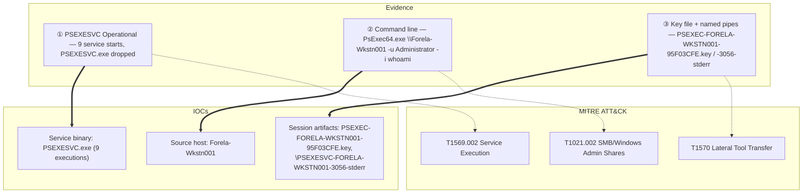

## Scenario

Tracer is an **Easy** HackTheBox *Sherlock* (defensive / DFIR challenge). The Forela SOC believes an adversary is moving laterally with **PsExec**, and a junior analyst flagged PsExec activity on a single workstation. You are handed the triage from that one endpoint and must reconstruct the PsExec activity: how many times the tool ran, the service binary it dropped, the exact run it left behind, and — critically — which host the attacker moved laterally **from**.

> *"We believe a threat actor is lurking in our environment and using PsExec to move laterally. A junior SOC analyst reported PsExec usage on a workstation. Confirm how many times PsExec executed, identify the service binary and the artifacts it dropped, and determine the source host the attacker pivoted from."*

| Field | Value |
|---------------------------|-------|
| Platform | HackTheBox — Sherlock |
| Category | DFIR / Windows lateral movement |
| Difficulty | Easy |
| Artifacts | Triage from `Forela-Wkstn002` (Windows event logs, incl. PsExec Operational log) |
| Skills | PsExec internals, PSEXESVC service tracing, named-pipe analysis, command-line forensics |

## Artifacts

- **`Forela-Wkstn002` triage** — the collected Windows event logs from the affected workstation (the case directory holds the note plus a packaged evidence ZIP). The decisive channel is the **PSEXESVC Operational log**, where every PsExec service start, file-create, and named-pipe event is recorded; supporting `System`, `Security`, and Sysmon-style operational logs round out the timeline.

The whole case is endpoint-centric: the destination host (`Forela-Wkstn002.forela.local`) recorded the *inbound* PsExec service activity, and the recorded **command line** of one run reveals the *source* host the operator pivoted from. You never touch the attacker's machine — its hostname falls out of the artifacts the service binary left behind.

## Toolkit

- **EvtxECmd** (Eric Zimmerman) → CSV → **Timeline Explorer** for the PSEXESVC Operational, `System` and `Security` logs
- A custom **EVTX dashboard** (my own DFIR triage UI) for fast keyword filtering (`psexesvc`) and raw-record field inspection — shown in the screenshots below
- **Windows Event Viewer** (native) with XPath filters as a fallback
- **PECmd** / **MFTECmd** (Eric Zimmerman) if you need to corroborate the `.key` file's creation against Prefetch or the MFT

```powershell
# Carve every event log to CSV for Timeline Explorer
EvtxECmd.exe -d C:\Triage\Forela-Wkstn002\Windows\System32\winevt\Logs --csv . --csvf tracer.csv

# Or target just the PSEXESVC Operational channel
EvtxECmd.exe -f "PSEXESVC%4Operational.evtx" --csv . --csvf psexesvc.csv
```

<svg width="15" height="15" viewBox="0 0 24 24" fill="none" stroke="currentColor" stroke-width="2.2" stroke-linecap="round" stroke-linejoin="round" style="vertical-align:-2px;"><path d="M9 18h6"/><path d="M10 22h4"/><path d="M15.1 14c.2-1 .7-1.7 1.4-2.5A4.6 4.6 0 0 0 18 8 6 6 0 0 0 6 8c0 1 .2 2.2 1.5 3.5.7.8 1.2 1.5 1.4 2.5"/></svg> **Analysis** — PsExec is loud on the *destination* host. When the client connects it writes `PSEXESVC.exe` to `ADMIN$`, registers and starts a service, and creates a set of named pipes (`stdin`/`stdout`/`stderr`) plus a per-host `.key` file for the encrypted channel. Each of those is a discrete, timestamped artifact — so "how many times did PsExec run" becomes a counting exercise over the service-start records, and "where did it come from" is answered by the host name baked into the pipe names, key file, and the recorded command line. (MITRE ATT&CK **T1021.002 — SMB/Windows Admin Shares**, **T1569.002 — Service Execution**.)

## Background: PsExec artifacts on the destination host

PsExec achieves remote execution by abusing SMB admin shares and the Service Control Manager. Knowing the artifacts it leaves on the **target** is what makes this case tractable from a single endpoint.

| Signal | What it is | Why it matters here |
|---|---|---|
| `PSEXESVC.exe` | service binary copied to `ADMIN$` (`C:\Windows\PSEXESVC.exe`) | the dropper's footprint; one per PsExec session |
| Event ID `7045` (System) | "A service was installed" — service name `PSEXESVC` | classic SCM signal that PsExec ran |
| PSEXESVC **Operational** log | per-session service start / file-create / pipe events | lets you *count* executions and pull the source host |
| `PSEXEC-<HOST>-<id>.key` | per-host key file for the encrypted comms channel | the host token in the name is the **source** workstation |
| Named pipes `\PSEXESVC-<HOST>-<pid>-{stdin,stdout,stderr}` | I/O channels for the remote process | the host token again identifies the origin host |
| Recorded command line | e.g. `PsExec64.exe \\Forela-Wkstn001 -u Administrator -i whoami` | direct proof of the lateral-movement direction |

The trick of Tracer: the *destination* (`Forela-Wkstn002`) keeps records that name the *source* (`Forela-Wkstn001`) — in the key file, the pipe names, and the command line.

## Investigation

<h2 id="q1" style="background:rgba(255,159,67,.16);border-left:5px solid #ff9f43;border-radius:6px;padding:.5rem .85rem;margin:2.5rem 0 1rem;">Q1. The SOC Team suspects that an adversary is lurking in their environment and are using PsExec to move laterally. A junior SOC Analyst specifically reported the usage of PsExec on a WorkStation. How many times was PsExec executed by the attacker on the system?</h2>

Filter the triage on the `psexesvc` keyword and count the distinct PsExec **service-start** events in the PSEXESVC Operational log. Each PsExec session opens a fresh service instance, so the number of those start records is the number of executions. Counting the highlighted `psexesvc` hits in the event message column gives nine distinct runs.

<svg width="15" height="15" viewBox="0 0 24 24" fill="none" stroke="currentColor" stroke-width="2.2" stroke-linecap="round" stroke-linejoin="round" style="vertical-align:-2px;"><path d="M21.8 10A10 10 0 1 1 17 3.3"/><path d="m9 11 3 3L22 4"/></svg> **Answer**

```text
9
```


<svg width="15" height="15" viewBox="0 0 24 24" fill="none" stroke="currentColor" stroke-width="2.2" stroke-linecap="round" stroke-linejoin="round" style="vertical-align:-2px;"><path d="M9 18h6"/><path d="M10 22h4"/><path d="M15.1 14c.2-1 .7-1.7 1.4-2.5A4.6 4.6 0 0 0 18 8 6 6 0 0 0 6 8c0 1 .2 2.2 1.5 3.5.7.8 1.2 1.5 1.4 2.5"/></svg> **Analysis** — Counting executions cleanly means counting *service starts*, not every line that mentions PsExec — a single run emits the service start plus several file-create and pipe events, so a naive grep over-counts. Anchoring on the per-session start record is what yields the true figure of nine. (MITRE ATT&CK **T1569.002 — System Services: Service Execution**.)

<h2 id="q2" style="background:rgba(255,159,67,.16);border-left:5px solid #ff9f43;border-radius:6px;padding:.5rem .85rem;margin:2.5rem 0 1rem;">Q2. What is the name of the service binary dropped by PsExec tool allowing attacker to execute remote commands?</h2>

PsExec copies its service binary into `ADMIN$` (i.e. `C:\Windows\`) and the SCM starts it as the `PSEXESVC` service. The triage alert panel for the PsExec lateral-movement instances names the dropped binary directly.

<svg width="15" height="15" viewBox="0 0 24 24" fill="none" stroke="currentColor" stroke-width="2.2" stroke-linecap="round" stroke-linejoin="round" style="vertical-align:-2px;"><path d="M21.8 10A10 10 0 1 1 17 3.3"/><path d="m9 11 3 3L22 4"/></svg> **Answer**

```text
PSEXESVC.exe
```


<svg width="15" height="15" viewBox="0 0 24 24" fill="none" stroke="currentColor" stroke-width="2.2" stroke-linecap="round" stroke-linejoin="round" style="vertical-align:-2px;"><path d="M9 18h6"/><path d="M10 22h4"/><path d="M15.1 14c.2-1 .7-1.7 1.4-2.5A4.6 4.6 0 0 0 18 8 6 6 0 0 0 6 8c0 1 .2 2.2 1.5 3.5.7.8 1.2 1.5 1.4 2.5"/></svg> **Analysis** — `PSEXESVC.exe` is the on-disk fingerprint of PsExec: the client uploads it to the target's `ADMIN$`, registers it as a service, and it acts as the local broker that spawns the requested command. Its presence in `C:\Windows\` (or any Event ID 7045 naming the `PSEXESVC` service) is a high-fidelity indicator of remote execution. (MITRE ATT&CK **T1570 — Lateral Tool Transfer**.)

<h2 id="q3" style="background:rgba(255,159,67,.16);border-left:5px solid #ff9f43;border-radius:6px;padding:.5rem .85rem;margin:2.5rem 0 1rem;">Q3. Now we have confirmed that PsExec ran multiple times, we are particularly interested in the 5th Last instance of the PsExec. What is the timestamp when the PsExec Service binary ran?</h2>

Sort the PSEXESVC Operational service-start records chronologically and walk back five from the most recent (the 5th-from-last run). The timestamp of that instance's service-start event is the moment its `PSEXESVC` binary executed.

<svg width="15" height="15" viewBox="0 0 24 24" fill="none" stroke="currentColor" stroke-width="2.2" stroke-linecap="round" stroke-linejoin="round" style="vertical-align:-2px;"><path d="M21.8 10A10 10 0 1 1 17 3.3"/><path d="m9 11 3 3L22 4"/></svg> **Answer**

```text
07/09/2023 12:06:54
```

<svg width="15" height="15" viewBox="0 0 24 24" fill="none" stroke="currentColor" stroke-width="2.2" stroke-linecap="round" stroke-linejoin="round" style="vertical-align:-2px;"><path d="M9 18h6"/><path d="M10 22h4"/><path d="M15.1 14c.2-1 .7-1.7 1.4-2.5A4.6 4.6 0 0 0 18 8 6 6 0 0 0 6 8c0 1 .2 2.2 1.5 3.5.7.8 1.2 1.5 1.4 2.5"/></svg> **Analysis** — "5th last" is a deliberate anchor: rather than the first or last run, the challenge pins a specific session whose artifacts (key file, pipes, command line) you then correlate in the following questions. Establishing its exact service-start time first is what lets you tie the on-disk `.key` file and the named pipes to *this* run and no other.

<h2 id="q4" style="background:rgba(255,159,67,.16);border-left:5px solid #ff9f43;border-radius:6px;padding:.5rem .85rem;margin:2.5rem 0 1rem;">Q4. Can you confirm the hostname of the workstation from which attacker moved laterally?</h2>

Open the raw event for the 5th-last PsExec run; the log itself lives on the destination host `Forela-Wkstn002.forela.local`. PsExec stamps the **source** host into the artifacts it leaves on the destination — the authenticating machine account is `FORELA-WKSTN001$`, and the dropped key file and `\PSEXESVC-…` named pipes are all named after `FORELA-WKSTN001`. Those fields identify the workstation the attacker moved laterally *from*.

<svg width="15" height="15" viewBox="0 0 24 24" fill="none" stroke="currentColor" stroke-width="2.2" stroke-linecap="round" stroke-linejoin="round" style="vertical-align:-2px;"><path d="M21.8 10A10 10 0 1 1 17 3.3"/><path d="m9 11 3 3L22 4"/></svg> **Answer**

```text
Forela-Wkstn001
```


<svg width="15" height="15" viewBox="0 0 24 24" fill="none" stroke="currentColor" stroke-width="2.2" stroke-linecap="round" stroke-linejoin="round" style="vertical-align:-2px;"><path d="M9 18h6"/><path d="M10 22h4"/><path d="M15.1 14c.2-1 .7-1.7 1.4-2.5A4.6 4.6 0 0 0 18 8 6 6 0 0 0 6 8c0 1 .2 2.2 1.5 3.5.7.8 1.2 1.5 1.4 2.5"/></svg> **Analysis** — This is the pivot of the whole case: the *destination* endpoint records the *source* host inside PsExec's own artifacts — the `FORELA-WKSTN001$` machine account plus the source-stamped key file and named-pipe names. Even with zero triage from the attacker's machine, `Forela-Wkstn001` is established as the origin of the lateral movement. (MITRE ATT&CK **T1021.002 — Remote Services: SMB/Windows Admin Shares**.)

<h2 id="q5" style="background:rgba(255,159,67,.16);border-left:5px solid #ff9f43;border-radius:6px;padding:.5rem .85rem;margin:2.5rem 0 1rem;">Q5. What is full name of the Key File dropped by 5th last instance of the Psexec?</h2>

PsExec drops a per-host `.key` file used to set up the encrypted I/O channel. Filter the System/PSEXESVC file-create events for the 5th-last run and read the `.key` file name — the host token inside it again points at the source host.

<svg width="15" height="15" viewBox="0 0 24 24" fill="none" stroke="currentColor" stroke-width="2.2" stroke-linecap="round" stroke-linejoin="round" style="vertical-align:-2px;"><path d="M21.8 10A10 10 0 1 1 17 3.3"/><path d="m9 11 3 3L22 4"/></svg> **Answer**

```text
PSEXEC-FORELA-WKSTN001-95F03CFE.key
```


<svg width="15" height="15" viewBox="0 0 24 24" fill="none" stroke="currentColor" stroke-width="2.2" stroke-linecap="round" stroke-linejoin="round" style="vertical-align:-2px;"><path d="M9 18h6"/><path d="M10 22h4"/><path d="M15.1 14c.2-1 .7-1.7 1.4-2.5A4.6 4.6 0 0 0 18 8 6 6 0 0 0 6 8c0 1 .2 2.2 1.5 3.5.7.8 1.2 1.5 1.4 2.5"/></svg> **Analysis** — The `.key` file naming convention `PSEXEC-<SOURCEHOST>-<random>.key` is itself an IOC: it corroborates the command-line finding that the operation originated from `FORELA-WKSTN001`, independent of any command-line logging. The random suffix (`95F03CFE`) ties the file to this specific session. (MITRE ATT&CK **T1021.002 — SMB/Windows Admin Shares**.)

<h2 id="q6" style="background:rgba(255,159,67,.16);border-left:5px solid #ff9f43;border-radius:6px;padding:.5rem .85rem;margin:2.5rem 0 1rem;">Q6. Can you confirm the timestamp when this key file was created on disk?</h2>

Read the file-create timestamp of that `.key` file from the same record. It lands one second after the service binary ran — the service starts, then immediately writes its key material.

<svg width="15" height="15" viewBox="0 0 24 24" fill="none" stroke="currentColor" stroke-width="2.2" stroke-linecap="round" stroke-linejoin="round" style="vertical-align:-2px;"><path d="M21.8 10A10 10 0 1 1 17 3.3"/><path d="m9 11 3 3L22 4"/></svg> **Answer**

```text
07/09/2023 12:06:55
```

<svg width="15" height="15" viewBox="0 0 24 24" fill="none" stroke="currentColor" stroke-width="2.2" stroke-linecap="round" stroke-linejoin="round" style="vertical-align:-2px;"><path d="M9 18h6"/><path d="M10 22h4"/><path d="M15.1 14c.2-1 .7-1.7 1.4-2.5A4.6 4.6 0 0 0 18 8 6 6 0 0 0 6 8c0 1 .2 2.2 1.5 3.5.7.8 1.2 1.5 1.4 2.5"/></svg> **Analysis** — The one-second gap between the service-start (`12:06:54`) and the key-file creation (`12:06:55`) is exactly the expected PsExec sequence: launch service → establish encrypted channel. That tight ordering is what confirms the `.key` file belongs to the 5th-last run and not an adjacent session, and it gives the responder a precise on-disk artifact to hunt for across other hosts. (MITRE ATT&CK **T1570 — Lateral Tool Transfer**.)

<h2 id="q7" style="background:rgba(255,159,67,.16);border-left:5px solid #ff9f43;border-radius:6px;padding:.5rem .85rem;margin:2.5rem 0 1rem;">Q7. What is the full name of the Named Pipe ending with the "stderr" keyword for the 5th last instance of the PsExec?</h2>

PsExec creates three named pipes per session — `stdin`, `stdout`, `stderr` — to relay the remote process I/O. Filter the operational pipe-create events for the 5th-last run and read the `stderr` pipe; its name embeds the source host and the service PID.

<svg width="15" height="15" viewBox="0 0 24 24" fill="none" stroke="currentColor" stroke-width="2.2" stroke-linecap="round" stroke-linejoin="round" style="vertical-align:-2px;"><path d="M21.8 10A10 10 0 1 1 17 3.3"/><path d="m9 11 3 3L22 4"/></svg> **Answer**

```text
\PSEXESVC-FORELA-WKSTN001-3056-stderr
```


<svg width="15" height="15" viewBox="0 0 24 24" fill="none" stroke="currentColor" stroke-width="2.2" stroke-linecap="round" stroke-linejoin="round" style="vertical-align:-2px;"><path d="M9 18h6"/><path d="M10 22h4"/><path d="M15.1 14c.2-1 .7-1.7 1.4-2.5A4.6 4.6 0 0 0 18 8 6 6 0 0 0 6 8c0 1 .2 2.2 1.5 3.5.7.8 1.2 1.5 1.4 2.5"/></svg> **Analysis** — The pipe name encodes three IOCs at once: the prefix `PSEXESVC`, the **source host** `FORELA-WKSTN001`, and the service **PID** `3056`. It is the third independent artifact (after the command line and the `.key` file) that points back at the same origin host, giving the analyst high confidence in attribution. Hunting for `\PSEXESVC-*-stderr` pipes is also a practical live-detection rule. (MITRE ATT&CK **T1021.002 — SMB/Windows Admin Shares**, **T1059 — Command and Scripting Interpreter**.)

## Attack Timeline

| Time | Stage | Evidence |
|---|---|---|
| (prior runs) | Lateral Movement | 9 total PsExec executions recorded on `Forela-Wkstn002` — PSEXESVC Operational log |
| 07/09/2023 12:06:54 | Service Execution | 5th-last PsExec run — `PSEXESVC.exe` service started (cmd: `PsExec64.exe \\Forela-Wkstn001 -u Administrator -i whoami`) |
| 07/09/2023 12:06:55 | Lateral Tool Transfer | Key file `PSEXEC-FORELA-WKSTN001-95F03CFE.key` written to disk |
| 07/09/2023 ~12:06:55 | Command Execution | Named pipes created — `\PSEXESVC-FORELA-WKSTN001-3056-stderr` (+ stdin/stdout) |



## Detection & Hardening (Blue Team)

What would have caught this earlier:

- **Alert on Event ID 7045 with service name `PSEXESVC`** (and the binary path `C:\Windows\PSEXESVC.exe`) — a near-perfect signature for stock PsExec.
- **Hunt for the named pipes `\PSEXESVC-*-{stdin,stdout,stderr}`** and `PSEXEC-*-*.key` files — these survive even when attackers rename the executable, and the host token reveals the source.
- **Monitor `ADMIN$` / `IPC$` writes of executables** and SCM service creations from remote sessions — PsExec needs admin-share write + service install.
- **Restrict local Administrator reuse and enforce LAPS** — the `-u Administrator` in the captured command line is the classic shared-local-admin lateral path; unique per-host passwords break it.
- **Correlate destination-host PsExec artifacts back to a source host** (key file / pipe names / command line), exactly as in this challenge, to scope which workstation to isolate first.

## Key Takeaways

- PsExec is loudest on the **destination**: counting `PSEXESVC` service starts gives the true execution count (9 here), not a raw keyword grep.
- The **source host** (`Forela-Wkstn001`) is recoverable three independent ways from the victim alone — the recorded command line, the `PSEXEC-FORELA-WKSTN001-*.key` file, and the `\PSEXESVC-FORELA-WKSTN001-3056-stderr` pipe.
- Anchoring on a specific run ("5th last") and using the tight service-start → key-file → pipe sequence (`12:06:54` → `12:06:55`) is how you attribute artifacts to one session with confidence.

## References

- HackTheBox Sherlock: Tracer — <https://app.hackthebox.com/sherlocks>
- Microsoft Sysinternals — PsExec — <https://learn.microsoft.com/sysinternals/downloads/psexec>
- Microsoft — 7045: A service was installed in the system — <https://learn.microsoft.com/windows/security/threat-protection/auditing/event-7045>
- Eric Zimmerman's Tools (EvtxECmd / Timeline Explorer / PECmd) — <https://ericzimmerman.github.io/>
- MITRE ATT&CK: T1021.002 (SMB/Windows Admin Shares), T1569.002 (Service Execution), T1570 (Lateral Tool Transfer)
