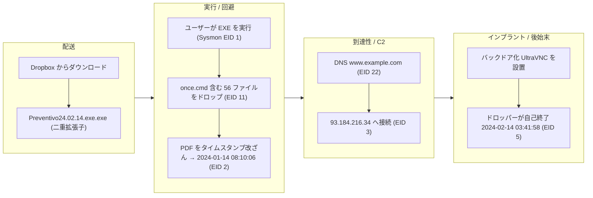
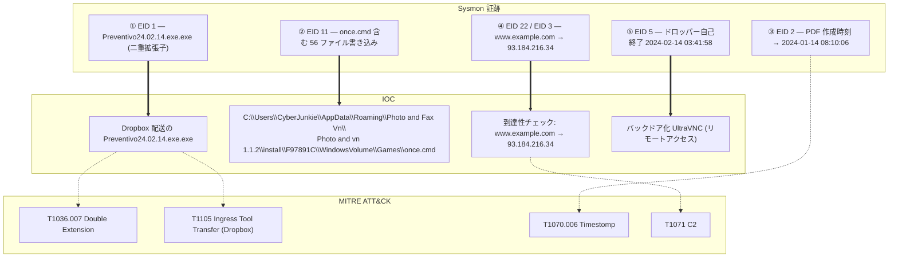

## シナリオ

Unit42 は HackTheBox の *Sherlock*（防御・DFIR 系チャレンジ）で難易度 **Very Easy**。マシンを攻略するのではなく、侵害された Windows ホストのフォレンジック証跡を渡され、攻撃者が何をしたかを再構築する。

> *「DFIR チャレンジ・シリーズの第1弾。提供される証跡を通じて Sysmon ログと Windows イベント解析に慣れることが目的。従業員が不審な挙動を報告し、調査用に Sysmon ログが与えられる。」*

| 項目 | 内容 |
|---------------------------|-------|
| プラットフォーム | HackTheBox — Sherlock |
| カテゴリ | DFIR / エンドポイントログ解析 |
| 難易度 | Very Easy |
| 証跡 | `Microsoft-Windows-Sysmon-Operational.evtx` |
| 必要スキル | Sysmon イベントID、プロセスツリー、防御回避の発見、C2 特定 |

## 提供される証跡

ファイルは1つだけ:

- `Microsoft-Windows-Sysmon-Operational.evtx` — 被害ホストからエクスポートされた System Monitor (Sysmon) の運用ログ。

物語を語るのに必要なものは、この1ファイルの中にすべて入っている。本チャレンジは要するに **Sysmon を正しく読む**演習である。

## 使用ツール

以下のいずれでも `.evtx` を解析できる。好みで選べばよい:

- **EvtxECmd**（Eric Zimmerman）→ CSV 変換 → **Timeline Explorer** で閲覧
- **Windows イベントビューア**（標準）+ Event ID ごとのカスタム XPath フィルタ
- 大量解析なら **Chainsaw** / **Hayabusa** によるルールベースの Sysmon ハンティング

```powershell
# Eric Zimmerman の EvtxECmd: evtx -> CSV にして Timeline Explorer でトリアージ
EvtxECmd.exe -f Microsoft-Windows-Sysmon-Operational.evtx --csv . --csvf unit42.csv
```

<svg width="15" height="15" viewBox="0 0 24 24" fill="none" stroke="currentColor" stroke-width="2.2" stroke-linecap="round" stroke-linejoin="round" style="vertical-align:-2px;"><path d="M9 18h6"/><path d="M10 22h4"/><path d="M15.1 14c.2-1 .7-1.7 1.4-2.5A4.6 4.6 0 0 0 18 8 6 6 0 0 0 6 8c0 1 .2 2.2 1.5 3.5.7.8 1.2 1.5 1.4 2.5"/></svg> **解説** — Sysmon は生の Windows イベントに、レスポンダーが本当に必要とするフィールド（完全なコマンドライン、イメージのハッシュ、親プロセス、ネットワークの宛先）を付加してくれる。先に `.evtx` をタイムライン化しておけば、以降の問いはすべて「探索」ではなく「フィルタ」になる。

## 前提: 押さえるべき Sysmon Event ID

調査のほとんどは「正しい Event ID で絞り込み、フィールドを読む」だけで進む。関係するもの:

| Event ID | 意味 | ここでの重要性 |
|---|---|---|
| 1 | プロセス生成 | コマンドライン・ハッシュ・親プロセス → 悪性バイナリの特定 |
| 2 | プロセスがファイル作成時刻を変更 | **タイムスタンプ改ざん(time stomping)の決定的シグナル** |
| 3 | ネットワーク接続 | 送信元/宛先 IP とポート → C2 通信 |
| 5 | プロセス終了 | ドロッパーの活動時間を区切る(自己終了) |
| 11 | ファイル作成 | ドロッパーがディスクに書き込んだファイル |
| 22 | DNS クエリ | マルウェアが名前解決したドメイン |

## 調査

<h2 id="q1" style="background:rgba(255,159,67,.16);border-left:5px solid #ff9f43;border-radius:6px;padding:.5rem .85rem;margin:2.5rem 0 1rem;">Q1. How many event logs are there with Event ID 11?</h2>

ログを `EventID = 11`（FileCreate）で絞り込み、件数を数える。

<svg width="15" height="15" viewBox="0 0 24 24" fill="none" stroke="currentColor" stroke-width="2.2" stroke-linecap="round" stroke-linejoin="round" style="vertical-align:-2px;"><path d="M21.8 10A10 10 0 1 1 17 3.3"/><path d="m9 11 3 3L22 4"/></svg> **答え**

```text
56
```


<svg width="15" height="15" viewBox="0 0 24 24" fill="none" stroke="currentColor" stroke-width="2.2" stroke-linecap="round" stroke-linejoin="round" style="vertical-align:-2px;"><path d="M9 18h6"/><path d="M10 22h4"/><path d="M15.1 14c.2-1 .7-1.7 1.4-2.5A4.6 4.6 0 0 0 18 8 6 6 0 0 0 6 8c0 1 .2 2.2 1.5 3.5.7.8 1.2 1.5 1.4 2.5"/></svg> **解説** — FileCreate の件数をまず数えると、ドロッパーがディスク上でどれだけ「騒がしい」かが一目で分かる。クリック1回で数十ファイルが書き込まれている時点で、マルウェア名を特定する前から強い感染指標になる。

<h2 id="q2" style="background:rgba(255,159,67,.16);border-left:5px solid #ff9f43;border-radius:6px;padding:.5rem .85rem;margin:2.5rem 0 1rem;">Q2. What is the malicious process that infected the victim's system?</h2>

`EventID = 1`（プロセス生成）に移り、`Image` / `CommandLine` フィールドを精査する。**二重拡張子**になっているエントリが即座に目につく — 実行ファイルを文書に見せかける古典的な手口だ。

<svg width="15" height="15" viewBox="0 0 24 24" fill="none" stroke="currentColor" stroke-width="2.2" stroke-linecap="round" stroke-linejoin="round" style="vertical-align:-2px;"><path d="M21.8 10A10 10 0 1 1 17 3.3"/><path d="m9 11 3 3L22 4"/></svg> **答え**

```text
C:\Users\CyberJunkie\Downloads\Preventivo24.02.14.exe.exe
```


<svg width="15" height="15" viewBox="0 0 24 24" fill="none" stroke="currentColor" stroke-width="2.2" stroke-linecap="round" stroke-linejoin="round" style="vertical-align:-2px;"><path d="M9 18h6"/><path d="M10 22h4"/><path d="M15.1 14c.2-1 .7-1.7 1.4-2.5A4.6 4.6 0 0 0 18 8 6 6 0 0 0 6 8c0 1 .2 2.2 1.5 3.5.7.8 1.2 1.5 1.4 2.5"/></svg> **解説** — `*.exe.exe` は明白な危険信号だ。Windows は既定で既知の拡張子を隠すため、被害者には `Preventivo24.02.14.exe` としか見えず、通常のファイルだと思い込む。`\Downloads\` からの実行に加え、イタリア語の囮名（*preventivo* =「見積もり」）はソーシャルエンジニアリングによる配送を強く示唆する。（MITRE ATT&CK **T1036.007 — Masquerading: Double File Extension**）

<h2 id="q3" style="background:rgba(255,159,67,.16);border-left:5px solid #ff9f43;border-radius:6px;padding:.5rem .85rem;margin:2.5rem 0 1rem;">Q3. Which cloud drive was used to distribute the malware?</h2>

囮ファイルは、評価ベースの制御をすり抜けるために正規のファイルホスティングサービスから配信された。

<svg width="15" height="15" viewBox="0 0 24 24" fill="none" stroke="currentColor" stroke-width="2.2" stroke-linecap="round" stroke-linejoin="round" style="vertical-align:-2px;"><path d="M21.8 10A10 10 0 1 1 17 3.3"/><path d="m9 11 3 3L22 4"/></svg> **答え**

```text
Dropbox
```


<svg width="15" height="15" viewBox="0 0 24 24" fill="none" stroke="currentColor" stroke-width="2.2" stroke-linecap="round" stroke-linejoin="round" style="vertical-align:-2px;"><path d="M9 18h6"/><path d="M10 22h4"/><path d="M15.1 14c.2-1 .7-1.7 1.4-2.5A4.6 4.6 0 0 0 18 8 6 6 0 0 0 6 8c0 1 .2 2.2 1.5 3.5.7.8 1.2 1.5 1.4 2.5"/></svg> **解説** — 攻撃者は信頼された SaaS ストレージ（Dropbox、Google Drive、OneDrive）を悪用する。ダウンロード元が高評価ドメインになるため、プロキシや URL フィルタにブロックされにくい。（MITRE ATT&CK **T1105 — Ingress Tool Transfer**、信頼された Web サービス経由）

<h2 id="q4" style="background:rgba(255,159,67,.16);border-left:5px solid #ff9f43;border-radius:6px;padding:.5rem .85rem;margin:2.5rem 0 1rem;">Q4. The malware used time stomping on a PDF. What was the timestamp changed to?</h2>

タイムスタンプ改ざんはファイルの作成時刻を書き換え、古い正規ファイルに紛れ込ませる手口。Sysmon はこれを **Event ID 2**（「プロセスがファイル作成時刻を変更した」）として記録する。これで絞り込み、PDF に適用された新しい値を読む。

<svg width="15" height="15" viewBox="0 0 24 24" fill="none" stroke="currentColor" stroke-width="2.2" stroke-linecap="round" stroke-linejoin="round" style="vertical-align:-2px;"><path d="M21.8 10A10 10 0 1 1 17 3.3"/><path d="m9 11 3 3L22 4"/></svg> **答え**

```text
2024-01-14 08:10:06
```


<svg width="15" height="15" viewBox="0 0 24 24" fill="none" stroke="currentColor" stroke-width="2.2" stroke-linecap="round" stroke-linejoin="round" style="vertical-align:-2px;"><path d="M9 18h6"/><path d="M10 22h4"/><path d="M15.1 14c.2-1 .7-1.7 1.4-2.5A4.6 4.6 0 0 0 18 8 6 6 0 0 0 6 8c0 1 .2 2.2 1.5 3.5.7.8 1.2 1.5 1.4 2.5"/></svg> **解説** — Event ID 2 は、アナリストが*アンチフォレンジックの直接的証拠*を得られる数少ない場所の1つだ。ドロッパーはファイルを過去日付に偽装し、作成時刻でソートするレスポンダーの目を素通りさせる。そもそも EID 2 が存在すること自体が怪しい — 正規ソフトが作成時刻を書き換えることはまずない。（MITRE ATT&CK **T1070.006 — Timestomp**）

<h2 id="q5" style="background:rgba(255,159,67,.16);border-left:5px solid #ff9f43;border-radius:6px;padding:.5rem .85rem;margin:2.5rem 0 1rem;">Q5. Where was <code>once.cmd</code> created on disk? (full path)</h2>

`EventID = 11` を `TargetFilename` の `once.cmd` で絞り込む。

<svg width="15" height="15" viewBox="0 0 24 24" fill="none" stroke="currentColor" stroke-width="2.2" stroke-linecap="round" stroke-linejoin="round" style="vertical-align:-2px;"><path d="M21.8 10A10 10 0 1 1 17 3.3"/><path d="m9 11 3 3L22 4"/></svg> **答え**

```text
C:\Users\CyberJunkie\AppData\Roaming\Photo and Fax Vn\Photo and vn 1.1.2\install\F97891C\WindowsVolume\Games\once.cmd
```


<svg width="15" height="15" viewBox="0 0 24 24" fill="none" stroke="currentColor" stroke-width="2.2" stroke-linecap="round" stroke-linejoin="round" style="vertical-align:-2px;"><path d="M9 18h6"/><path d="M10 22h4"/><path d="M15.1 14c.2-1 .7-1.7 1.4-2.5A4.6 4.6 0 0 0 18 8 6 6 0 0 0 6 8c0 1 .2 2.2 1.5 3.5.7.8 1.2 1.5 1.4 2.5"/></svg> **解説** — 深くネストしたもっともらしい `AppData\Roaming\...` パスは、無害なインストール済みアプリに見せかけるためのもの。`AppData\Roaming` 配下へのバッチ/スクリプト配置は、再起動後も残り注目されにくい、よくあるステージング/永続化の場所だ。

<h2 id="q6" style="background:rgba(255,159,67,.16);border-left:5px solid #ff9f43;border-radius:6px;padding:.5rem .85rem;margin:2.5rem 0 1rem;">Q6. The malware tried to reach a dummy domain to check internet connectivity. Which domain?</h2>

`EventID = 22`（DNS クエリ）を、悪性プロセスが発行したクエリで絞り込む。

<svg width="15" height="15" viewBox="0 0 24 24" fill="none" stroke="currentColor" stroke-width="2.2" stroke-linecap="round" stroke-linejoin="round" style="vertical-align:-2px;"><path d="M21.8 10A10 10 0 1 1 17 3.3"/><path d="m9 11 3 3L22 4"/></svg> **答え**

```text
www.example.com
```


<svg width="15" height="15" viewBox="0 0 24 24" fill="none" stroke="currentColor" stroke-width="2.2" stroke-linecap="round" stroke-linejoin="round" style="vertical-align:-2px;"><path d="M9 18h6"/><path d="M10 22h4"/><path d="M15.1 14c.2-1 .7-1.7 1.4-2.5A4.6 4.6 0 0 0 18 8 6 6 0 0 0 6 8c0 1 .2 2.2 1.5 3.5.7.8 1.2 1.5 1.4 2.5"/></svg> **解説** — マルウェアは本物のインフラに接触する前に、必ず稼働している「カナリア」ドメインをまず名前解決し、インターネット接続があるかを確認することが多い — 安価なサンドボックス/エアギャップ確認だ。`www.example.com` は IANA 予約ドメインで、到達性プローブに最適。

<h2 id="q7" style="background:rgba(255,159,67,.16);border-left:5px solid #ff9f43;border-radius:6px;padding:.5rem .85rem;margin:2.5rem 0 1rem;">Q7. Which IP address did the malicious process try to reach out to?</h2>

`EventID = 3`（ネットワーク接続）を悪性プロセスで絞り込む。

<svg width="15" height="15" viewBox="0 0 24 24" fill="none" stroke="currentColor" stroke-width="2.2" stroke-linecap="round" stroke-linejoin="round" style="vertical-align:-2px;"><path d="M21.8 10A10 10 0 1 1 17 3.3"/><path d="m9 11 3 3L22 4"/></svg> **答え**

```text
93.184.216.34
```


<svg width="15" height="15" viewBox="0 0 24 24" fill="none" stroke="currentColor" stroke-width="2.2" stroke-linecap="round" stroke-linejoin="round" style="vertical-align:-2px;"><path d="M9 18h6"/><path d="M10 22h4"/><path d="M15.1 14c.2-1 .7-1.7 1.4-2.5A4.6 4.6 0 0 0 18 8 6 6 0 0 0 6 8c0 1 .2 2.2 1.5 3.5.7.8 1.2 1.5 1.4 2.5"/></svg> **解説** — `93.184.216.34` は長らく `example.com` の公開 IP だった — 上の DNS クエリが解決され、ホストが実際に外向き通信したことを裏付ける。EID 22（解決の意図）と EID 3（実際の接続）を対にすることで、単なる DNS 試行ではなく、ビーコンが実際に外へ出たことを証明できる。

<h2 id="q8" style="background:rgba(255,159,67,.16);border-left:5px solid #ff9f43;border-radius:6px;padding:.5rem .85rem;margin:2.5rem 0 1rem;">Q8. When did the process terminate itself?</h2>

ドロッパーはペイロード — バックドア化された **UltraVNC** — を仕込んだ後、後始末をする。`EventID = 5`（プロセス終了）を悪性イメージで絞り込む。

<svg width="15" height="15" viewBox="0 0 24 24" fill="none" stroke="currentColor" stroke-width="2.2" stroke-linecap="round" stroke-linejoin="round" style="vertical-align:-2px;"><path d="M21.8 10A10 10 0 1 1 17 3.3"/><path d="m9 11 3 3L22 4"/></svg> **答え**

```text
2024-02-14 03:41:58
```


<svg width="15" height="15" viewBox="0 0 24 24" fill="none" stroke="currentColor" stroke-width="2.2" stroke-linecap="round" stroke-linejoin="round" style="vertical-align:-2px;"><path d="M9 18h6"/><path d="M10 22h4"/><path d="M15.1 14c.2-1 .7-1.7 1.4-2.5A4.6 4.6 0 0 0 18 8 6 6 0 0 0 6 8c0 1 .2 2.2 1.5 3.5.7.8 1.2 1.5 1.4 2.5"/></svg> **解説** — 本物のインプラントを落とした後の自己終了は意図的だ。騒がしく短命なドロッパーが終了し、静かで正規に見える UltraVNC サービスだけがリモートアクセス用に残る。EID 5 を捉えれば、ドロッパーの活動時間を正確に区切れる。

## 攻撃タイムライン

| 時刻 (UTC) | 段階 | 証跡 |
|---|---|---|
| — | 配送 | `Preventivo24.02.14.exe.exe` を **Dropbox** から `\Downloads\` にダウンロード |
| (クリック時) | 実行 | Sysmon **EID 1** — 二重拡張子バイナリが `CyberJunkie` として実行 |
| 2024-01-14 08:10:06 | 防御回避 | Sysmon **EID 2** — PDF の作成時刻を過去日付に改ざん |
| (ドロップ) | ステージング | Sysmon **EID 11** — `AppData\Roaming` 配下の `once.cmd` を含む 56 ファイルを書き込み |
| (ビーコン) | 到達性確認 | Sysmon **EID 22** — DNS `www.example.com` |
| (ビーコン) | C2 通信 | Sysmon **EID 3** — `93.184.216.34` へ接続 |
| — | インプラント | バックドア化された **UltraVNC** をリモートアクセス用に設置 |
| 2024-02-14 03:41:58 | 後始末 | Sysmon **EID 5** — ドロッパーが自己終了 |



## 証跡 → IOC → ATT&CK 関係図

<!-- DFIR 関係図 (hokkaido 図B 流): 丸数字①〜⑤=各設問の証跡。矢印は 実線=フロー / 太線=IOC抽出(強調) / 点線=ATT&CK対応。値は省略しない。 -->


## 検知と防御（ブルーチーム）

もっと早く捕捉するには:

- **二重拡張子にアラートを出す**（`*.exe.exe`、`*.pdf.exe`）。特に `\Downloads\` や `\AppData\` からの実行パス。
- **Sysmon Event ID 2 を高シグナルとして扱う。** 正規ソフトが作成時刻を書き換えることはまずないため、EID 2 へのルールは極めて低ノイズでタイムスタンプ改ざんを浮かび上がらせる。
- **外向き通信をベースライン化する。** ワークステーションが `www.example.com` を解決して即座に外へ出るのは異常。カナリアドメインの参照は安価なハンティングの起点になる。
- **信頼された SaaS 経由の配送を監視する。** Dropbox/Drive/OneDrive 由来の実行ファイルのダウンロードは、評価による無条件パスではなく内容検査に値する。
- **強力な Sysmon 構成を導入する**（SwiftOnSecurity / Olaf Hartong `sysmon-modular` など）。EID 1/2/3/11/22 をコマンドラインとハッシュ込みで取得する。

## まとめ

- 適切に構成された **Sysmon** ログ1つで、配送・実行・回避・C2・後始末という感染チェーン全体を再構築できる。
- **二重拡張子**と **Event ID 2（タイムスタンプ改ざん）** は、防御側が持つ最も高シグナル・低ノイズな指標の2つ。
- 何かを「C2」と断定する前に、必ず **DNS（EID 22）** と **実際の接続（EID 3）** を突き合わせること。
- 調査しながら所見を **MITRE ATT&CK** にマッピングすると、散らばった証跡が説明可能な物語になる。

## 参考文献

- HackTheBox Sherlock: Unit42 — <https://app.hackthebox.com/sherlocks>
- Sysmon (Sysinternals) — <https://learn.microsoft.com/sysinternals/downloads/sysmon>
- Eric Zimmerman's Tools (EvtxECmd / Timeline Explorer) — <https://ericzimmerman.github.io/>
- SwiftOnSecurity sysmon-config — <https://github.com/SwiftOnSecurity/sysmon-config>
- MITRE ATT&CK: T1036.007 (Double Extension), T1070.006 (Timestomp), T1071 (C2)
