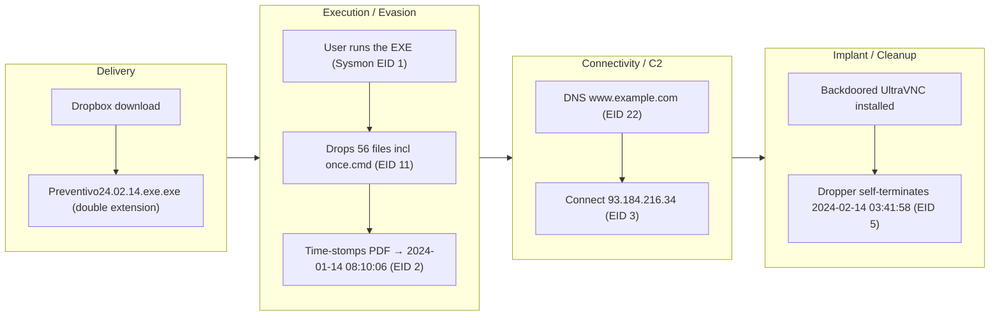
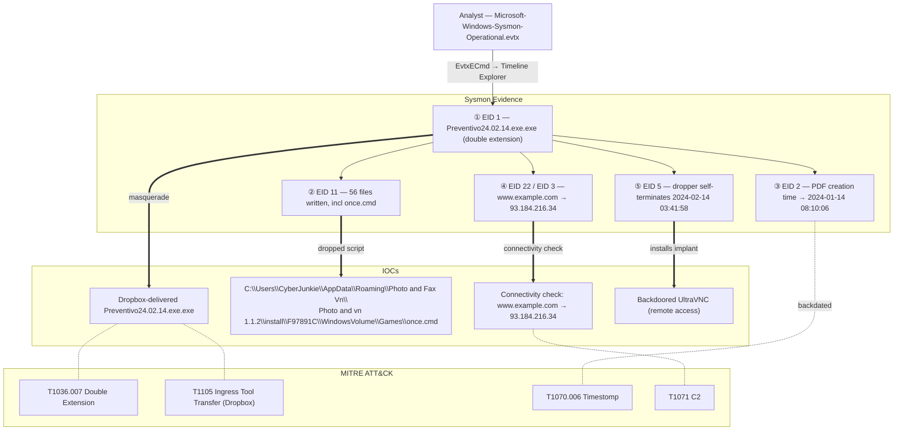

## Scenario

Unit42 is a **Very Easy** HackTheBox *Sherlock* (defensive / DFIR challenge). Instead of exploiting a box, you are handed forensic artifacts from a compromised Windows host and must reconstruct what the attacker did.

> *"This is the first installment in a thematic series of DFIR challenges. The artifacts provided will familiarise you with Sysmon logs and Windows event analysis. An employee reported suspicious activity; you are given the Sysmon log to investigate the infection chain."*

| Field | Value |
|---------------------------|-------|
| Platform | HackTheBox — Sherlock |
| Category | DFIR / Endpoint log analysis |
| Difficulty | Very Easy |
| Artifact | `Microsoft-Windows-Sysmon-Operational.evtx` |
| Skills | Sysmon event IDs, process tree, defense-evasion spotting, C2 identification |

## Artifacts

A single file is provided:

- `Microsoft-Windows-Sysmon-Operational.evtx` — the System Monitor (Sysmon) operational log exported from the victim host.

Everything we need to tell the story lives inside this one log. The whole challenge is an exercise in reading **Sysmon** correctly.

## Toolkit

Any of the following can parse the `.evtx`; pick one:

- **EvtxECmd** (Eric Zimmerman) → convert to CSV, then open in **Timeline Explorer**
- **Windows Event Viewer** (native) with custom XPath filters per Event ID
- **Chainsaw** or **Hayabusa** for rule-based Sysmon hunting at scale

```powershell
# Eric Zimmerman's EvtxECmd: evtx -> CSV for triage in Timeline Explorer
EvtxECmd.exe -f Microsoft-Windows-Sysmon-Operational.evtx --csv . --csvf unit42.csv
```

<svg width="15" height="15" viewBox="0 0 24 24" fill="none" stroke="currentColor" stroke-width="2.2" stroke-linecap="round" stroke-linejoin="round" style="vertical-align:-2px;"><path d="M9 18h6"/><path d="M10 22h4"/><path d="M15.1 14c.2-1 .7-1.7 1.4-2.5A4.6 4.6 0 0 0 18 8 6 6 0 0 0 6 8c0 1 .2 2.2 1.5 3.5.7.8 1.2 1.5 1.4 2.5"/></svg> **Analysis** — Sysmon enriches the raw Windows event stream with the fields a responder actually needs — full command line, image hashes, parent process, and network tuples. Normalising the `.evtx` into a timeline first means every later question becomes a filter, not a hunt.

## Background: the Sysmon Event IDs you need

Most of the investigation is "filter by the right Event ID, then read the fields." The relevant ones:

| Event ID | Meaning | Why it matters here |
|---|---|---|
| 1 | Process creation | command line, hashes, parent → spot the malicious binary |
| 2 | A process changed a file creation time | **the canonical time-stomping signal** |
| 3 | Network connection | source/destination IP and port → C2 reachout |
| 5 | Process terminated | bounds the dropper's active window (self-termination) |
| 11 | File created | files written to disk by the dropper |
| 22 | DNS query | domains the malware resolved |

## Investigation

<h2 id="q1" style="background:rgba(255,159,67,.16);border-left:5px solid #ff9f43;border-radius:6px;padding:.5rem .85rem;margin:2.5rem 0 1rem;">Q1. How many event logs are there with Event ID 11?</h2>

Filter the log on `EventID = 11` (FileCreate) and count the results.

<svg width="15" height="15" viewBox="0 0 24 24" fill="none" stroke="currentColor" stroke-width="2.2" stroke-linecap="round" stroke-linejoin="round" style="vertical-align:-2px;"><path d="M21.8 10A10 10 0 1 1 17 3.3"/><path d="m9 11 3 3L22 4"/></svg> **Answer**

```text
56
```


<svg width="15" height="15" viewBox="0 0 24 24" fill="none" stroke="currentColor" stroke-width="2.2" stroke-linecap="round" stroke-linejoin="round" style="vertical-align:-2px;"><path d="M9 18h6"/><path d="M10 22h4"/><path d="M15.1 14c.2-1 .7-1.7 1.4-2.5A4.6 4.6 0 0 0 18 8 6 6 0 0 0 6 8c0 1 .2 2.2 1.5 3.5.7.8 1.2 1.5 1.4 2.5"/></svg> **Analysis** — Counting FileCreate events first gives a quick sense of how "noisy" the dropper was on disk — a single click that writes dozens of files is already a strong infection indicator before you have even named the malware.

<h2 id="q2" style="background:rgba(255,159,67,.16);border-left:5px solid #ff9f43;border-radius:6px;padding:.5rem .85rem;margin:2.5rem 0 1rem;">Q2. What is the malicious process that infected the victim's system?</h2>

Pivot to `EventID = 1` (process creation) and scan the `Image` / `CommandLine` fields. One entry stands out immediately because of a **double file extension** — a classic attempt to disguise an executable as a document.

<svg width="15" height="15" viewBox="0 0 24 24" fill="none" stroke="currentColor" stroke-width="2.2" stroke-linecap="round" stroke-linejoin="round" style="vertical-align:-2px;"><path d="M21.8 10A10 10 0 1 1 17 3.3"/><path d="m9 11 3 3L22 4"/></svg> **Answer**

```text
C:\Users\CyberJunkie\Downloads\Preventivo24.02.14.exe.exe
```


<svg width="15" height="15" viewBox="0 0 24 24" fill="none" stroke="currentColor" stroke-width="2.2" stroke-linecap="round" stroke-linejoin="round" style="vertical-align:-2px;"><path d="M9 18h6"/><path d="M10 22h4"/><path d="M15.1 14c.2-1 .7-1.7 1.4-2.5A4.6 4.6 0 0 0 18 8 6 6 0 0 0 6 8c0 1 .2 2.2 1.5 3.5.7.8 1.2 1.5 1.4 2.5"/></svg> **Analysis** — `*.exe.exe` is a glaring red flag: Windows hides known extensions by default, so the victim only saw `Preventivo24.02.14.exe` and assumed it was a normal file. Running from `\Downloads\` plus an Italian lure name (*preventivo* = "quote/estimate") screams social-engineering delivery. (MITRE ATT&CK **T1036.007 — Masquerading: Double File Extension**.)

<h2 id="q3" style="background:rgba(255,159,67,.16);border-left:5px solid #ff9f43;border-radius:6px;padding:.5rem .85rem;margin:2.5rem 0 1rem;">Q3. Which cloud drive was used to distribute the malware?</h2>

The lure was delivered from a legitimate file-hosting service to slip past reputation-based controls.

<svg width="15" height="15" viewBox="0 0 24 24" fill="none" stroke="currentColor" stroke-width="2.2" stroke-linecap="round" stroke-linejoin="round" style="vertical-align:-2px;"><path d="M21.8 10A10 10 0 1 1 17 3.3"/><path d="m9 11 3 3L22 4"/></svg> **Answer**

```text
Dropbox
```


<svg width="15" height="15" viewBox="0 0 24 24" fill="none" stroke="currentColor" stroke-width="2.2" stroke-linecap="round" stroke-linejoin="round" style="vertical-align:-2px;"><path d="M9 18h6"/><path d="M10 22h4"/><path d="M15.1 14c.2-1 .7-1.7 1.4-2.5A4.6 4.6 0 0 0 18 8 6 6 0 0 0 6 8c0 1 .2 2.2 1.5 3.5.7.8 1.2 1.5 1.4 2.5"/></svg> **Analysis** — Attackers abuse trusted SaaS storage (Dropbox, Google Drive, OneDrive) so the download originates from a high-reputation domain that proxies and URL filters rarely block. (MITRE ATT&CK **T1105 — Ingress Tool Transfer** via a trusted web service.)

<h2 id="q4" style="background:rgba(255,159,67,.16);border-left:5px solid #ff9f43;border-radius:6px;padding:.5rem .85rem;margin:2.5rem 0 1rem;">Q4. The malware used time stomping on a PDF. What was the timestamp changed to?</h2>

Time stomping rewrites a file's creation time so the artifact blends in with older, legitimate files. Sysmon records this specifically as **Event ID 2** ("A process changed a file creation time"). Filter on it and read the new value applied to the PDF.

<svg width="15" height="15" viewBox="0 0 24 24" fill="none" stroke="currentColor" stroke-width="2.2" stroke-linecap="round" stroke-linejoin="round" style="vertical-align:-2px;"><path d="M21.8 10A10 10 0 1 1 17 3.3"/><path d="m9 11 3 3L22 4"/></svg> **Answer**

```text
2024-01-14 08:10:06
```


<svg width="15" height="15" viewBox="0 0 24 24" fill="none" stroke="currentColor" stroke-width="2.2" stroke-linecap="round" stroke-linejoin="round" style="vertical-align:-2px;"><path d="M9 18h6"/><path d="M10 22h4"/><path d="M15.1 14c.2-1 .7-1.7 1.4-2.5A4.6 4.6 0 0 0 18 8 6 6 0 0 0 6 8c0 1 .2 2.2 1.5 3.5.7.8 1.2 1.5 1.4 2.5"/></svg> **Analysis** — Event ID 2 is one of the few places an analyst gets *direct evidence of anti-forensics*. The dropper backdates the file so a responder sorting by creation time scrolls right past it. The presence of EID 2 at all is itself suspicious — legitimate software almost never rewrites creation timestamps. (MITRE ATT&CK **T1070.006 — Timestomp**.)

<h2 id="q5" style="background:rgba(255,159,67,.16);border-left:5px solid #ff9f43;border-radius:6px;padding:.5rem .85rem;margin:2.5rem 0 1rem;">Q5. Where was <code>once.cmd</code> created on disk? (full path)</h2>

Filter `EventID = 11` for `once.cmd` in the `TargetFilename` field.

<svg width="15" height="15" viewBox="0 0 24 24" fill="none" stroke="currentColor" stroke-width="2.2" stroke-linecap="round" stroke-linejoin="round" style="vertical-align:-2px;"><path d="M21.8 10A10 10 0 1 1 17 3.3"/><path d="m9 11 3 3L22 4"/></svg> **Answer**

```text
C:\Users\CyberJunkie\AppData\Roaming\Photo and Fax Vn\Photo and vn 1.1.2\install\F97891C\WindowsVolume\Games\once.cmd
```


<svg width="15" height="15" viewBox="0 0 24 24" fill="none" stroke="currentColor" stroke-width="2.2" stroke-linecap="round" stroke-linejoin="round" style="vertical-align:-2px;"><path d="M9 18h6"/><path d="M10 22h4"/><path d="M15.1 14c.2-1 .7-1.7 1.4-2.5A4.6 4.6 0 0 0 18 8 6 6 0 0 0 6 8c0 1 .2 2.2 1.5 3.5.7.8 1.2 1.5 1.4 2.5"/></svg> **Analysis** — The deeply nested, plausible-looking `AppData\Roaming\...` path is meant to look like a benign installed app. Dropping batch/scripts under `AppData\Roaming` is a common persistence/staging location that survives reboots and rarely draws attention.

<h2 id="q6" style="background:rgba(255,159,67,.16);border-left:5px solid #ff9f43;border-radius:6px;padding:.5rem .85rem;margin:2.5rem 0 1rem;">Q6. The malware tried to reach a dummy domain to check internet connectivity. Which domain?</h2>

Filter `EventID = 22` (DNS query) for queries made by the malicious process.

<svg width="15" height="15" viewBox="0 0 24 24" fill="none" stroke="currentColor" stroke-width="2.2" stroke-linecap="round" stroke-linejoin="round" style="vertical-align:-2px;"><path d="M21.8 10A10 10 0 1 1 17 3.3"/><path d="m9 11 3 3L22 4"/></svg> **Answer**

```text
www.example.com
```


<svg width="15" height="15" viewBox="0 0 24 24" fill="none" stroke="currentColor" stroke-width="2.2" stroke-linecap="round" stroke-linejoin="round" style="vertical-align:-2px;"><path d="M9 18h6"/><path d="M10 22h4"/><path d="M15.1 14c.2-1 .7-1.7 1.4-2.5A4.6 4.6 0 0 0 18 8 6 6 0 0 0 6 8c0 1 .2 2.2 1.5 3.5.7.8 1.2 1.5 1.4 2.5"/></svg> **Analysis** — Malware frequently resolves a guaranteed-up "canary" domain first to confirm it has internet before contacting real infrastructure — a cheap sandbox/airgap check. `www.example.com` is an IANA-reserved domain, perfect as a connectivity probe.

<h2 id="q7" style="background:rgba(255,159,67,.16);border-left:5px solid #ff9f43;border-radius:6px;padding:.5rem .85rem;margin:2.5rem 0 1rem;">Q7. Which IP address did the malicious process try to reach out to?</h2>

Pivot to `EventID = 3` (network connection) for the malicious process.

<svg width="15" height="15" viewBox="0 0 24 24" fill="none" stroke="currentColor" stroke-width="2.2" stroke-linecap="round" stroke-linejoin="round" style="vertical-align:-2px;"><path d="M21.8 10A10 10 0 1 1 17 3.3"/><path d="m9 11 3 3L22 4"/></svg> **Answer**

```text
93.184.216.34
```


<svg width="15" height="15" viewBox="0 0 24 24" fill="none" stroke="currentColor" stroke-width="2.2" stroke-linecap="round" stroke-linejoin="round" style="vertical-align:-2px;"><path d="M9 18h6"/><path d="M10 22h4"/><path d="M15.1 14c.2-1 .7-1.7 1.4-2.5A4.6 4.6 0 0 0 18 8 6 6 0 0 0 6 8c0 1 .2 2.2 1.5 3.5.7.8 1.2 1.5 1.4 2.5"/></svg> **Analysis** — `93.184.216.34` was the long-standing public IP of `example.com` — confirming the DNS query above resolved and the host actually egressed. Pairing EID 22 (intent to resolve) with EID 3 (actual connection) is how you prove the beacon left the building rather than just attempted DNS.

<h2 id="q8" style="background:rgba(255,159,67,.16);border-left:5px solid #ff9f43;border-radius:6px;padding:.5rem .85rem;margin:2.5rem 0 1rem;">Q8. When did the process terminate itself?</h2>

The dropper cleans up after planting its payload — a backdoored variant of **UltraVNC**. Filter `EventID = 5` (process terminated) for the malicious image.

<svg width="15" height="15" viewBox="0 0 24 24" fill="none" stroke="currentColor" stroke-width="2.2" stroke-linecap="round" stroke-linejoin="round" style="vertical-align:-2px;"><path d="M21.8 10A10 10 0 1 1 17 3.3"/><path d="m9 11 3 3L22 4"/></svg> **Answer**

```text
2024-02-14 03:41:58
```


<svg width="15" height="15" viewBox="0 0 24 24" fill="none" stroke="currentColor" stroke-width="2.2" stroke-linecap="round" stroke-linejoin="round" style="vertical-align:-2px;"><path d="M9 18h6"/><path d="M10 22h4"/><path d="M15.1 14c.2-1 .7-1.7 1.4-2.5A4.6 4.6 0 0 0 18 8 6 6 0 0 0 6 8c0 1 .2 2.2 1.5 3.5.7.8 1.2 1.5 1.4 2.5"/></svg> **Analysis** — Self-termination after dropping the real implant is deliberate: the loud, short-lived dropper exits, leaving only the quiet, legitimate-looking UltraVNC service for remote access. Catching the EID 5 lets you bound the dropper's active window precisely.

## Attack Timeline

| Time (UTC) | Stage | Evidence |
|---|---|---|
| — | Delivery | `Preventivo24.02.14.exe.exe` downloaded from **Dropbox** into `\Downloads\` |
| (on click) | Execution | Sysmon **EID 1** — double-extension binary runs as `CyberJunkie` |
| 2024-01-14 08:10:06 | Defense evasion | Sysmon **EID 2** — PDF creation time backdated (time stomp) |
| (drop) | Staging | Sysmon **EID 11** — 56 files written incl. `once.cmd` under `AppData\Roaming` |
| (beacon) | Connectivity check | Sysmon **EID 22** — DNS `www.example.com` |
| (beacon) | C2 reachout | Sysmon **EID 3** — connection to `93.184.216.34` |
| — | Implant | Backdoored **UltraVNC** installed for remote access |
| 2024-02-14 03:41:58 | Cleanup | Sysmon **EID 5** — dropper self-terminates |



## Evidence → IOC → ATT&CK Map

<!-- DFIR 関係図 (hokkaido 図B 流): 丸数字①〜⑤=各設問の証跡。矢印は 実線=フロー / 太線=IOC抽出(強調) / 点線=ATT&CK対応。値は省略しない。 -->


## Detection & Hardening (Blue Team)

What would have caught this earlier:

- **Alert on double extensions** (`*.exe.exe`, `*.pdf.exe`) in `\Downloads\` and `\AppData\` execution paths.
- **Treat Sysmon Event ID 2 as high-signal.** Legitimate software rarely rewrites file creation times; a SIEM rule on EID 2 surfaces time-stomping with very low noise.
- **Baseline egress.** A workstation resolving `www.example.com` then connecting straight out is anomalous; canary-domain lookups are a cheap hunting pivot.
- **Watch trusted-SaaS delivery.** Downloads of executables originating from Dropbox/Drive/OneDrive deserve content inspection, not a reputation free pass.
- **Deploy a strong Sysmon config** (e.g. SwiftOnSecurity / Olaf Hartong `sysmon-modular`) so EID 1/2/3/11/22 are all captured with command line and hashes.

## Key Takeaways

- A single well-configured **Sysmon** log can reconstruct an entire infection chain — delivery, execution, evasion, C2, and cleanup.
- **Double file extensions** and **Event ID 2 (time stomping)** are two of the highest-signal, lowest-noise indicators a defender has.
- Always corroborate **DNS (EID 22)** with the **actual connection (EID 3)** before calling something "C2."
- Map findings to **MITRE ATT&CK** as you go — it turns scattered artifacts into a defensible narrative.

## References

- HackTheBox Sherlock: Unit42 — <https://app.hackthebox.com/sherlocks>
- Sysmon (Sysinternals) — <https://learn.microsoft.com/sysinternals/downloads/sysmon>
- Eric Zimmerman's Tools (EvtxECmd / Timeline Explorer) — <https://ericzimmerman.github.io/>
- SwiftOnSecurity sysmon-config — <https://github.com/SwiftOnSecurity/sysmon-config>
- MITRE ATT&CK: T1036.007 (Double Extension), T1070.006 (Timestomp), T1071 (C2)
