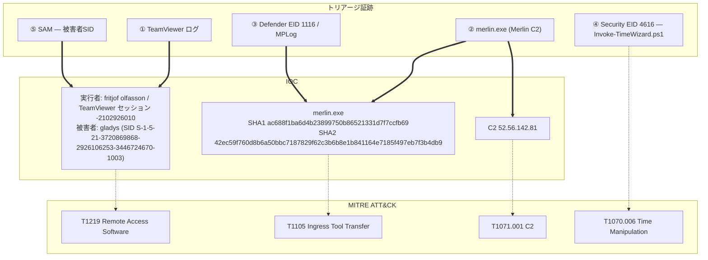

## シナリオ

TickTock は HackTheBox の *Sherlock*(防御・DFIR 系)で難易度 **Easy**。攻撃者は **gladys** ワークステーションに **TeamViewer** で遠隔アクセスし、オープンソースの C2 エージェントを投下、BitLocker でディスクをロックしようとし、さらに PowerShell スクリプトで**システム時刻を何度も改ざん**した(反フォレンジック)。渡されるホストのトリアージから、C2 エージェント・遠隔セッション・C2 エンドポイント・バイナリのハッシュ・時刻改ざんスクリプト・被害者を一連で再構築する。

> *「gladys のワークステーションが遠隔アクセスされ C2 エージェントが投下された。トリアージを調査し、C2 エージェントとそのコールバック、TeamViewer 経由の侵入経路、Defender の判定とハッシュ、時刻改ざんに使われたスクリプト、被害アカウントを特定せよ。」*

| 項目 | 内容 |
|---------------------------|-------|
| プラットフォーム | HackTheBox — Sherlock |
| カテゴリ | DFIR / エンドポイント・トリアージ |
| 難易度 | Easy |
| 証跡 | `gladys` の KAPE トリアージ(TeamViewer ログ・Windows Defender MPLog・Windows イベントログ・レジストリ) |
| 必要スキル | TeamViewer ログ解析、Defender MPLog/1116 トリアージ、Event ID 4616 時刻変更解析、レジストリ SID 調査 |

## 提供される証跡

**gladys** ワークステーションの KAPE 形式トリアージ。決定的な情報源は:

- **TeamViewer ログ**(`TeamViewer15_Logfile.log`) — プレーンテキスト。受信セッションID・接続時刻・攻撃者の表示名を保持。
- **Windows Defender MPLog**(`C:\ProgramData\Microsoft\Windows Defender\Support\MPLog-*`) — スキャン詳細。`SDN` イベントにバイナリの SHA1/SHA2 が含まれる。
- **Windows イベントログ** — Defender Operational **EID 1116**(マルウェア検知)、Security **EID 4616**(システム時刻変更)。
- **レジストリ / SAM** — 被害ユーザーの SID。

## 使用ツール

- **EvtxECmd**(Eric Zimmerman)→ CSV →**Timeline Explorer** でイベントログを閲覧
- 自作の **EVTX ダッシュボード**(私自身の DFIR トリアージ UI) — キーワード高速フィルタとフィールド確認に使用(以下のスクショ)
- TeamViewer ログ・Defender MPLog 用の**テキストエディタ / grep**
- ユーザーSID 確認に **Registry Explorer**(Eric Zimmerman)

```powershell
# トリアージのイベントログを CSV 化(Timeline Explorer 用)
EvtxECmd.exe -d C:\Triage --csv . --csvf ticktock.csv
# TeamViewer の接続記録(プレーンテキスト)
type "C:\Program Files\TeamViewer\TeamViewer15_Logfile.log"
# Defender スキャン詳細 — SHA1/SHA2 は SDN イベントにある
findstr /i "merlin" "C:\ProgramData\Microsoft\Windows Defender\Support\MPLog-*"
```

<svg width="15" height="15" viewBox="0 0 24 24" fill="none" stroke="currentColor" stroke-width="2.2" stroke-linecap="round" stroke-linejoin="round" style="vertical-align:-2px;"><path d="M9 18h6"/><path d="M10 22h4"/><path d="M15.1 14c.2-1 .7-1.7 1.4-2.5A4.6 4.6 0 0 0 18 8 6 6 0 0 0 6 8c0 1 .2 2.2 1.5 3.5.7.8 1.2 1.5 1.4 2.5"/></svg> **解説** — 本ケースは3種の異なる証跡の突き合わせだ: ベンダーアプリのログ(TeamViewer)が *誰が/いつ* を、アンチウイルスのログ(Defender MPLog)が *何を*(バイナリの正体＋ハッシュ)を、Windows イベントログが *反フォレンジック*(大量の時刻変更)を教える。時刻改ざんがひねりで、タイムスタンプ順の単純な解析が当てにならなくなる。そこで**システム時刻に依存しない順序を持つ証跡**を軸にする。

## 前提: 押さえるべきシグナル

| シグナル | 何か | ここでの重要性 |
|---|---|---|
| `TeamViewer15_Logfile.log` | TeamViewer のプレーンテキスト・セッションログ | 受信セッションID・接続時刻・攻撃者表示名 |
| Merlin(`merlin.exe`) | オープンソースの HTTP/2 C2 エージェント | 投下されたインプラント |
| Defender **EID 1116** | 「マルウェア検知」(Defender Operational) | バイナリの AV カテゴリ |
| Defender MPLog `SDN` イベント | スキャンごとの詳細行 | バイナリの **SHA1・SHA2** を保持 |
| Security **EID 4616** | 「システム時刻が変更された」 | 時刻変更ごとに1件 — 数えれば改ざん回数が分かる |
| `Invoke-TimeWizard.ps1` | PowerShell 時刻変更ツール | `4616` 連発の駆動元 |
| SAM / レジストリ | ローカルアカウントDB | 被害ユーザーの SID |

## 調査

<h2 id="q1" style="background:rgba(255,159,67,.16);border-left:5px solid #ff9f43;border-radius:6px;padding:.5rem .85rem;margin:2.5rem 0 1rem;">Q1. What was the name of the executable that was uploaded as a C2 Agent?</h2>

ユーザープロファイル配下に投下されたファイルをトリアージする。インプラント — オープンソースの **Merlin** HTTP/2 C2 エージェント — がデスクトップに素直な名前の実行ファイルとして置かれている。

<svg width="15" height="15" viewBox="0 0 24 24" fill="none" stroke="currentColor" stroke-width="2.2" stroke-linecap="round" stroke-linejoin="round" style="vertical-align:-2px;"><path d="M21.8 10A10 10 0 1 1 17 3.3"/><path d="m9 11 3 3L22 4"/></svg> **答え**

```text
merlin.exe
```

<svg width="15" height="15" viewBox="0 0 24 24" fill="none" stroke="currentColor" stroke-width="2.2" stroke-linecap="round" stroke-linejoin="round" style="vertical-align:-2px;"><path d="M9 18h6"/><path d="M10 22h4"/><path d="M15.1 14c.2-1 .7-1.7 1.4-2.5A4.6 4.6 0 0 0 18 8 6 6 0 0 0 6 8c0 1 .2 2.2 1.5 3.5.7.8 1.2 1.5 1.4 2.5"/></svg> **解説** — `merlin.exe` は Merlin C2 エージェント(著名なオープンソースのポストエクスプロイトフレームワーク)。`C:\Users\gladys\Desktop\` に投下され、本ケースの他の全証跡が中心に据える実体だ。(MITRE ATT&CK **T1105 — Ingress Tool Transfer**)

<h2 id="q2" style="background:rgba(255,159,67,.16);border-left:5px solid #ff9f43;border-radius:6px;padding:.5rem .85rem;margin:2.5rem 0 1rem;">Q2. What was the session id for the initial access?</h2>

侵入は TeamViewer 経由だった。`TeamViewer15_Logfile.log` を開き、受信セッションを読む — セッションID が記録されている。

<svg width="15" height="15" viewBox="0 0 24 24" fill="none" stroke="currentColor" stroke-width="2.2" stroke-linecap="round" stroke-linejoin="round" style="vertical-align:-2px;"><path d="M21.8 10A10 10 0 1 1 17 3.3"/><path d="m9 11 3 3L22 4"/></svg> **答え**

```text
-2102926010
```


<svg width="15" height="15" viewBox="0 0 24 24" fill="none" stroke="currentColor" stroke-width="2.2" stroke-linecap="round" stroke-linejoin="round" style="vertical-align:-2px;"><path d="M9 18h6"/><path d="M10 22h4"/><path d="M15.1 14c.2-1 .7-1.7 1.4-2.5A4.6 4.6 0 0 0 18 8 6 6 0 0 0 6 8c0 1 .2 2.2 1.5 3.5.7.8 1.2 1.5 1.4 2.5"/></svg> **解説** — TeamViewer は正規の遠隔アクセスソフトなので、その自前のログが侵入の最良の記録になる。セッションID が、続く設問の接続時刻・リモート相手・表示名を束ねる。(MITRE ATT&CK **T1219 — Remote Access Software**)

<h2 id="q3" style="background:rgba(255,159,67,.16);border-left:5px solid #ff9f43;border-radius:6px;padding:.5rem .85rem;margin:2.5rem 0 1rem;">Q3. The attacker attempted to set a BitLocker password on the <code>C:</code> drive — what was the password?</h2>

トリアージ内の BitLocker / `manage-bde` 活動を見る。試行された保護パスワードが記録されている。

<svg width="15" height="15" viewBox="0 0 24 24" fill="none" stroke="currentColor" stroke-width="2.2" stroke-linecap="round" stroke-linejoin="round" style="vertical-align:-2px;"><path d="M21.8 10A10 10 0 1 1 17 3.3"/><path d="m9 11 3 3L22 4"/></svg> **答え**

```text
reallylongpassword
```


<svg width="15" height="15" viewBox="0 0 24 24" fill="none" stroke="currentColor" stroke-width="2.2" stroke-linecap="round" stroke-linejoin="round" style="vertical-align:-2px;"><path d="M9 18h6"/><path d="M10 22h4"/><path d="M15.1 14c.2-1 .7-1.7 1.4-2.5A4.6 4.6 0 0 0 18 8 6 6 0 0 0 6 8c0 1 .2 2.2 1.5 3.5.7.8 1.2 1.5 1.4 2.5"/></svg> **解説** — システムドライブに BitLocker パスワードを設定するのは impact / 破壊の動き — 被害者を締め出すランサム的挙動だ。試行パスワードの復元は意図を示し、実案件ではドライブ復旧の助けにもなり得る。(MITRE ATT&CK **T1486 — Data Encrypted for Impact**)

<h2 id="q4" style="background:rgba(255,159,67,.16);border-left:5px solid #ff9f43;border-radius:6px;padding:.5rem .85rem;margin:2.5rem 0 1rem;">Q4. What name was used by the attacker?</h2>

再び TeamViewer ログ。セッションのリモート相手の表示名が記録されている。

<svg width="15" height="15" viewBox="0 0 24 24" fill="none" stroke="currentColor" stroke-width="2.2" stroke-linecap="round" stroke-linejoin="round" style="vertical-align:-2px;"><path d="M21.8 10A10 10 0 1 1 17 3.3"/><path d="m9 11 3 3L22 4"/></svg> **答え**

```text
fritjof olfasson
```


<svg width="15" height="15" viewBox="0 0 24 24" fill="none" stroke="currentColor" stroke-width="2.2" stroke-linecap="round" stroke-linejoin="round" style="vertical-align:-2px;"><path d="M9 18h6"/><path d="M10 22h4"/><path d="M15.1 14c.2-1 .7-1.7 1.4-2.5A4.6 4.6 0 0 0 18 8 6 6 0 0 0 6 8c0 1 .2 2.2 1.5 3.5.7.8 1.2 1.5 1.4 2.5"/></svg> **解説** — リモート端末/表示名(`fritjof olfasson`)は緩い帰属の証跡 — 攻撃者が選んだ名前であろうが、他ホストでの同名ハンティングやレポートの起点になる。(MITRE ATT&CK **T1219 — Remote Access Software**)

<h2 id="q5" style="background:rgba(255,159,67,.16);border-left:5px solid #ff9f43;border-radius:6px;padding:.5rem .85rem;margin:2.5rem 0 1rem;">Q5. What IP address did the C2 connect back to?</h2>

Merlin エージェントのネットワーク活動(Sysmon / ネットワーク証跡)を突き合わせ、コールバック先を特定する。

<svg width="15" height="15" viewBox="0 0 24 24" fill="none" stroke="currentColor" stroke-width="2.2" stroke-linecap="round" stroke-linejoin="round" style="vertical-align:-2px;"><path d="M21.8 10A10 10 0 1 1 17 3.3"/><path d="m9 11 3 3L22 4"/></svg> **答え**

```text
52.56.142.81
```


<svg width="15" height="15" viewBox="0 0 24 24" fill="none" stroke="currentColor" stroke-width="2.2" stroke-linecap="round" stroke-linejoin="round" style="vertical-align:-2px;"><path d="M9 18h6"/><path d="M10 22h4"/><path d="M15.1 14c.2-1 .7-1.7 1.4-2.5A4.6 4.6 0 0 0 18 8 6 6 0 0 0 6 8c0 1 .2 2.2 1.5 3.5.7.8 1.2 1.5 1.4 2.5"/></svg> **解説** — `52.56.142.81` は Merlin C2 サーバ — 外向き遮断と脅威インテリ横展開の最上位級 IOC。Merlin は HTTP/2 を話すためビーコンは通常の Web 通信に紛れる。ホスト側の証跡こそがそれを浮かび上がらせる。(MITRE ATT&CK **T1071.001 — Application Layer Protocol: Web Protocols**)

<h2 id="q6" style="background:rgba(255,159,67,.16);border-left:5px solid #ff9f43;border-radius:6px;padding:.5rem .85rem;margin:2.5rem 0 1rem;">Q6. What category did Windows Defender give to the C2 binary file?</h2>

Defender Operational ログを **Event ID 1116**(マルウェア検知)で絞る — 脅威名/カテゴリがイベントに入っている。

<svg width="15" height="15" viewBox="0 0 24 24" fill="none" stroke="currentColor" stroke-width="2.2" stroke-linecap="round" stroke-linejoin="round" style="vertical-align:-2px;"><path d="M21.8 10A10 10 0 1 1 17 3.3"/><path d="m9 11 3 3L22 4"/></svg> **答え**

```text
VirTool:Win32/Myrddin.D
```


<svg width="15" height="15" viewBox="0 0 24 24" fill="none" stroke="currentColor" stroke-width="2.2" stroke-linecap="round" stroke-linejoin="round" style="vertical-align:-2px;"><path d="M9 18h6"/><path d="M10 22h4"/><path d="M15.1 14c.2-1 .7-1.7 1.4-2.5A4.6 4.6 0 0 0 18 8 6 6 0 0 0 6 8c0 1 .2 2.2 1.5 3.5.7.8 1.2 1.5 1.4 2.5"/></svg> **解説** — `VirTool:Win32/Myrddin.D` は Microsoft の Merlin ファミリ名(Myrddin = ウェールズ語の「Merlin」)。Defender は検知したが攻撃は続いた — つまり**検知 ≠ 防御**。`1116` が実際に*ブロック*したのか単に記録しただけかを必ず確認すること。(MITRE ATT&CK **T1105 — Ingress Tool Transfer**)

<h2 id="q7" style="background:rgba(255,159,67,.16);border-left:5px solid #ff9f43;border-radius:6px;padding:.5rem .85rem;margin:2.5rem 0 1rem;">Q7. What was the filename of the powershell script the attackers used to manipulate time?</h2>

システム時刻変更は Security **EID 4616** を上げる。そのイベントから駆動元の PowerShell スクリプトへ展開する — スクリプト証跡を確認し、Windows 標準や乱数テンポラリの `.ps1` 名を除外すると、意味のある名前のスクリプトが際立つ。

<svg width="15" height="15" viewBox="0 0 24 24" fill="none" stroke="currentColor" stroke-width="2.2" stroke-linecap="round" stroke-linejoin="round" style="vertical-align:-2px;"><path d="M21.8 10A10 10 0 1 1 17 3.3"/><path d="m9 11 3 3L22 4"/></svg> **答え**

```text
Invoke-TimeWizard.ps1
```


<svg width="15" height="15" viewBox="0 0 24 24" fill="none" stroke="currentColor" stroke-width="2.2" stroke-linecap="round" stroke-linejoin="round" style="vertical-align:-2px;"><path d="M9 18h6"/><path d="M10 22h4"/><path d="M15.1 14c.2-1 .7-1.7 1.4-2.5A4.6 4.6 0 0 0 18 8 6 6 0 0 0 6 8c0 1 .2 2.2 1.5 3.5.7.8 1.2 1.5 1.4 2.5"/></svg> **解説** — `Invoke-TimeWizard.ps1` はシステム時刻を繰り返し動かして**タイムラインを汚染**する — タイムスタンプ順の解析を壊す反フォレンジック手法。対策は、時刻に依存しない順序を持つ証跡(イベントのレコード番号・USN ジャーナル・`$MFT`)でトリアージすること。(MITRE ATT&CK **T1070.006 — Indicator Removal: Timestomp / 時刻改ざん**、**T1059.001 — PowerShell**)

<h2 id="q8" style="background:rgba(255,159,67,.16);border-left:5px solid #ff9f43;border-radius:6px;padding:.5rem .85rem;margin:2.5rem 0 1rem;">Q8. What time did the initial access connection start? (UTC)</h2>

TeamViewer ログから受信セッションの接続タイムスタンプを読む。

<svg width="15" height="15" viewBox="0 0 24 24" fill="none" stroke="currentColor" stroke-width="2.2" stroke-linecap="round" stroke-linejoin="round" style="vertical-align:-2px;"><path d="M21.8 10A10 10 0 1 1 17 3.3"/><path d="m9 11 3 3L22 4"/></svg> **答え**

```text
04/05/2023 11:35:27
```


<svg width="15" height="15" viewBox="0 0 24 24" fill="none" stroke="currentColor" stroke-width="2.2" stroke-linecap="round" stroke-linejoin="round" style="vertical-align:-2px;"><path d="M9 18h6"/><path d="M10 22h4"/><path d="M15.1 14c.2-1 .7-1.7 1.4-2.5A4.6 4.6 0 0 0 18 8 6 6 0 0 0 6 8c0 1 .2 2.2 1.5 3.5.7.8 1.2 1.5 1.4 2.5"/></svg> **解説** — 攻撃者が OS の時計を改ざんしたため Windows のタイムスタンプは信頼できない — だが TeamViewer は*自前*のタイムスタンプをログに書き、改ざんとは独立(かつそれ以前)だ。よって TeamViewer の接続時刻が信頼できる侵入開始点になる。(MITRE ATT&CK **T1219 — Remote Access Software**)

<h2 id="q9" style="background:rgba(255,159,67,.16);border-left:5px solid #ff9f43;border-radius:6px;padding:.5rem .85rem;margin:2.5rem 0 1rem;">Q9. What is the SHA1 and SHA2 sum of the malicious binary?</h2>

Defender の **MPLog**(`C:\ProgramData\Microsoft\Windows Defender\Support\MPLog-*`)は、スキャンしたファイルごとに `sha1=` と `sha2=` を含む `SDN`(検体送信)行を記録する。`merlin.exe` のエントリを見つけ、両ハッシュを読む。

<svg width="15" height="15" viewBox="0 0 24 24" fill="none" stroke="currentColor" stroke-width="2.2" stroke-linecap="round" stroke-linejoin="round" style="vertical-align:-2px;"><path d="M21.8 10A10 10 0 1 1 17 3.3"/><path d="m9 11 3 3L22 4"/></svg> **答え**

```text
ac688f1ba6d4b23899750b86521331d7f7ccfb69:42ec59f760d8b6a50bbc7187829f62c3b6b8e1b841164e7185f497eb7f3b4db9
```


<svg width="15" height="15" viewBox="0 0 24 24" fill="none" stroke="currentColor" stroke-width="2.2" stroke-linecap="round" stroke-linejoin="round" style="vertical-align:-2px;"><path d="M9 18h6"/><path d="M10 22h4"/><path d="M15.1 14c.2-1 .7-1.7 1.4-2.5A4.6 4.6 0 0 0 18 8 6 6 0 0 0 6 8c0 1 .2 2.2 1.5 3.5.7.8 1.2 1.5 1.4 2.5"/></svg> **解説** — Defender の MPLog は過小評価されがちな DFIR の金脈: バイナリが削除された後でも `SDN` 行がパスとハッシュを保全する — `SDN:Issuing SDN query for …\merlin.exe (sha1=…, sha2=…)`。両ハッシュにより、ファイル自体が無くても VirusTotal / 脅威インテリの横展開ができる。

<h2 id="q10" style="background:rgba(255,159,67,.16);border-left:5px solid #ff9f43;border-radius:6px;padding:.5rem .85rem;margin:2.5rem 0 1rem;">Q10. How many times did the powershell script change the time on the machine?</h2>

時刻変更が成功するたびに Security **EID 4616** が出る。`4616` で絞り、プロセスを `powershell.exe`(`Invoke-TimeWizard.ps1` の実行)に限定 — 正規の時刻同期源を除外 — して数える。

<svg width="15" height="15" viewBox="0 0 24 24" fill="none" stroke="currentColor" stroke-width="2.2" stroke-linecap="round" stroke-linejoin="round" style="vertical-align:-2px;"><path d="M21.8 10A10 10 0 1 1 17 3.3"/><path d="m9 11 3 3L22 4"/></svg> **答え**

```text
2371
```


<svg width="15" height="15" viewBox="0 0 24 24" fill="none" stroke="currentColor" stroke-width="2.2" stroke-linecap="round" stroke-linejoin="round" style="vertical-align:-2px;"><path d="M9 18h6"/><path d="M10 22h4"/><path d="M15.1 14c.2-1 .7-1.7 1.4-2.5A4.6 4.6 0 0 0 18 8 6 6 0 0 0 6 8c0 1 .2 2.2 1.5 3.5.7.8 1.2 1.5 1.4 2.5"/></svg> **解説** — **2371** 回の時刻変更は反フォレンジックの規模を示す — だが `4616` 自体が防御側の味方だ: `powershell.exe`(通常の `w32time` / SYSTEM 源ではなく)に絞れば、改ざんの立証と正確な回数の両方が得られる。この件数の多さ自体も高シグナルのアラートになる。

<h2 id="q11" style="background:rgba(255,159,67,.16);border-left:5px solid #ff9f43;border-radius:6px;padding:.5rem .85rem;margin:2.5rem 0 1rem;">Q11. What is the SID of the victim user?</h2>

侵害アカウントは **gladys**。SAM / レジストリ証跡でローカルアカウントの SID を引く。

<svg width="15" height="15" viewBox="0 0 24 24" fill="none" stroke="currentColor" stroke-width="2.2" stroke-linecap="round" stroke-linejoin="round" style="vertical-align:-2px;"><path d="M21.8 10A10 10 0 1 1 17 3.3"/><path d="m9 11 3 3L22 4"/></svg> **答え**

```text
S-1-5-21-3720869868-2926106253-3446724670-1003
```


<svg width="15" height="15" viewBox="0 0 24 24" fill="none" stroke="currentColor" stroke-width="2.2" stroke-linecap="round" stroke-linejoin="round" style="vertical-align:-2px;"><path d="M9 18h6"/><path d="M10 22h4"/><path d="M15.1 14c.2-1 .7-1.7 1.4-2.5A4.6 4.6 0 0 0 18 8 6 6 0 0 0 6 8c0 1 .2 2.2 1.5 3.5.7.8 1.2 1.5 1.4 2.5"/></svg> **解説** — SID(`…-1003`、通常の非管理者ローカル RID)はアカウントが改名されても principal を一意に特定し、SID しか現れない他のログ・システムでも `gladys` の活動を脅威ハンティングチームが横断追跡できるようにする。(MITRE ATT&CK **T1078 — Valid Accounts**)

## 攻撃タイムライン

| 時刻 (UTC) | 段階 | 証跡 |
|---|---|---|
| 04/05/2023 11:35:27 | 初期侵入 | TeamViewer 受信セッション — 「fritjof olfasson」、セッション `-2102926010` — TeamViewer ログ |
| (侵入後) | 実行 / C2 | `gladys` Desktop の `merlin.exe`(Merlin C2)が `52.56.142.81` へビーコン |
| (侵入後) | 防御回避 | `Invoke-TimeWizard.ps1` がシステム時刻を **2371回**動かす — Security **EID 4616** |
| (侵入後) | Impact(試行) | `C:` に BitLocker パスワード `reallylongpassword` を設定 |
| (検知) | — | Defender が `VirTool:Win32/Myrddin.D` と判定 — **EID 1116** / MPLog(SHA1/SHA2) |



## 検知と防御（ブルーチーム）

- **サーバや重要端末への TeamViewer / 遠隔アクセスの受信セッションにアラート** — 管理外の RMM は最上位の初期侵入経路。承認済みツールのみ許可リスト化する。
- **Defender EID 1116 は“掃除”ではなく“インシデント”として扱う** — *ブロックしていない*検知＋後続活動 = 脅威は生きている。
- **`w32time` / SYSTEM 以外のプロセス(特に `powershell.exe`)からの Security EID 4616 にアラート** — 正規アプリはまず時計を変えない。`4616` のバーストは強い反フォレンジックのシグナル。
- **Defender MPLog**(`…\Windows Defender\Support\MPLog-*`)をトリアージで採取 — 削除後でもスキャンしたファイルのパスと SHA1/SHA2 を保全する。
- **システムドライブの BitLocker / `manage-bde` 保護変更を監視** — 予期しないパスワード保護はランサムの前兆になり得る。

## まとめ・学んだこと

- ベンダーアプリのログ(**TeamViewer**)が、改ざんされた OS 時計に依存しない信頼できる *誰が/いつ* の初期侵入を与えた。
- **Defender MPLog** がファイル無しでバイナリの **SHA1/SHA2** を、**EID 1116** がファミリ名(`VirTool:Win32/Myrddin.D` = Merlin)を与えた。
- 反フォレンジックな**時刻改ざん**(`Invoke-TimeWizard.ps1`、**2371回**・**EID 4616**)自体が検知可能 — `4616` を `powershell.exe` に絞れば立証と計数の両方ができる。
- 時計が信頼できないときは、タイムスタンプ順より**複数ソースの突き合わせ**が勝る。

## 参考文献

- HackTheBox Sherlock: TickTock — <https://app.hackthebox.com/sherlocks>
- Merlin C2 — <https://github.com/Ne0nd0g/merlin>
- Microsoft — 4616(S): The system time was changed — <https://learn.microsoft.com/windows/security/threat-protection/auditing/event-4616>
- Windows Defender MPLog(DFIR 活用) — <https://www.crowdstrike.com/blog/how-to-use-microsoft-protection-logging-for-forensic-investigations/>
- MITRE ATT&CK: T1219 (Remote Access Software), T1105 (Ingress Tool Transfer), T1071.001 (Web C2), T1070.006 (Time manipulation), T1486 (Data Encrypted for Impact)
