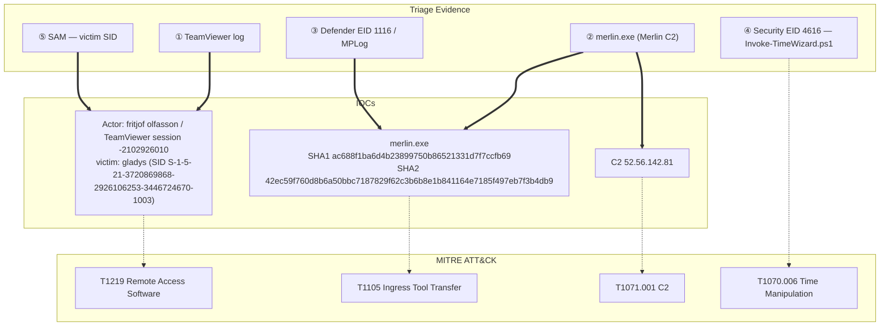

## Scenario

TickTock is an **Easy** HackTheBox *Sherlock* (defensive / DFIR challenge). An attacker remotely accessed the **gladys** workstation over **TeamViewer**, dropped an open-source C2 agent, attempted to lock the disk with BitLocker, and ran a PowerShell script to repeatedly **manipulate the system clock** (anti-forensics). You are handed a triage of the host and must reconstruct the whole sequence: the C2 agent, the remote session, the C2 endpoint, the binary's hashes, the time-tampering script, and the victim.

> *"The gladys workstation was accessed remotely and a C2 agent was deployed. Investigate the triage: identify the C2 agent and its callback, how the attacker got in over TeamViewer, the Defender verdict and hashes of the binary, the script used to tamper with time, and the victim account."*

| Field | Value |
|---------------------------|-------|
| Platform | HackTheBox — Sherlock |
| Category | DFIR / endpoint triage |
| Difficulty | Easy |
| Artifacts | KAPE triage of `gladys` (TeamViewer log, Windows Defender MPLog, Windows event logs, registry) |
| Skills | TeamViewer log analysis, Defender MPLog/1116 triage, Event ID 4616 time-change analysis, registry SID lookup |

## Artifacts

A KAPE-style triage collection from the **gladys** workstation. The decisive sources are:

- **TeamViewer log** (`TeamViewer15_Logfile.log`) — plain text; holds the inbound session ID, connect time, and the attacker's display name.
- **Windows Defender MPLog** (`C:\ProgramData\Microsoft\Windows Defender\Support\MPLog-*`) — scan detail incl. the binary's SHA1/SHA2 in `SDN` events.
- **Windows event logs** — Defender Operational **EID 1116** (malware detected) and Security **EID 4616** (system time changed).
- **Registry / SAM** — for the victim user's SID.

## Toolkit

- **EvtxECmd** (Eric Zimmerman) → CSV → **Timeline Explorer** for the event logs
- A custom **EVTX dashboard** (my own DFIR triage UI) for fast keyword filtering and field inspection — shown in the screenshots below
- A **text editor / grep** for the TeamViewer log and the Defender MPLog
- **Registry Explorer** (Eric Zimmerman) for the user SID

```powershell
# Carve the triage event logs to CSV for Timeline Explorer
EvtxECmd.exe -d C:\Triage --csv . --csvf ticktock.csv
# TeamViewer connection records (plain text)
type "C:\Program Files\TeamViewer\TeamViewer15_Logfile.log"
# Defender scan detail — SHA1/SHA2 live in the SDN events
findstr /i "merlin" "C:\ProgramData\Microsoft\Windows Defender\Support\MPLog-*"
```

<svg width="15" height="15" viewBox="0 0 24 24" fill="none" stroke="currentColor" stroke-width="2.2" stroke-linecap="round" stroke-linejoin="round" style="vertical-align:-2px;"><path d="M9 18h6"/><path d="M10 22h4"/><path d="M15.1 14c.2-1 .7-1.7 1.4-2.5A4.6 4.6 0 0 0 18 8 6 6 0 0 0 6 8c0 1 .2 2.2 1.5 3.5.7.8 1.2 1.5 1.4 2.5"/></svg> **Analysis** — The case is a correlation across three very different artifacts: a vendor app log (TeamViewer) gives *who/when* got in, the antivirus log (Defender MPLog) gives the *what* (binary identity + hashes), and the Windows event logs give the *anti-forensics* (mass time changes). The clock tampering is the twist — it makes naive timeline-by-timestamp analysis unreliable, so you anchor on artifacts whose order is independent of the system clock.

## Background: signals you need

| Signal | What it is | Why it matters here |
|---|---|---|
| `TeamViewer15_Logfile.log` | TeamViewer's plain-text session log | inbound session ID, connect time, attacker display name |
| Merlin (`merlin.exe`) | open-source HTTP/2 C2 agent | the dropped implant |
| Defender **EID 1116** | "malware detected" (Defender Operational) | the AV category for the binary |
| Defender MPLog `SDN` event | per-scan detail line | carries the binary's **SHA1 and SHA2** |
| Security **EID 4616** | "the system time was changed" | each clock change emits one — count them to measure the tampering |
| `Invoke-TimeWizard.ps1` | PowerShell time-changer | the script driving the `4616` storm |
| SAM / registry | local account database | the victim user's SID |

## Investigation

<h2 id="q1" style="background:rgba(255,159,67,.16);border-left:5px solid #ff9f43;border-radius:6px;padding:.5rem .85rem;margin:2.5rem 0 1rem;">Q1. What was the name of the executable that was uploaded as a C2 Agent?</h2>

Triage the dropped files under the user's profile. The implant — an open-source **Merlin** HTTP/2 C2 agent — sits on the desktop as a plainly-named executable.

<svg width="15" height="15" viewBox="0 0 24 24" fill="none" stroke="currentColor" stroke-width="2.2" stroke-linecap="round" stroke-linejoin="round" style="vertical-align:-2px;"><path d="M21.8 10A10 10 0 1 1 17 3.3"/><path d="m9 11 3 3L22 4"/></svg> **Answer**

```text
merlin.exe
```

<svg width="15" height="15" viewBox="0 0 24 24" fill="none" stroke="currentColor" stroke-width="2.2" stroke-linecap="round" stroke-linejoin="round" style="vertical-align:-2px;"><path d="M9 18h6"/><path d="M10 22h4"/><path d="M15.1 14c.2-1 .7-1.7 1.4-2.5A4.6 4.6 0 0 0 18 8 6 6 0 0 0 6 8c0 1 .2 2.2 1.5 3.5.7.8 1.2 1.5 1.4 2.5"/></svg> **Analysis** — `merlin.exe` is the Merlin C2 agent (a well-known open-source post-exploitation framework). Dropped to `C:\Users\gladys\Desktop\`, it is the implant everything else in this case revolves around. (MITRE ATT&CK **T1105 — Ingress Tool Transfer**.)

<h2 id="q2" style="background:rgba(255,159,67,.16);border-left:5px solid #ff9f43;border-radius:6px;padding:.5rem .85rem;margin:2.5rem 0 1rem;">Q2. What was the session id for the initial access?</h2>

The intrusion came over TeamViewer. Open `TeamViewer15_Logfile.log` and read the inbound session — the session ID is recorded there.

<svg width="15" height="15" viewBox="0 0 24 24" fill="none" stroke="currentColor" stroke-width="2.2" stroke-linecap="round" stroke-linejoin="round" style="vertical-align:-2px;"><path d="M21.8 10A10 10 0 1 1 17 3.3"/><path d="m9 11 3 3L22 4"/></svg> **Answer**

```text
-2102926010
```


<svg width="15" height="15" viewBox="0 0 24 24" fill="none" stroke="currentColor" stroke-width="2.2" stroke-linecap="round" stroke-linejoin="round" style="vertical-align:-2px;"><path d="M9 18h6"/><path d="M10 22h4"/><path d="M15.1 14c.2-1 .7-1.7 1.4-2.5A4.6 4.6 0 0 0 18 8 6 6 0 0 0 6 8c0 1 .2 2.2 1.5 3.5.7.8 1.2 1.5 1.4 2.5"/></svg> **Analysis** — TeamViewer is legitimate remote-access software, so its own log is the best record of the intrusion. The session ID ties together the connect time, the remote peer, and the display name in the following questions. (MITRE ATT&CK **T1219 — Remote Access Software**.)

<h2 id="q3" style="background:rgba(255,159,67,.16);border-left:5px solid #ff9f43;border-radius:6px;padding:.5rem .85rem;margin:2.5rem 0 1rem;">Q3. The attacker attempted to set a BitLocker password on the <code>C:</code> drive — what was the password?</h2>

Look at the BitLocker / `manage-bde` activity in the triage; the attempted protector password is captured.

<svg width="15" height="15" viewBox="0 0 24 24" fill="none" stroke="currentColor" stroke-width="2.2" stroke-linecap="round" stroke-linejoin="round" style="vertical-align:-2px;"><path d="M21.8 10A10 10 0 1 1 17 3.3"/><path d="m9 11 3 3L22 4"/></svg> **Answer**

```text
reallylongpassword
```


<svg width="15" height="15" viewBox="0 0 24 24" fill="none" stroke="currentColor" stroke-width="2.2" stroke-linecap="round" stroke-linejoin="round" style="vertical-align:-2px;"><path d="M9 18h6"/><path d="M10 22h4"/><path d="M15.1 14c.2-1 .7-1.7 1.4-2.5A4.6 4.6 0 0 0 18 8 6 6 0 0 0 6 8c0 1 .2 2.2 1.5 3.5.7.8 1.2 1.5 1.4 2.5"/></svg> **Analysis** — Setting a BitLocker password on the system drive is an impact / destruction move — encrypt-the-victim-out ransomware behaviour. Recovering the attempted password shows intent and, in a real case, could help recover the drive. (MITRE ATT&CK **T1486 — Data Encrypted for Impact**.)

<h2 id="q4" style="background:rgba(255,159,67,.16);border-left:5px solid #ff9f43;border-radius:6px;padding:.5rem .85rem;margin:2.5rem 0 1rem;">Q4. What name was used by the attacker?</h2>

Back in the TeamViewer log, the remote peer's display name is recorded for the session.

<svg width="15" height="15" viewBox="0 0 24 24" fill="none" stroke="currentColor" stroke-width="2.2" stroke-linecap="round" stroke-linejoin="round" style="vertical-align:-2px;"><path d="M21.8 10A10 10 0 1 1 17 3.3"/><path d="m9 11 3 3L22 4"/></svg> **Answer**

```text
fritjof olfasson
```


<svg width="15" height="15" viewBox="0 0 24 24" fill="none" stroke="currentColor" stroke-width="2.2" stroke-linecap="round" stroke-linejoin="round" style="vertical-align:-2px;"><path d="M9 18h6"/><path d="M10 22h4"/><path d="M15.1 14c.2-1 .7-1.7 1.4-2.5A4.6 4.6 0 0 0 18 8 6 6 0 0 0 6 8c0 1 .2 2.2 1.5 3.5.7.8 1.2 1.5 1.4 2.5"/></svg> **Analysis** — The remote device/display name (`fritjof olfasson`) is a soft attribution artifact — likely attacker-chosen, but a pivot point for hunting the same name across other hosts and for the incident report. (MITRE ATT&CK **T1219 — Remote Access Software**.)

<h2 id="q5" style="background:rgba(255,159,67,.16);border-left:5px solid #ff9f43;border-radius:6px;padding:.5rem .85rem;margin:2.5rem 0 1rem;">Q5. What IP address did the C2 connect back to?</h2>

Correlate the Merlin agent's network activity (Sysmon / network artifacts) to find the callback endpoint.

<svg width="15" height="15" viewBox="0 0 24 24" fill="none" stroke="currentColor" stroke-width="2.2" stroke-linecap="round" stroke-linejoin="round" style="vertical-align:-2px;"><path d="M21.8 10A10 10 0 1 1 17 3.3"/><path d="m9 11 3 3L22 4"/></svg> **Answer**

```text
52.56.142.81
```


<svg width="15" height="15" viewBox="0 0 24 24" fill="none" stroke="currentColor" stroke-width="2.2" stroke-linecap="round" stroke-linejoin="round" style="vertical-align:-2px;"><path d="M9 18h6"/><path d="M10 22h4"/><path d="M15.1 14c.2-1 .7-1.7 1.4-2.5A4.6 4.6 0 0 0 18 8 6 6 0 0 0 6 8c0 1 .2 2.2 1.5 3.5.7.8 1.2 1.5 1.4 2.5"/></svg> **Analysis** — `52.56.142.81` is the Merlin C2 server — a top-tier IOC for egress blocking and threat-intel pivoting. Merlin speaks HTTP/2, so the beacon blends into normal web traffic; the host-side artifact is what surfaces it. (MITRE ATT&CK **T1071.001 — Application Layer Protocol: Web Protocols**.)

<h2 id="q6" style="background:rgba(255,159,67,.16);border-left:5px solid #ff9f43;border-radius:6px;padding:.5rem .85rem;margin:2.5rem 0 1rem;">Q6. What category did Windows Defender give to the C2 binary file?</h2>

Filter the Defender Operational log on **Event ID 1116** (malware detected) — the threat name / category is in the event.

<svg width="15" height="15" viewBox="0 0 24 24" fill="none" stroke="currentColor" stroke-width="2.2" stroke-linecap="round" stroke-linejoin="round" style="vertical-align:-2px;"><path d="M21.8 10A10 10 0 1 1 17 3.3"/><path d="m9 11 3 3L22 4"/></svg> **Answer**

```text
VirTool:Win32/Myrddin.D
```


<svg width="15" height="15" viewBox="0 0 24 24" fill="none" stroke="currentColor" stroke-width="2.2" stroke-linecap="round" stroke-linejoin="round" style="vertical-align:-2px;"><path d="M9 18h6"/><path d="M10 22h4"/><path d="M15.1 14c.2-1 .7-1.7 1.4-2.5A4.6 4.6 0 0 0 18 8 6 6 0 0 0 6 8c0 1 .2 2.2 1.5 3.5.7.8 1.2 1.5 1.4 2.5"/></svg> **Analysis** — `VirTool:Win32/Myrddin.D` is Microsoft's family name for Merlin (Myrddin = the Welsh form of "Merlin"). Defender detected it but the attack continued — so detection ≠ prevention; always check whether a `1116` actually *blocked* or merely logged. (MITRE ATT&CK **T1105 — Ingress Tool Transfer**.)

<h2 id="q7" style="background:rgba(255,159,67,.16);border-left:5px solid #ff9f43;border-radius:6px;padding:.5rem .85rem;margin:2.5rem 0 1rem;">Q7. What was the filename of the powershell script the attackers used to manipulate time?</h2>

System-time changes raise Security **EID 4616**. Pivot from those events to the PowerShell script that drove them — review the script artifacts, exclude Windows' own and random temp `.ps1` names, and the meaningfully-named script stands out.

<svg width="15" height="15" viewBox="0 0 24 24" fill="none" stroke="currentColor" stroke-width="2.2" stroke-linecap="round" stroke-linejoin="round" style="vertical-align:-2px;"><path d="M21.8 10A10 10 0 1 1 17 3.3"/><path d="m9 11 3 3L22 4"/></svg> **Answer**

```text
Invoke-TimeWizard.ps1
```


<svg width="15" height="15" viewBox="0 0 24 24" fill="none" stroke="currentColor" stroke-width="2.2" stroke-linecap="round" stroke-linejoin="round" style="vertical-align:-2px;"><path d="M9 18h6"/><path d="M10 22h4"/><path d="M15.1 14c.2-1 .7-1.7 1.4-2.5A4.6 4.6 0 0 0 18 8 6 6 0 0 0 6 8c0 1 .2 2.2 1.5 3.5.7.8 1.2 1.5 1.4 2.5"/></svg> **Analysis** — `Invoke-TimeWizard.ps1` repeatedly rolls the system clock to **poison the timeline** — an anti-forensic technique that breaks order-by-timestamp analysis. The defence is to triage by artifacts whose sequence is clock-independent (event record numbers, USN journal, `$MFT`). (MITRE ATT&CK **T1070.006 — Indicator Removal: Timestomp / time manipulation**, **T1059.001 — PowerShell**.)

<h2 id="q8" style="background:rgba(255,159,67,.16);border-left:5px solid #ff9f43;border-radius:6px;padding:.5rem .85rem;margin:2.5rem 0 1rem;">Q8. What time did the initial access connection start? (UTC)</h2>

Read the connect timestamp of the inbound session from the TeamViewer log.

<svg width="15" height="15" viewBox="0 0 24 24" fill="none" stroke="currentColor" stroke-width="2.2" stroke-linecap="round" stroke-linejoin="round" style="vertical-align:-2px;"><path d="M21.8 10A10 10 0 1 1 17 3.3"/><path d="m9 11 3 3L22 4"/></svg> **Answer**

```text
04/05/2023 11:35:27
```


<svg width="15" height="15" viewBox="0 0 24 24" fill="none" stroke="currentColor" stroke-width="2.2" stroke-linecap="round" stroke-linejoin="round" style="vertical-align:-2px;"><path d="M9 18h6"/><path d="M10 22h4"/><path d="M15.1 14c.2-1 .7-1.7 1.4-2.5A4.6 4.6 0 0 0 18 8 6 6 0 0 0 6 8c0 1 .2 2.2 1.5 3.5.7.8 1.2 1.5 1.4 2.5"/></svg> **Analysis** — Because the attacker tampered with the OS clock, Windows timestamps are unreliable — but TeamViewer writes its **own** timestamps in its log, independent of (and before) the tampering. That makes the TeamViewer connect time the trustworthy start of the intrusion. (MITRE ATT&CK **T1219 — Remote Access Software**.)

<h2 id="q9" style="background:rgba(255,159,67,.16);border-left:5px solid #ff9f43;border-radius:6px;padding:.5rem .85rem;margin:2.5rem 0 1rem;">Q9. What is the SHA1 and SHA2 sum of the malicious binary?</h2>

Defender's **MPLog** (`C:\ProgramData\Microsoft\Windows Defender\Support\MPLog-*`) records an `SDN` (Sample submission) line per scanned file, including its `sha1=` and `sha2=`. Find the `merlin.exe` entry and read both hashes.

<svg width="15" height="15" viewBox="0 0 24 24" fill="none" stroke="currentColor" stroke-width="2.2" stroke-linecap="round" stroke-linejoin="round" style="vertical-align:-2px;"><path d="M21.8 10A10 10 0 1 1 17 3.3"/><path d="m9 11 3 3L22 4"/></svg> **Answer**

```text
ac688f1ba6d4b23899750b86521331d7f7ccfb69:42ec59f760d8b6a50bbc7187829f62c3b6b8e1b841164e7185f497eb7f3b4db9
```


<svg width="15" height="15" viewBox="0 0 24 24" fill="none" stroke="currentColor" stroke-width="2.2" stroke-linecap="round" stroke-linejoin="round" style="vertical-align:-2px;"><path d="M9 18h6"/><path d="M10 22h4"/><path d="M15.1 14c.2-1 .7-1.7 1.4-2.5A4.6 4.6 0 0 0 18 8 6 6 0 0 0 6 8c0 1 .2 2.2 1.5 3.5.7.8 1.2 1.5 1.4 2.5"/></svg> **Analysis** — Defender's MPLog is an underrated DFIR goldmine: even after a binary is deleted, the `SDN` line preserves its path and hashes — `SDN:Issuing SDN query for …\merlin.exe (sha1=…, sha2=…)`. Both sums enable VirusTotal / threat-intel pivoting without ever needing the file itself.

<h2 id="q10" style="background:rgba(255,159,67,.16);border-left:5px solid #ff9f43;border-radius:6px;padding:.5rem .85rem;margin:2.5rem 0 1rem;">Q10. How many times did the powershell script change the time on the machine?</h2>

Every successful clock change emits a Security **EID 4616**. Filter on `4616` and scope the process to `powershell.exe` (the `Invoke-TimeWizard.ps1` runs) — excluding legitimate time-sync sources — then count.

<svg width="15" height="15" viewBox="0 0 24 24" fill="none" stroke="currentColor" stroke-width="2.2" stroke-linecap="round" stroke-linejoin="round" style="vertical-align:-2px;"><path d="M21.8 10A10 10 0 1 1 17 3.3"/><path d="m9 11 3 3L22 4"/></svg> **Answer**

```text
2371
```


<svg width="15" height="15" viewBox="0 0 24 24" fill="none" stroke="currentColor" stroke-width="2.2" stroke-linecap="round" stroke-linejoin="round" style="vertical-align:-2px;"><path d="M9 18h6"/><path d="M10 22h4"/><path d="M15.1 14c.2-1 .7-1.7 1.4-2.5A4.6 4.6 0 0 0 18 8 6 6 0 0 0 6 8c0 1 .2 2.2 1.5 3.5.7.8 1.2 1.5 1.4 2.5"/></svg> **Analysis** — **2371** time changes is the scale of the anti-forensic effort — but `4616` itself is the defender's friend: scoping it to `powershell.exe` (vs the normal `w32time` / SYSTEM source) both proves the tampering and gives the exact count. The sheer volume is also a high-signal alert on its own.

<h2 id="q11" style="background:rgba(255,159,67,.16);border-left:5px solid #ff9f43;border-radius:6px;padding:.5rem .85rem;margin:2.5rem 0 1rem;">Q11. What is the SID of the victim user?</h2>

The compromised account is **gladys**. Look up the local account's SID in the SAM / registry artifact.

<svg width="15" height="15" viewBox="0 0 24 24" fill="none" stroke="currentColor" stroke-width="2.2" stroke-linecap="round" stroke-linejoin="round" style="vertical-align:-2px;"><path d="M21.8 10A10 10 0 1 1 17 3.3"/><path d="m9 11 3 3L22 4"/></svg> **Answer**

```text
S-1-5-21-3720869868-2926106253-3446724670-1003
```


<svg width="15" height="15" viewBox="0 0 24 24" fill="none" stroke="currentColor" stroke-width="2.2" stroke-linecap="round" stroke-linejoin="round" style="vertical-align:-2px;"><path d="M9 18h6"/><path d="M10 22h4"/><path d="M15.1 14c.2-1 .7-1.7 1.4-2.5A4.6 4.6 0 0 0 18 8 6 6 0 0 0 6 8c0 1 .2 2.2 1.5 3.5.7.8 1.2 1.5 1.4 2.5"/></svg> **Analysis** — The SID (`…-1003`, a normal non-admin local RID) uniquely identifies the principal even if renamed, and lets the threat-hunting team correlate `gladys`'s activity across logs and systems where only SIDs appear. (MITRE ATT&CK **T1078 — Valid Accounts**.)

## Attack Timeline

| Time (UTC) | Stage | Evidence |
|---|---|---|
| 04/05/2023 11:35:27 | Initial Access | TeamViewer inbound session — "fritjof olfasson", session `-2102926010` — TeamViewer log |
| (post-access) | Execution / C2 | `merlin.exe` (Merlin C2) on `gladys` Desktop, beacons to `52.56.142.81` |
| (post-access) | Defense Evasion | `Invoke-TimeWizard.ps1` rolls the system clock **2371×** — Security **EID 4616** |
| (post-access) | Impact (attempt) | BitLocker password `reallylongpassword` set on `C:` |
| (detection) | — | Defender flags it `VirTool:Win32/Myrddin.D` — **EID 1116** / MPLog (SHA1/SHA2) |



## Detection & Hardening (Blue Team)

- **Alert on inbound TeamViewer / remote-access sessions** to servers and sensitive endpoints — unmanaged RMM is a top initial-access vector. Allowlist approved tools only.
- **Treat Defender EID 1116 as an incident, not a cleanup** — a detection that doesn't *block* (and is followed by more activity) means the threat is live.
- **Alert on Security EID 4616 from non-`w32time` / non-SYSTEM processes** (especially `powershell.exe`) — legitimate apps almost never set the clock; a burst of `4616` is a strong anti-forensics signal.
- **Collect Defender MPLog** (`…\Windows Defender\Support\MPLog-*`) in triage — it preserves paths and SHA1/SHA2 of scanned files even after deletion.
- **Monitor BitLocker / `manage-bde` protector changes** on system drives — an unexpected password protector can be a ransomware precursor.

## Key Takeaways

- A vendor app log (**TeamViewer**) gave the trustworthy *who / when* of initial access — independent of the tampered OS clock.
- **Defender MPLog** yielded the binary's **SHA1 / SHA2** without the file, and **EID 1116** the family name (`VirTool:Win32/Myrddin.D` = Merlin).
- Anti-forensic **time manipulation** (`Invoke-TimeWizard.ps1`, **2371×** via **EID 4616**) is itself detectable — scope `4616` to `powershell.exe` to both prove and count it.
- When the clock can't be trusted, cross-source correlation beats timeline-by-timestamp.

## References

- HackTheBox Sherlock: TickTock — <https://app.hackthebox.com/sherlocks>
- Merlin C2 — <https://github.com/Ne0nd0g/merlin>
- Microsoft — 4616(S): The system time was changed — <https://learn.microsoft.com/windows/security/threat-protection/auditing/event-4616>
- Windows Defender MPLog (DFIR value) — <https://www.crowdstrike.com/blog/how-to-use-microsoft-protection-logging-for-forensic-investigations/>
- MITRE ATT&CK: T1219 (Remote Access Software), T1105 (Ingress Tool Transfer), T1071.001 (Web C2), T1070.006 (Time manipulation), T1486 (Data Encrypted for Impact)
